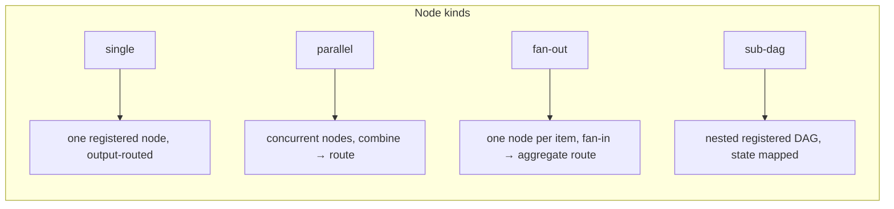
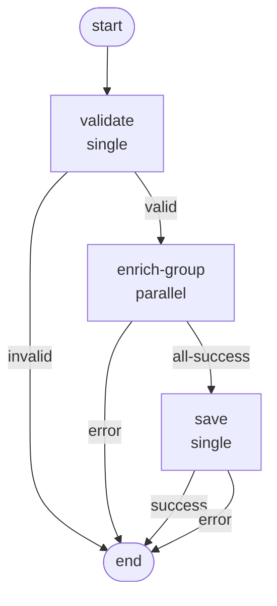
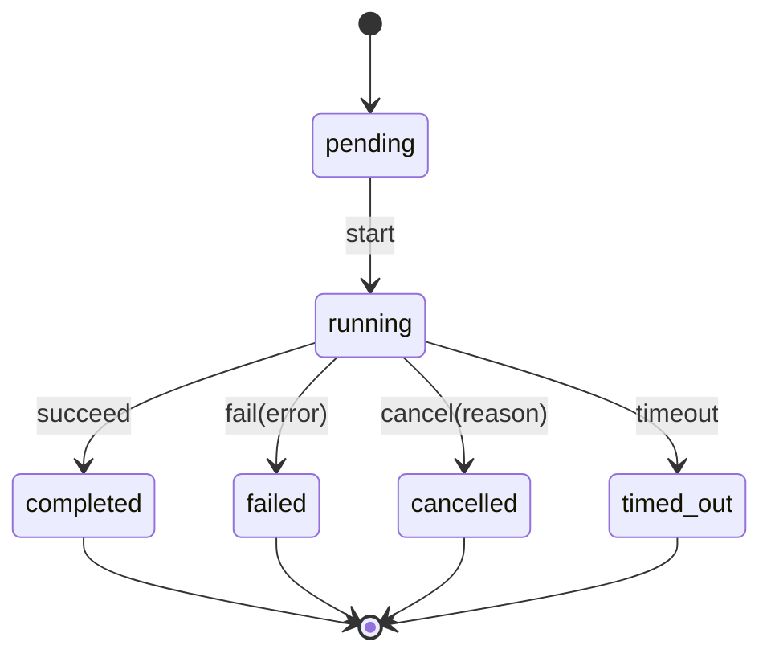

# Architecture

Dagonizer is a single-class, in-process DAG dispatcher. The core loop is a `while` iterator over a node graph. The dispatcher is the watcher; every node is an eye on the graph.

## Core objects

| Object | Role |
|--------|------|
| `Dagonizer<TState>` | Dispatcher. Holds the node and DAG registries. Executes DAGs. |
| `DAG` | Plain-object graph definition: nodes + entrypoint. |
| `NodeInterface<TState, TOutput>` | Stateless unit of work. Receives node state + context; returns an output name. |
| `NodeStateInterface` | Lifecycle + error/warning accumulation surface. Travels through every node. |
| `Execution<TState>` | Handle returned by `execute()` / `resume()`. AsyncIterable + PromiseLike. |

## Node kinds



**`single`** — the fundamental unit. One registered node; output name selects the next node (or `null` to terminate).

**`parallel`** — a named group of previously-declared `single` entries. The dispatcher runs them with `Promise.all`, then applies a combine strategy (`all-success`, `any-success`, or `collect`) to produce a single routing output.

**`fan-out`** — reads an array from a dotted state path, runs one registered node per item (with configurable concurrency), then merges results through a fan-in strategy (`append`, `partition`, or `custom`). Aggregate output is one of `all-success`, `partial`, `all-error`, or `empty`.

**`sub-dag`** — invokes another registered DAG as a nested call. The child runs in a cloned node state; optional `stateMapping` copies keys in before the sub-DAG and copies keys out after. Errors and warnings from the child always bubble up to the parent.

## Sample three-node DAG



## Lifecycle FSM

Every DAG execution runs a lifecycle state machine. The dispatcher transitions it; nodes observe it via `state.lifecycle.kind`.



Terminal states are sticky: once reached, all further events are silently ignored.

### Lifecycle timestamps

```ts
type DAGLifecycleState =
  | { kind: 'pending';   startedAt: null;   finishedAt: null;   error: null;  reason: null }
  | { kind: 'running';   startedAt: number; finishedAt: null;   error: null;  reason: null }
  | { kind: 'completed'; startedAt: number; finishedAt: number; error: null;  reason: null }
  | { kind: 'failed';    startedAt: number; finishedAt: number; error: Error; reason: null }
  | { kind: 'cancelled'; startedAt: number; finishedAt: number; error: null;  reason: string }
  | { kind: 'timed_out'; startedAt: number; finishedAt: number; error: null;  reason: null };
```

Timestamps are monotonic milliseconds from `Clock.monotonicMs()`. Use them for duration math; do not display them as wall-clock values.

## Execution model

`Dagonizer.execute()` wraps an async generator in an `Execution<TState>` instance. The generator:

1. Resolves the DAG from the registry.
2. Composes `signal` + `deadlineMs` into a single `AbortSignal` via `AbortSignal.any()`.
3. Marks state `running`.
4. Iterates the node graph: look up the current node, call `executeDAGNode`, yield the result, follow the routing to the next node name.
5. Stops when the routing produces `null` (normal completion) or when the signal fires (abort / timeout).
6. Marks state `completed`, `cancelled`, or `timed_out` accordingly.
7. Returns `ExecutionResultInterface` with `cursor` (next node name or `null`), `executedNodes`, `skippedNodes`, and final `state`.

`Execution` is both `PromiseLike` (awaitable) and `AsyncIterable` (iterable per node). Both modes share a single internal generator — the flow body runs exactly once.

## Signal propagation

```
dispatcher.execute(dag, state, { signal, deadlineMs })
        │
        ▼
AbortSignal.any([signal, AbortSignal.timeout(deadlineMs)])
        │
        ▼
node.execute(state, { signal: composedSignal, dagName, nodeName })
        │
        ▼
context.signal propagated to IO (fetch, db, sleep in RetryPolicy)
```

Sub-DAGs receive the composed signal from the parent — cancellation propagates through the full nesting depth.

## State flow

```
dispatcher.execute(dagName, initialState)
    │
    ▼
initialState travels through each node's execute(state, context)
    │  (nodes mutate state in place)
    ▼
fan-out items get a clone of state (metadata copied, lifecycle reset)
sub-DAGs get a clone of state (optional key mapping in/out)
    │
    ▼
result.state === initialState  // same reference
```

`NodeStateBase.clone()` is called for fan-out items and sub-DAGs. The clone carries metadata but resets lifecycle to `pending` and clears errors/warnings — each child execution is a fresh lifecycle run.

## Interface taxonomy

Three distinct kinds of interface live in the package. Each kind has one home; the homes do not overlap.

### Class-shape interfaces

Describe the public face of one class. Live in the **same file** as the class. Exported as `type` only.

| Interface | Class | File |
|-----------|-------|------|
| `DagonizerInterface` | `Dagonizer` | `src/Dagonizer.ts` |
| `NodeStateInterface` | `NodeStateBase` | `src/NodeStateBase.ts` |
| `DAGErrorInterface`  | `DAGError`     | `src/errors/DAGError.ts` |

Consumers extend these classes; the interface is what their subclasses implement.

### Adapter contracts

What consumers implement to swap a backend or contribute behavior. Live at the root of `src/contracts/`. **Single source of truth** — never re-exported from sibling modules.

Examples: `ClockProvider`, `SchedulerProvider`, `SchedulerHandle`, `NodeInterface`, `ExecuteOptionsInterface`, `RetryPolicyOptionsInterface`, `ErrorConstructorType`.

A `runtime/` barrel re-exports an adapter contract for ergonomic co-import with the engine class — the source of the type stays in `contracts/`.

### Entity-narrowing interfaces

Pair with a JSON Schema-derived entity. Narrow the wire shape with runtime-only fields (e.g. `signal: AbortSignal`) or with a generic parameter the schema cannot express. Live in the same file as the entity at `src/entities/<group>/<Entity>.ts`.

| Interface | Entity | File |
|-----------|--------|------|
| `NodeContextInterface` | `NodeContext` | `src/entities/node/NodeContext.ts` |
| `NodeOutputInterface<TOutput>` | `NodeOutput` | `src/entities/node/NodeOutput.ts` |
| `NodeResultInterface<TState>` | `NodeResult` | `src/entities/node/NodeResult.ts` |
| `NodeErrorInterface` | `NodeError` | `src/entities/node/NodeError.ts` |
| `ExecutionResultInterface<TState>` | `ExecutionResult` | `src/entities/execution/ExecutionResult.ts` |
| `SingleNodePlacementInterface<TOutput>` | `SingleNode` | `src/entities/dag/SingleNode.ts` |

The schema, the `FromSchema`-derived type, and the narrowing interface live together in the same file. All three re-export through `entities/index.ts`.

## Submodule exports

Every public surface ships through a `package.json` `exports` entry:

| Subpath | Contents |
|---------|----------|
| `.` | Root barrel — classes, constants, errors, schemas, types |
| `./types` | Every public type and interface (no runtime classes) |
| `./contracts` | Every adapter contract |
| `./entities` | Every JSON Schema and derived type |
| `./errors` | `DAGError` and subclasses, `DAGErrorInterface` |
| `./constants` | Constant value+type pairs (`FanInStrategy`, etc.) |
| `./lifecycle` | `DAGLifecycleMachine`, lifecycle types |
| `./runtime` | `Clock`, `Scheduler`, `RetryPolicy`, `RealTimeScheduler`, `BackoffStrategy` |
| `./builder` | `DAGBuilder` and its option interfaces |
| `./validation` | `Validator` and `EntityValidator<T>` |
| `./checkpoint` | `Checkpoint`, `StateRestoreFnType` |
| `./testing` | `VirtualClockProvider`, `VirtualScheduler` (test-only) |

Consumers import from the narrowest subpath that gives them what they need. The root barrel is for one-line bootstraps; everything else lives behind a stable subpath so the bundle stays trim.

## Extension model

Class extension is the only extension mechanism. Zero callbacks. Zero function-pass-in.

- **Observability** — subclass `Dagonizer`, override the protected hooks (`onFlowStart`, `onFlowEnd`, `onNodeStart`, `onNodeEnd`, `onError`). Multi-observer composition is the consumer's responsibility — write it into the subclass.
- **Domain state** — subclass `NodeStateBase`. Override `snapshotData()` and `restoreData()` for checkpointable fields.
- **Nodes** — implement `NodeInterface<TState, TOutput>`. Nodes never throw; they route to a named output.
- **Time / scheduling** — implement `ClockProvider` / `SchedulerProvider`. `Clock.configure()` and `Scheduler.configure()` install the provider. Production runs the default `RealTimeScheduler` and the wrapped `process.hrtime.bigint()`; tests install `VirtualClockProvider` / `VirtualScheduler` for deterministic time.

## See also

- [Concepts](./concepts) — vocabulary used across the docs
- [Getting Started](./getting-started)
- [Reference: Dagonizer](./reference/dagonizer)
- [Reference: Contracts](./reference/contracts)
- [Reference: Entities](./reference/entities)
