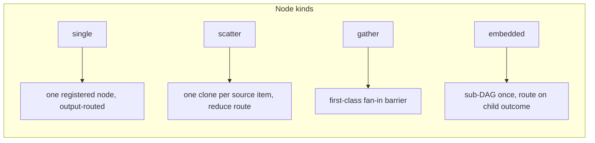
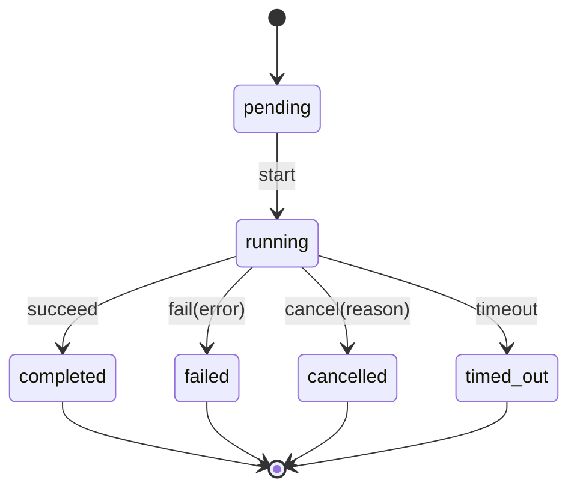

<script setup lang="ts">
import { DAG_CONTEXT } from '@studnicky/dagonizer';
import type { DAGType } from '@studnicky/dagonizer';

// Sample three-node DAG used to illustrate output routing.
// validate → enrich → save, with explicit terminal routes.
const sampleDAG: DAGType = {
  '@context': DAG_CONTEXT,
  '@id': 'urn:noocodec:dag:sample',
  '@type': 'DAG',
  name: 'sample',
  version: '1',
  entrypoints: { main: 'urn:noocodec:dag:sample/node/validate' },
  nodes: [
    {
      '@id': 'urn:noocodec:dag:sample/node/validate',
      '@type': 'SingleNode',
      name: 'validate',
      node: 'validate',
      outputs: { valid: 'urn:noocodec:dag:sample/node/enrich', invalid: 'urn:noocodec:dag:sample/node/end' },
    },
    {
      '@id': 'urn:noocodec:dag:sample/node/enrich',
      '@type': 'SingleNode',
      name: 'enrich',
      node: 'enrich',
      outputs: { success: 'urn:noocodec:dag:sample/node/save', error: 'urn:noocodec:dag:sample/node/end' },
    },
    {
      '@id': 'urn:noocodec:dag:sample/node/save',
      '@type': 'SingleNode',
      name: 'save',
      node: 'save',
      outputs: { success: 'urn:noocodec:dag:sample/node/end', error: 'urn:noocodec:dag:sample/node/end' },
    },
    {
      '@id': 'urn:noocodec:dag:sample/node/end',
      '@type': 'TerminalNode',
      name: 'end',
      outcome: 'completed',
    },
  ],
};
</script>

# Architecture

## What It Is

Architecture is the system map for Dagonizer: the dispatcher core, the JSON-LD graph document produced by `DAGBuilder` or a registry bundle, the node and DAG registries, the lifecycle state machine, and the ports that let applications plug in clocks, stores, containers, handoff channels, LLMs, embedders, and tools.

Use this page after [Concepts](./concepts). Concepts names the parts; Architecture explains how the parts touch. The important design principle is deliberately boring: graph shape is data, behavior is TypeScript, infrastructure is behind interfaces, and the dispatcher is the only place where orchestration policy lives.

## How It Works

Dagonizer runs a graph by joining three registries at the execution boundary. The DAG registry supplies the canonical JSON-LD document, the node registry supplies implementation objects, and optional container/channel registries supply infrastructure boundaries. The dispatcher validates the graph, walks placement IRIs, calls nodes, and records lifecycle state as it goes. `@id` values are runtime identity; `name` values are labels for logs, watchers, and diagrams.

That shape is what makes the same engine work for very different domains. The Archivist uses model calls, tool dispatch, memory, and retries. The Cartographer uses streaming ingest, geo enrichment, redaction, and aggregation. Their node code is different; the execution architecture is the same.

### Core objects

| Object | Role |
|--------|------|
| `Dagonizer<TState>` | Dispatcher. Holds the node and DAG registries. Executes DAGs. |
| `DAG` | Plain-object graph definition: placements plus labeled `entrypoints`. |
| `NodeInterface<TState, TOutput>` | Stateless unit of work. Receives a `Batch<TState>` and a `NodeContextType`; returns a `RoutedBatchType<TOutput, TState>`. |
| `NodeStateInterface` | Lifecycle and error/warning accumulation surface. Travels through every node. |
| `Execution<TState>` | Handle returned by `execute()` and `resume()`. AsyncIterable and PromiseLike. |

### Node kinds



#### Node base

One abstract base class covers the authoring surface:

- **`MonadicNode<TState, TOutput>`** — implements `NodeInterface` and supplies `timeout` / `validate` / `destroy` defaults. Concrete nodes declare `name`, `outputs`, `outputSchema`, and `execute(batch, context)`. Batch-native nodes process the whole batch in one call; per-item nodes keep the item loop inside `execute` and return the same `RoutedBatchType`.

`MonadicNode` ships from `@studnicky/dagonizer` and `@studnicky/dagonizer/core`; `@studnicky/dagonizer/patterns` re-exports it for co-import with the agent-flow template-method bases.

##### `DagReference` — runtime DAG resolution

A scatter or embedded placement can declare a dynamic `DagReference` instead of a fixed DAG IRI. Scatter DAG bodies use `{ dag: { from: 'item', path: 'path.to.field', candidates: [...] } }`; embedded DAG placements use the same reference shape from parent state. The dispatcher reads the dotted path at runtime, expands the selected value to a DAG IRI, and validates it against the declared candidate set before execution. This is the recursion / self-reference primitive: a flow can choose a child DAG from data, including the case where a DAG dispatches back to itself.

**`single`**, the fundamental unit. One registered node; output name selects the next placement IRI. Flows terminate at an explicit `TerminalNode`.

**`scatter`** isolates one state clone per item in a `source`, runs a node body or DAG body in each clone, emits producer records, and routes on the aggregate outcome via an outcome `reducer`. It owns fan-out, checkpointed item progress, and aggregate route selection; gather configuration lives on downstream `GatherNode` placements. Default reducer: `aggregate`. Heterogeneous fan-out is expressed with a dynamic `DagReference` or by authoring the `source` as a descriptor array and writing a body node that dispatches on the item.

**`gather`** is the first-class fan-in placement. A `GatherNode` declares producer `sources`, a `gather` strategy (`map`, `append`, `partition`, `custom`, `collect`, `discard`), and a readiness policy (`all`, `any`, or `quorum`). Fan-in is visible in JSON-LD topology instead of being hidden inside scatter.

The `source` can be a plain array (finite producer) or an `AsyncIterable`/`AsyncGenerator` (stream). Both drain through the same bounded worker pool: `concurrency` is the backpressure — the engine pulls the next item only when a worker slot frees. Resume is durable via an **inbox/work-queue**: un-acked items reprocess on restart; the stream source is never re-read from the beginning. This is the streaming spine both finite scatter and live-feed ETL pipelines share.

**`embedded`** invokes a registered sub-DAG exactly once (cardinality 1) in an isolated state and routes the parent on the child's terminal outcome (`success` or `error`). Optional `stateMapping.input` seeds child fields from the parent before the child runs; `stateMapping.output` copies child fields back into the parent after it completes.

### Lifecycle FSM

Every DAG execution runs a lifecycle state machine. The dispatcher transitions it; nodes observe it via `state.lifecycle.variant`.



Terminal states are sticky: once reached, all further events are silently ignored.

#### Lifecycle timestamps

Narrowing `state.lifecycle.variant` unlocks the typed fields:

<<< @/../examples/18-observability.ts#lifecycle-state

Timestamps are monotonic milliseconds from `Clock.monotonicMs()`. Use them for duration math; do not display them as wall-clock values.

### Execution model

`Dagonizer.execute()` wraps an async generator in an `Execution<TState>` instance. The generator:

1. Resolves the DAG from the registry.
2. Composes `signal` and `deadlineMs` into one `AbortSignal` via `Signal.compose(...)`.
3. Marks state `running`.
4. Iterates the graph by placement IRI: look up the current placement, call the matching executor, yield the result, and route each output token to the next placement IRI.
5. For `EmbeddedDAGNode` and DAG-body `ScatterNode` placements that declare a `container` role, the dispatcher resolves the bound `DagContainerInterface` and delegates the whole child DAG execution to that backend. The child state crosses the boundary as a snapshot; the backend preserves the DAG boundary, placement path, terminal snapshot, and intermediate topology events; the dispatcher applies the returned snapshot and continues.
6. Stops when the work set drains through explicit `TerminalNode` placements or when the signal fires (abort or timeout).
7. Marks state `completed`, `cancelled`, or `timed_out` accordingly.
8. For non-embedded runs: if the terminal placement name is bound in `channels`, builds a `DAGHandoff` envelope (by-value `stateSnapshot`, `correlationId`, `registryVersion`, `placementPath`) and publishes it to the bound `HandoffChannelInterface`. A publish failure is collected as a `HANDOFF_PUBLISH_FAILED` error; it does not change the returned `ExecutionResult` or the terminal outcome.
9. Returns `ExecutionResultType` with `cursor` (next placement IRI or `null`), `executedNodes`, `skippedNodes`, and final `state`.

`Execution` is both `PromiseLike` (awaitable) and `AsyncIterable` (iterable per node). Both modes share a single internal generator. The flow body runs exactly once.

#### Container seam

Containment attaches to exactly two sites — both run a whole child DAG:

| Placement | Containment |
|-----------|-------------|
| `EmbeddedDAGNode` with `container` key | Sub-DAG runs in the bound backend |
| `ScatterNode` (dag body) with `container` key | Each clone's sub-DAG runs in the bound backend |
| `ScatterNode` (node body) | Runs inline; a node body is not a DAG |
| `SingleNode` | Never contained |

`SingleNode` carries no `container` key — this is a schema-level constraint.

### Signal propagation

```
dispatcher.execute(dag, state, { signal, deadlineMs })
        │
        ▼
Signal.compose({ signal, deadlineMs })
        │
        ▼
node.execute(state, { signal: composedSignal, dagName, nodeName })
        │
        ▼
context.signal propagated to IO (fetch, db, sleep in RetryPolicy)
```

Scatter clones receive the composed signal from the parent. Cancellation propagates through the full nesting depth.

### State flow

```
dispatcher.execute(dagName, initialState)
    │
    ▼
initialState travels through each node's execute(state, context)
    │  (nodes mutate state in place)
    ▼
scatter clones get a clone of state (metadata copied, lifecycle reset)
optional stateMapping.input seeds clone fields from parent paths before the body runs
downstream GatherNode folds producer records into the parent when fan-in is needed
    │
    ▼
result.state === initialState  // same reference
```

`NodeStateBase.clone()` is called for scatter clones. The clone carries metadata but resets lifecycle to `pending` and clears errors and warnings. Each clone execution is a fresh lifecycle run.

## Diagrams, Examples, and Outputs

The diagram below is generated from the sample JSON-LD DAG defined on this page. It is intentionally tiny: validate, enrich, save, terminal. The value is in the correspondence between source fields and graph shape.

In the runnable demos the same renderer is pointed at much larger DAGs. The Archivist and Cartographer pages prove that the architecture scales from this three-node sketch to agent and data-pipeline graphs without adding another execution model.

### Sample three-node DAG

A validate node routes to an enrich step on `valid`; enrich routes to save on `success`. Each placement declares both its happy-path output and its terminal exit.

<DagJsonMermaid :dag="sampleDAG" title="Sample three-node DAG" aria-label="Sample three-node JSON-LD DAG beside Mermaid generated from it." />

## What It Lets You Do

Architecture tells you where to extend Dagonizer without guessing. Need a new node? Implement `NodeInterface` or extend `MonadicNode`. Need deterministic tests? Swap clock and scheduler providers. Need a worker thread or Web Worker boundary? Bind a `DagContainerInterface`. Need to pass terminal state to another host? Bind a `HandoffChannelInterface`.

It also gives reviewers a checklist. If orchestration logic is hiding inside callbacks, it belongs in the graph. If infrastructure details are leaking into the dispatcher, they belong behind a port. If a reusable flow needs to ship across packages, it should become JSON-LD or builder output plus registry entries.

### Use this to understand

Use this page to understand how the engine pieces execute together: dispatcher, registries, JSON-LD DAGs, lifecycle FSM, node contracts, ports/adapters, containers, hand-off channels, and state flow. For vocabulary definitions, start with [Concepts](./concepts).

Dagonizer is a TypeScript DAG dispatcher. You describe work as a JSON-LD graph of placement IRIs, register the node implementations that perform the work, and let the dispatcher move state through the graph by following output routes to placement IRIs.

An embedded DAG or scatter-dag-body placement may declare a logical `container` role. The dispatcher binds roles to `DagContainerInterface` backends (worker thread, forked child, cluster worker, spawned process, Web Worker, or remote host) at construction time. The DAG definition and node implementations are unchanged: the container decides where the child DAG executes, not how it is authored. A dispatcher with no bound containers runs every body in-process; a dispatcher with at least one container validates declared roles at `registerDAG` time and rejects unbound roles.

When a top-level DAG completes at a terminal placement whose `name` is bound to a `HandoffChannelInterface`, the dispatcher publishes a `DAGHandoff` envelope to that channel. The envelope carries the terminal state snapshot, the terminal name, the placement path, and a `registryVersion` for the receiving host's handshake. A receiver restores the envelope state and executes the next DAG in the chain using a plain `Dagonizer` instance. Cross-host state pass-over is an envelope-in / envelope-out model; Dagonizer is the in-function runtime, not the orchestrator.

The engine is domain-agnostic. The Archivist (LLM-agent bibliographic assistant) and the Cartographer (streaming multi-format data-orchestration / ETL, no LLM) both run on the identical dispatcher, lifecycle FSM, scatter and first-class gather machinery, and checkpoint/resume mechanism. The difference is entirely in the node implementations; the engine is the same.

## Code Samples

The source below is the visible version of the architecture diagram. The same `DAGType` shape is what `DAGBuilder.build()` returns and what `dispatcher.registerDAG(dag)` accepts.

```ts
import { DAG_CONTEXT } from '@studnicky/dagonizer';
import type { DAGType } from '@studnicky/dagonizer';

const sampleDAG: DAGType = {
  '@context': DAG_CONTEXT,
  '@id': 'urn:noocodec:dag:sample',
  '@type': 'DAG',
  name: 'sample',
  version: '1',
  entrypoints: { main: 'urn:noocodec:dag:sample/node/validate' },
  nodes: [
    {
      '@id': 'urn:noocodec:dag:sample/node/validate',
      '@type': 'SingleNode',
      name: 'validate',
      node: 'validate',
      outputs: { valid: 'urn:noocodec:dag:sample/node/enrich', invalid: 'urn:noocodec:dag:sample/node/end' },
    },
    {
      '@id': 'urn:noocodec:dag:sample/node/enrich',
      '@type': 'SingleNode',
      name: 'enrich',
      node: 'enrich',
      outputs: { success: 'urn:noocodec:dag:sample/node/save', error: 'urn:noocodec:dag:sample/node/end' },
    },
    {
      '@id': 'urn:noocodec:dag:sample/node/save',
      '@type': 'SingleNode',
      name: 'save',
      node: 'save',
      outputs: { success: 'urn:noocodec:dag:sample/node/end', error: 'urn:noocodec:dag:sample/node/end' },
    },
    {
      '@id': 'urn:noocodec:dag:sample/node/end',
      '@type': 'TerminalNode',
      name: 'end',
      outcome: 'completed',
    },
  ],
};
```

The handoff seam is just as explicit: terminal placement names bind to channel implementations at dispatcher construction time.

### Hand-off channel binding

```ts twoslash
import { Dagonizer, NodeStateBase } from '@studnicky/dagonizer';
import type { HandoffChannelInterface } from '@studnicky/dagonizer';
// ---cut---
declare const myQueueChannel: HandoffChannelInterface;
declare const myDlqChannel: HandoffChannelInterface;

new Dagonizer<NodeStateBase>({
  channels: {
    done: myQueueChannel,
    escalate: myDlqChannel,
  },
});
```

## Details for Nerds

Dagonizer sits near workflow engines, dataflow systems, and agent graph frameworks, but it is opinionated about semantic assembly. JSON-LD gives IRIs and context. `name` gives display labels. Registries bind behavior. Ports hide infrastructure. Visualization is generated from the graph that actually runs.

The package does not try to be a distributed workflow platform by itself. It is the in-process graph execution kernel you can embed inside web handlers, CLIs, workers, queues, browsers, or durable workflow activities.

### Ports and adapters (hexagonal architecture)

Dagonizer is structured as a **ports-and-adapters** (hexagonal) architecture. The distinction between what is inside the engine and what applications supply is explicit and enforced by the module boundary.

**The hexagon — engine core.** The dispatcher (`Dagonizer`), the lifecycle FSM (`DAGLifecycleMachine`), and the scatter / `GatherNode` machinery are the application kernel. They implement all orchestration logic and depend on no external infrastructure. They are the only place where execution policy lives.

**Ports — the adapter contracts.** Each boundary the engine crosses has a named interface in `src/contracts/`. These are the ports:

| Port | Contract | Role |
|------|----------|------|
| Node execution | `NodeInterface<TState, TOutput>` | The step the dispatcher calls |
| Clock | `ClockProviderInterface` | Monotonic time source |
| Scheduler | `SchedulerProviderInterface` | Timer/sleep primitives |
| State store | `StoreInterface` | Key-value persistence |
| Checkpoint store | `CheckpointStoreInterface` | Cursor + state snapshot persistence |
| DAG container | `DagContainerInterface` | Sub-DAG isolation (worker thread, fork, cluster) |
| Channel | `HandoffChannelInterface` | Cross-host state hand-off |
| Embedder | `EmbedderInterface` | Vector embedding backend |
| LLM | `LlmAdapterInterface` | Chat-completion transport |

**Adapters — application-supplied implementations.** Applications wire their chosen backends to these ports at dispatcher construction time via `options.containers`, `options.channels`, and `Clock.configure()` / `Scheduler.configure()`. The engine does not import any infrastructure class directly — it only calls through the contract.

This is why **class extension and contract implementation are the only extension mechanisms** in this package. There are no callbacks and no function-pass-in. Every behavior change attaches to a port (an interface the engine calls through) or a hook (a protected method the application overrides). The engine's internals remain testable in isolation; any backend can be swapped without touching the orchestration code.

### Interface taxonomy

Three distinct kinds of interface live in the package. Each kind has one home; the homes do not overlap.

#### Class-shape interfaces

Describe the public face of one class. Live in the **same file** as the class. Exported as `type` only.

| Interface | Class | File |
|-----------|-------|------|
| `DagonizerInterface` | `Dagonizer` | `src/Dagonizer.ts` |
| `NodeStateInterface` | `NodeStateBase` | `src/NodeStateBase.ts` |
| `DAGErrorInterface`  | `DAGError`     | `src/errors/DAGError.ts` |

Applications extend these classes; the interface is what their subclasses implement.

#### Adapter contracts

What applications implement to swap a backend or contribute behavior. Live at the root of `src/contracts/`. **Single source of truth**; never re-exported from sibling modules.

Examples: `ClockProviderInterface`, `SchedulerProviderInterface`, `NodeInterface`, `ExecuteOptionsType`, `RetryPolicyOptionsType`, `ErrorConstructorType`, `DagContainerInterface`, `HandoffChannelInterface`, `RegistryModuleInterface`.

A `runtime/` barrel re-exports an adapter contract for ergonomic co-import with the engine class. The source of the type stays in `contracts/`.

#### Entity-narrowing interfaces

Pair with a JSON Schema-derived entity. Narrow the wire shape with runtime-only fields (for example, `signal: AbortSignal`) or with a generic parameter the schema cannot express. Live in the same file as the entity at `src/entities/<group>/<Entity>.ts`.

| Interface | Entity | File |
|-----------|--------|------|
| `NodeContextType` | `NodeContext` | `src/entities/node/NodeContext.ts` |
| `NodeOutputType<TOutput>` | `NodeOutput` | `src/entities/node/NodeOutput.ts` |
| `NodeResultType<TState>` | `NodeResult` | `src/entities/node/NodeResult.ts` |
| `NodeErrorType` | `NodeError` | `src/entities/node/NodeError.ts` |
| `ExecutionResultType<TState>` | `ExecutionResult` | `src/entities/execution/ExecutionResult.ts` |
| `SingleNodePlacementType<TOutput>` | `SingleNode` | `src/entities/dag/SingleNode.ts` |

The schema, the `FromSchema`-derived type, and the narrowing interface live together in the same file. All three re-export through `entities/index.ts`.

### Submodule exports

Every public surface ships through a `package.json` `exports` entry.

| Subpath | Contents |
|---------|----------|
| `.` | Root barrel: classes, constants, errors, schemas, types |
| `./types` | Every public type and interface (no runtime classes) |
| `./contracts` | Every adapter contract |
| `./entities` | Every JSON Schema and derived type |
| `./errors` | `DAGError` and subclasses, `DAGErrorInterface` |
| `./constants` | Constant value plus type pairs (values `GatherStrategyNames`, `MetadataKeys`, `NodeTypes`, `OutputNames`, `ScatterOutputNames`; types `GatherStrategyNameType`, `MetadataKeyType`, `NodeType`, `OutputType`, `ScatterOutputType`) |
| `./lifecycle` | `DAGLifecycleMachine`, lifecycle types |
| `./runtime` | `Clock`, `Scheduler`, `RetryPolicy`, `RealTimeScheduler`, `BackoffStrategy` |
| `./builder` | `DAGBuilder` and its option interfaces |
| `./validation` | `Validator` and `EntityValidatorInterface<T>` |
| `./checkpoint` | `Checkpoint`, `CheckpointRestoreAdapter` |
| `./testing` | `VirtualClockProvider`, `VirtualScheduler` (test-only) |
| `./adapter` | `BaseAdapter`, `OpenAiCompatibleAdapter`, `LlmAdapterCascade`, `LlmAdapterRegistry`, `BaseEmbedder`, `EmbedderCascade`, `EmbedderRegistry`; type `LlmAdapterInterface`; chat/tool schemas and `FromSchema` types; capability descriptors |
| `./patterns` | `MonadicNode` (root node base); agent-flow template-method node bases (`BuildChatRequestNode`, `CallModelNode`, `NormalizeResponseNode`, `DecodeTextToolCallsNode`, `AppendAssistantNode`, `NormalizeToolCallsNode`, `BuildToolWorksetsNode`, `CollectToolResultsNode`); `ToolCallScatterItemType`; `LlmClientInterface`; `TripleStoreInterface` |
| `./tool` | `ToolInterface`, `ToolError`, `HttpTransport`, `OpenApiGuard`, `ToolRegistry`, `ToolInvokeNode`, `ToolInvocationState` |
| `./core` | `GatherStrategies`, `OutcomeReducers` extension registries |
| `./viz` | `MermaidRenderer`, `JsonLdRenderer`, `CytoscapeRenderer`, `CytoscapeGraph`, `CompositeLayout` |
| `./store` | `Store` contract, `BaseStore`, `MemoryStore`, `TypedStore`, `StoreError` |
| `./container` | `DagContainerBase`, `DagContainerOptions`, `PoolEntry`, `DagContainerError`, `DEFAULT_SHUTDOWN_GRACE_MS`, `DagHost`, `DagTask`, `DagOutcome`, `DAG_CONTAINER_TRANSPORT`, `DAG_CONTAINER_WORKER_DIED`, `TransportErrorCode` |
| `./channels` | `InMemoryChannel`, `InMemoryChannelOptions` |

Applications import from the narrowest subpath that gives them what they need. The root barrel is for one-line bootstraps; everything else lives behind a stable subpath so the bundle stays trim.

### Extension model

Class extension is the only extension mechanism. Zero callbacks. Zero function-pass-in.

- **Observability**: subclass `Dagonizer`, override the protected hooks (`onFlowStart`, `onFlowEnd`, `onNodeStart`, `onNodeEnd`, `onError`, `onPhaseEnter`, `onPhaseExit`). Multi-observer composition is the application's responsibility; write it into the subclass.
- **Domain state**: subclass `NodeStateBase`. Override `snapshotData()` and `restoreData()` for checkpointable fields.
- **Nodes**: extend `MonadicNode<TState, TOutput>` or implement `NodeInterface<TState, TOutput>` directly. Nodes receive their dependencies through their constructors. Nodes never throw; they return a routed batch from `execute(batch, context)`.
- **Time and scheduling**: implement `ClockProviderInterface` and `SchedulerProviderInterface`. `Clock.configure()` and `Scheduler.configure()` install the provider. Production runs the default `RealTimeScheduler` and the wrapped `process.hrtime.bigint()`; tests install `VirtualClockProvider` and `VirtualScheduler` for deterministic time.
- **Isolating compute**: implement `DagContainerInterface` to run an embedded DAG or scatter-dag-body in any isolate. Bind roles to backend instances at dispatcher construction via `options.containers`; the container preserves DAG boundaries, placement paths, checkpoint/resume contracts, and graph topology while moving execution out of process. The `@studnicky/dagonizer-executor-node` package ships `WorkerThreadContainer`, `ForkContainer`, `ClusterContainer`, and `SpawnContainer` for Node.js deployments.
- **Cross-host egress**: implement `HandoffChannelInterface` to publish `DAGHandoff` envelopes to any transport (queue, message bus, HTTP endpoint). Bind to terminal names at construction via `options.channels`. `InMemoryChannel` (from `./channels`) is the reference implementation for tests and demos.

## Related Concepts

Read these next when you want to move from architecture map to vocabulary, quickstart code, or API contracts.

- [Concepts](./concepts) - vocabulary used across the docs
- [Getting Started](./getting-started) - install and run a one-node DAG
- [Reference: Dagonizer](./reference/dagonizer) - dispatcher class API
- [Reference: Contracts](./reference/contracts) - adapter interfaces
- [Reference: Entities](./reference/entities) - schemas and derived types
