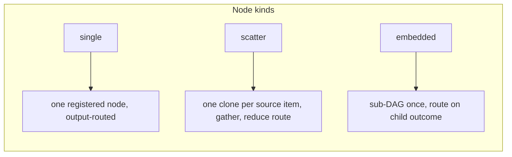
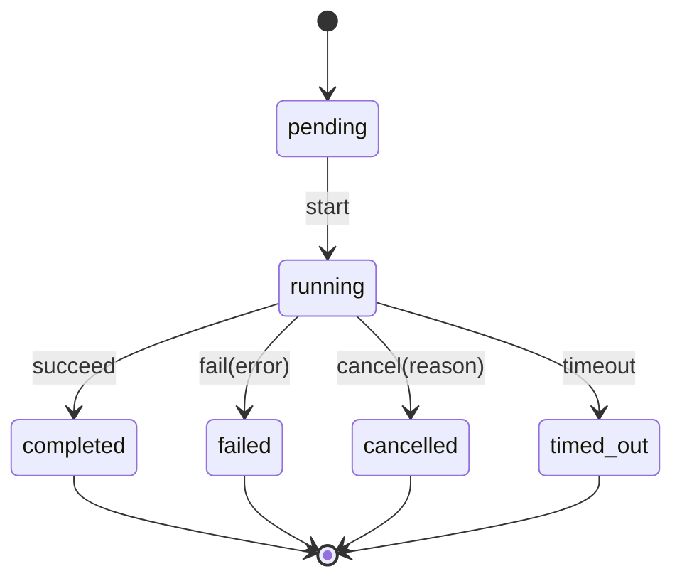

---
seeAlso:
  - text: 'Concepts'
    link: './concepts'
    description: 'vocabulary used across the docs'
  - text: 'Getting Started'
    link: './getting-started'
    description: 'install and run a one-node DAG'
  - text: 'Reference: Dagonizer'
    link: './reference/dagonizer'
    description: 'dispatcher class API'
  - text: 'Reference: Contracts'
    link: './reference/contracts'
    description: 'adapter interfaces'
  - text: 'Reference: Entities'
    link: './reference/entities'
    description: 'schemas and derived types'
---

<script setup lang="ts">
import { DAG_CONTEXT } from '@noocodex/dagonizer';
import type { DAG } from '@noocodex/dagonizer';
import DagGraph from './.vitepress/theme/components/DagGraph.vue';

// Sample three-node DAG used to illustrate output routing.
// validate → enrich → save, with explicit terminal routes.
const sampleDAG: DAG = {
  '@context': DAG_CONTEXT,
  '@id': 'urn:noocodex:dag:sample',
  '@type': 'DAG',
  name: 'sample',
  version: '1',
  entrypoint: 'validate',
  nodes: [
    {
      '@id': 'urn:noocodex:dag:sample/node/validate',
      '@type': 'SingleNode',
      name: 'validate',
      node: 'validate',
      outputs: { valid: 'enrich', invalid: 'end' },
    },
    {
      '@id': 'urn:noocodex:dag:sample/node/enrich',
      '@type': 'SingleNode',
      name: 'enrich',
      node: 'enrich',
      outputs: { success: 'save', error: 'end' },
    },
    {
      '@id': 'urn:noocodex:dag:sample/node/save',
      '@type': 'SingleNode',
      name: 'save',
      node: 'save',
      outputs: { success: 'end', error: 'end' },
    },
    {
      '@id': 'urn:noocodex:dag:sample/node/end',
      '@type': 'TerminalNode',
      name: 'end',
      outcome: 'completed',
    },
  ],
};
</script>

# Architecture

Dagonizer is a DAG dispatcher. The core loop is a `while` iterator over a node graph. The dispatcher is the watcher; every node is an eye on the graph.

An embedded DAG or scatter-dag-body placement may declare a logical `container` role. The dispatcher binds roles to `DagContainerInterface` backends (worker thread, forked child, cluster worker, spawned process, or Web Worker) at construction time. The DAG definition and node implementations are unchanged — the container decides where the sub-DAG executes, not how it is authored. An unbound role falls back to the in-process path and fires `contractWarning`; every DAG runs everywhere, degradation is visible.

When a top-level DAG completes at a terminal placement that is bound to a `HandoffChannelInterface`, the dispatcher publishes a `DAGHandoff` envelope to that channel. The envelope carries the terminal state snapshot, the terminal name, and a `registryVersion` for the receiving host's handshake. A receiver restores the envelope state and executes the next DAG in the chain using a plain `Dagonizer` instance — no orchestration runtime, no custom ingress adapter. Cross-host state pass-over is an envelope-in / envelope-out model; Dagonizer is the in-function runtime, not the orchestrator.

The engine is domain-agnostic. The Archivist (LLM-agent bibliographic assistant) and the Cartographer (streaming multi-format data-orchestration / ETL, no LLM) both run on the identical dispatcher, lifecycle FSM, scatter/gather machinery, and checkpoint/resume mechanism. The difference is entirely in the node implementations; the engine is the same.

## Core objects

| Object | Role |
|--------|------|
| `Dagonizer<TState>` | Dispatcher. Holds the node and DAG registries. Executes DAGs. |
| `DAG` | Plain-object graph definition: nodes plus entrypoint. |
| `NodeInterface<TState, TOutput>` | Stateless unit of work. Receives node state and context; returns an output name. |
| `NodeStateInterface` | Lifecycle and error/warning accumulation surface. Travels through every node. |
| `Execution<TState>` | Handle returned by `execute()` and `resume()`. AsyncIterable and PromiseLike. |

## Node kinds



**`single`**, the fundamental unit. One registered node; output name selects the next node. Flows terminate at an explicit `TerminalNode`.

**`scatter`** isolates one state clone per item in a `source`, runs a node body in each clone, merges produced clone state back into the parent via a required `gather` strategy, and routes on the aggregate outcome via an outcome `reducer`. Gather strategies: `map`, `append`, `partition`, `custom`, `collect`, `discard`. Default reducer: `aggregate`. Declare `{ strategy: 'discard' }` for side-effect-only fan-outs. Heterogeneous fan-out (running different logic per item) is expressed by authoring the `source` as a descriptor array and writing a body node that dispatches on the item — the engine is indifferent to whether bodies are identical.

The `source` can be a plain array (finite producer) or an `AsyncIterable`/`AsyncGenerator` (stream). Both drain through the same bounded worker pool: `concurrency` is the backpressure — the engine pulls the next item only when a worker slot frees. Resume is durable via an **inbox/work-queue**: un-acked items reprocess on restart; the stream source is never re-read from the beginning. This is the streaming spine both finite scatter and live-feed ETL pipelines share.

**`embedded`** invokes a registered sub-DAG exactly once (cardinality 1) in an isolated state and routes the parent on the child's terminal outcome (`success` or `error`). Optional `stateMapping.input` seeds child fields from the parent before the child runs; `stateMapping.output` copies child fields back into the parent after it completes.

## Sample three-node DAG

A validate node routes to an enrich step on `valid`; enrich routes to save on `success`. Each placement declares both its happy-path output and its terminal exit.

<DagGraph :dag="sampleDAG" aria-label="Sample three-node DAG: validate, enrich, save" />

## Lifecycle FSM

Every DAG execution runs a lifecycle state machine. The dispatcher transitions it; nodes observe it via `state.lifecycle.kind`.



Terminal states are sticky: once reached, all further events are silently ignored.

### Lifecycle timestamps

```ts twoslash
import type { DAGLifecycleState } from '@noocodex/dagonizer/lifecycle';
// ---cut---
type _LifecycleDoc = DAGLifecycleState;
//   ^? type _LifecycleDoc =
//        | { kind: 'pending';   startedAt: null;   finishedAt: null;   error: null;  reason: null }
//        | { kind: 'running';   startedAt: number; finishedAt: null;   error: null;  reason: null }
//        | { kind: 'completed'; startedAt: number; finishedAt: number; error: null;  reason: null }
//        | { kind: 'failed';    startedAt: number; finishedAt: number; error: Error; reason: null }
//        | { kind: 'cancelled'; startedAt: number; finishedAt: number; error: null;  reason: string }
//        | { kind: 'timed_out'; startedAt: number; finishedAt: number; error: null;  reason: null }
```

Timestamps are monotonic milliseconds from `Clock.monotonicMs()`. Use them for duration math; do not display them as wall-clock values.

## Execution model

`Dagonizer.execute()` wraps an async generator in an `Execution<TState>` instance. The generator:

1. Resolves the DAG from the registry.
2. Composes `signal` and `deadlineMs` into one `AbortSignal` via `AbortSignal.any()`.
3. Marks state `running`.
4. Iterates the node graph: look up the current node, call `executeDAGNode`, yield the result, follow the routing to the next node name.
5. For `EmbeddedDAGNode` and `ScatterNode` placements that declare a `container` role, the dispatcher resolves the bound `DagContainerInterface` and delegates the sub-DAG execution to that backend. The child state crosses the boundary as a snapshot; the backend runs the sub-DAG to completion and returns the terminal snapshot; the dispatcher applies it in-place and continues. An unbound role resolves to the in-process recursive path.
6. Stops when routing produces `null` (normal completion) or when the signal fires (abort or timeout).
7. Marks state `completed`, `cancelled`, or `timed_out` accordingly.
8. For non-embedded runs: if the terminal placement name is bound in `channels`, builds a `DAGHandoff` envelope (by-value `stateSnapshot`, `correlationId`, `registryVersion`, `placementPath`) and publishes it to the bound `HandoffChannelInterface`. A publish failure is collected as a `HANDOFF_PUBLISH_FAILED` error; it does not change the returned `ExecutionResult` or the terminal outcome.
9. Returns `ExecutionResultInterface` with `cursor` (next node name or `null`), `executedNodes`, `skippedNodes`, and final `state`.

`Execution` is both `PromiseLike` (awaitable) and `AsyncIterable` (iterable per node). Both modes share a single internal generator. The flow body runs exactly once.

### Container seam

Containment attaches to exactly two sites — both run a whole child DAG:

| Placement | Containment |
|-----------|-------------|
| `EmbeddedDAGNode` with `container` key | Sub-DAG runs in the bound backend |
| `ScatterNode` (dag body) with `container` key | Each clone's sub-DAG runs in the bound backend |
| `ScatterNode` (node body) | Runs inline; a node body is not a DAG |
| `SingleNode` | Never contained |

`SingleNode` carries no `container` key — this is a schema-level constraint.

### Hand-off channel binding

```ts twoslash
import { Dagonizer, NodeStateBase } from '@noocodex/dagonizer';
import type { HandoffChannelInterface } from '@noocodex/dagonizer';
// ---cut---
declare const myQueueChannel: HandoffChannelInterface;
declare const myDlqChannel: HandoffChannelInterface;

// options.channels keys are terminal placement names.
// A terminal not bound here follows today's path: no publish.
new Dagonizer<NodeStateBase>({
  channels: {
    done:      myQueueChannel,    // publishes DAGHandoff on 'done' terminal
    escalate:  myDlqChannel,      // routes to a different channel
  },
});
```

Embedded and contained child DAGs never publish — only the top-level host does. When `channels` is empty or a terminal is unbound, the run completes normally with no publish step.

## Signal propagation

```
dispatcher.execute(dag, state, { signal, deadlineMs })
        │
        ▼
AbortSignal.any([signal, AbortSignal.timeout(deadlineMs)])
        │
        ▼
node.execute(state, { signal: composedSignal, dagName, nodeName })
        │
        ▼
context.signal propagated to IO (fetch, db, sleep in RetryPolicy)
```

Scatter clones receive the composed signal from the parent. Cancellation propagates through the full nesting depth.

## State flow

```
dispatcher.execute(dagName, initialState)
    │
    ▼
initialState travels through each node's execute(state, context)
    │  (nodes mutate state in place)
    ▼
scatter clones get a clone of state (metadata copied, lifecycle reset)
optional stateMapping.input seeds clone fields from parent paths before the body runs
    │
    ▼
result.state === initialState  // same reference
```

`NodeStateBase.clone()` is called for scatter clones. The clone carries metadata but resets lifecycle to `pending` and clears errors and warnings. Each clone execution is a fresh lifecycle run.

## Interface taxonomy

Three distinct kinds of interface live in the package. Each kind has one home; the homes do not overlap.

### Class-shape interfaces

Describe the public face of one class. Live in the **same file** as the class. Exported as `type` only.

| Interface | Class | File |
|-----------|-------|------|
| `DagonizerInterface` | `Dagonizer` | `src/Dagonizer.ts` |
| `NodeStateInterface` | `NodeStateBase` | `src/NodeStateBase.ts` |
| `DAGErrorInterface`  | `DAGError`     | `src/errors/DAGError.ts` |

Consumers extend these classes; the interface is what their subclasses implement.

### Adapter contracts

What consumers implement to swap a backend or contribute behavior. Live at the root of `src/contracts/`. **Single source of truth**; never re-exported from sibling modules.

Examples: `ClockProvider`, `SchedulerProvider`, `NodeInterface`, `ExecuteOptionsInterface`, `RetryPolicyOptionsInterface`, `ErrorConstructorType`, `DagContainerInterface`, `HandoffChannelInterface`, `RegistryModuleInterface`.

A `runtime/` barrel re-exports an adapter contract for ergonomic co-import with the engine class. The source of the type stays in `contracts/`.

### Entity-narrowing interfaces

Pair with a JSON Schema-derived entity. Narrow the wire shape with runtime-only fields (for example, `signal: AbortSignal`) or with a generic parameter the schema cannot express. Live in the same file as the entity at `src/entities/<group>/<Entity>.ts`.

| Interface | Entity | File |
|-----------|--------|------|
| `NodeContextInterface` | `NodeContext` | `src/entities/node/NodeContext.ts` |
| `NodeOutputInterface<TOutput>` | `NodeOutput` | `src/entities/node/NodeOutput.ts` |
| `NodeResultInterface<TState>` | `NodeResult` | `src/entities/node/NodeResult.ts` |
| `NodeErrorInterface` | `NodeError` | `src/entities/node/NodeError.ts` |
| `ExecutionResultInterface<TState>` | `ExecutionResult` | `src/entities/execution/ExecutionResult.ts` |
| `SingleNodePlacementInterface<TOutput>` | `SingleNode` | `src/entities/dag/SingleNode.ts` |

The schema, the `FromSchema`-derived type, and the narrowing interface live together in the same file. All three re-export through `entities/index.ts`.

## Submodule exports

Every public surface ships through a `package.json` `exports` entry.

| Subpath | Contents |
|---------|----------|
| `.` | Root barrel: classes, constants, errors, schemas, types |
| `./types` | Every public type and interface (no runtime classes) |
| `./contracts` | Every adapter contract |
| `./entities` | Every JSON Schema and derived type |
| `./errors` | `DAGError` and subclasses, `DAGErrorInterface` |
| `./constants` | Constant value plus type pairs (`GatherStrategyName`, `MetadataKey`, `NodeType`, `Output`, `ScatterOutput`) |
| `./lifecycle` | `DAGLifecycleMachine`, lifecycle types |
| `./runtime` | `Clock`, `Scheduler`, `RetryPolicy`, `RealTimeScheduler`, `BackoffStrategy` |
| `./builder` | `DAGBuilder` and its option interfaces |
| `./validation` | `Validator` and `EntityValidator<T>` |
| `./checkpoint` | `Checkpoint`, `CheckpointRestoreAdapterFn` |
| `./testing` | `VirtualClockProvider`, `VirtualScheduler` (test-only) |
| `./adapter` | `LlmAdapter`, `BaseAdapter`, `OpenAiCompatibleAdapter`, `LlmAdapterCascade`, `LlmAdapterRegistry`, `BaseEmbedder`, `EmbedderCascade`, `EmbedderRegistry`, related types |
| `./patterns` | `MonadicNode` base class, `LlmClient` and `TripleStore` service contracts for pattern plugins |
| `./tool` | `Tool` interface, `ToolError`, `HttpTransport` shared fetch wrapper |
| `./core` | `GatherStrategies`, `OutcomeReducers` extension registries |
| `./derive` | `DAGDeriver.derive`, `OperationContract`, `DAGDeriverAnnotations`, `ContractRegistryValidator` |
| `./viz` | `MermaidRenderer`, `JsonLdRenderer`, `CytoscapeRenderer`, `CytoscapeGraph`, `CompositeLayout` |
| `./store` | `Store` contract, `BaseStore`, `MemoryStore`, `TypedStore`, `StoreError` |
| `./container` | `DagContainerBase`, `DagContainerOptions`, `PoolEntry`, `DagContainerError`, `DEFAULT_SHUTDOWN_GRACE_MS`, `DagHost`, `DagTask`, `DagOutcome`, `DAG_CONTAINER_TRANSPORT`, `DAG_CONTAINER_WORKER_DIED`, `TransportErrorCode` |
| `./channels` | `InMemoryChannel`, `InMemoryChannelOptions` |

Consumers import from the narrowest subpath that gives them what they need. The root barrel is for one-line bootstraps; everything else lives behind a stable subpath so the bundle stays trim.

## Extension model

Class extension is the only extension mechanism. Zero callbacks. Zero function-pass-in.

- **Observability**: subclass `Dagonizer`, override the protected hooks (`onFlowStart`, `onFlowEnd`, `onNodeStart`, `onNodeEnd`, `onError`). Multi-observer composition is the consumer's responsibility; write it into the subclass.
- **Domain state**: subclass `NodeStateBase`. Override `snapshotData()` and `restoreData()` for checkpointable fields.
- **Nodes**: implement `NodeInterface<TState, TOutput>`. Nodes never throw; they route to a named output.
- **Time and scheduling**: implement `ClockProvider` and `SchedulerProvider`. `Clock.configure()` and `Scheduler.configure()` install the provider. Production runs the default `RealTimeScheduler` and the wrapped `process.hrtime.bigint()`; tests install `VirtualClockProvider` and `VirtualScheduler` for deterministic time.
- **Isolating compute**: implement `DagContainerInterface` to run an embedded DAG or scatter-dag-body in any isolate. Bind roles to backend instances at dispatcher construction via `options.containers`. The `@noocodex/dagonizer-executor-node` package ships `WorkerThreadContainer`, `ForkContainer`, `ClusterContainer`, and `SpawnContainer` for Node.js deployments.
- **Cross-host egress**: implement `HandoffChannelInterface` to publish `DAGHandoff` envelopes to any transport (queue, message bus, HTTP endpoint). Bind to terminal names at construction via `options.channels`. `InMemoryChannel` (from `./channels`) is the reference implementation for tests and demos.
