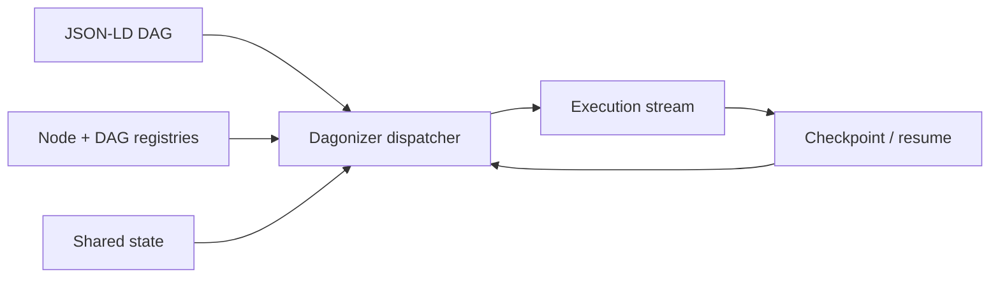

# Concepts

## What It Is

Use this page as the vocabulary map for the rest of the docs. It defines the nouns that appear everywhere else: node, DAG, placement, state, lifecycle, dispatcher, execution, route, scatter, checkpoint, and composition.

Dagonizer is domain-agnostic. The Archivist uses these concepts for an LLM-agent flow; the Cartographer uses the same concepts for streaming ETL; the Dispatcher uses them for human-in-the-loop support routing. The words do not change when the domain changes, which is the point: once you understand the graph vocabulary, every demo becomes easier to read.

## How It Works

### DAG

A **DAG** is a JSON-LD document that declares one or more labeled `entrypoints` and a list of placement IRIs with their routing. It is plain data: store it in a file, a database row, or a configuration service. Load it through `DAGDocument.load(json)`; that is the DAG document ingest boundary and it validates against `DAGSchema` before the dispatcher sees the graph. Register the result with `dispatcher.registerDAG(dag)`; everything downstream is typed and keyed by absolute IRI.

The Archivist DAG spans dozens of placements covering intent classification, tool-registry DAG references, embedded search sub-DAGs, compose retry loops, and persistence. Its `@context`, `@id`, and `@type` discriminator make it both a runtime artifact and a Linked Data document. The IRI is the binding rune; `name` is the label humans read in logs, diagrams, and observability output.

### Placement

A **placement** is one vertex in the DAG. Each placement has a canonical `@id` IRI, a display `name`, a `@type` discriminator that selects the kind, and usually an `outputs` map that routes named outputs to the next placement IRI. Flows terminate at an explicit `TerminalNode` placement.

Six kinds:

- **`single`**: one registered node. The node returns one output name; the dispatcher follows the corresponding route.
- **`scatter`**: isolates one state clone per item in a source array or stream, runs a registered node or DAG body in each clone, records per-item outcomes, and routes by aggregate reducer. Scatter is the fork; it does not secretly own the join.
- **`embedded`**: invokes a registered sub-DAG exactly once (cardinality 1) in an isolated state, then routes the parent on the child's terminal outcome (`success` or `error`). Optional `stateMapping` seeds the child from the parent before it runs and copies fields back after it completes. The Archivist's sub-DAG compositions are `EmbeddedDAGNode` placements.
- **`gather`**: buffers records from producer placement IRIs or entrypoint IRIs, applies a gather strategy, and routes once its policy is satisfied. Use `GatherNode` for scatter fan-in, multi-entry intake, or any join that deserves to appear in the graph rather than lurking in the reeds.
- **`terminal`**: named end state for explicit completion or failure. Use when a flow has more than one "done" semantics (for example, `accepted` versus `rejected`).
- **`phase`**: a single placement that wraps one registered node with a lifecycle attachment. `phase: 'pre'` runs the node before the DAG entrypoint; `phase: 'post'` runs the node after the main loop drains on every exit path. Pre-phase errors abort the run; post-phase errors are collected as warnings and do not change the already-set lifecycle. Phase placements carry no `outputs` and cannot route to other placements.

#### When to choose each

| Need | Kind |
|------|------|
| Sequential steps with conditional branching | `single` |
| Process every item in a collection or stream | `scatter` |
| Aggregate records from one or more producers | `gather` |
| Invoke a registered sub-DAG exactly once and route on its outcome | `embedded` |
| Join multiple producers at a first-class fan-in barrier | `gather` |
| Distinguish multiple terminal semantics | `terminal` |
| Attach a pre- or post-run lifecycle hook to the DAG | `phase` |

### State

**State** is the shared data record that travels through every node. It implements `NodeStateInterface` and typically extends `NodeStateBase`. The Archivist's `ArchivistState` carries the user query, classification, retrieved candidates, scout results, composed answer, and persistence metadata.

All mutations happen in place on the state object. The dispatcher returns the same reference it received.

`NodeStateBase` provides:

- `lifecycle`: discriminated union of the current lifecycle variant plus timestamps
- `errors` and `warnings`: arrays collected from every node
- `metadata`: generic key-value record for cross-node messages
- `collectError`, `collectWarning`, `setMetadata`, lifecycle mark methods

`clone()` is called by the dispatcher before scatter clones. The clone carries a copy of `metadata` but resets `lifecycle` to `pending` and clears `errors` and `warnings`. Each child execution is a fresh run.

Map domain fields to graph predicates so they remain checkpointable through the shared graph state.

### Dispatcher

The **dispatcher** is the `Dagonizer<TState>` instance. It holds the node and DAG registries, owns the execution loop, and exposes the observability hooks (`onFlowStart`, `onFlowEnd`, `onNodeStart`, `onNodeEnd`, `onError`, `onPhaseEnter`, `onPhaseExit`). Applications extend `Dagonizer` to compose multi-observer behavior into one subclass.

Production code instantiates one dispatcher per process. Tests instantiate per case for isolation.

### Execution

An **execution** is one run of a DAG. `dispatcher.execute(dagName, state, options)` returns an `Execution<TState>` that is both `PromiseLike` (await it for the final result) and `AsyncIterable` (iterate it for one event per node). Both modes share a single internal generator; the flow body runs once.

`ExecutionResultType` carries:

- `state`: the final state (same reference as the input)
- `cursor`: the next node that would have run, or `null` if the flow completed
- `executedNodes`: nodes that ran
- `skippedNodes`: nodes skipped (for example, an empty scatter)

When `cursor` is non-null, the execution stopped early. Pass it to `dispatcher.resume()` to continue.

### Route

A **route** is the directed edge in the DAG: an output name on one placement mapped to the IRI of the next placement. The Archivist's classify-intent placement has several routes, one per typed output. The TypeScript compiler verifies that every declared output in the node's `TOutput` union appears in the placement's `outputs` map; an unwired output is a build error before `registerDAG` runs the same check at runtime.

### Streaming and backpressure

`ScatterNode` has one code path for both finite and streaming sources. A `source` that is an array is a finite producer; a `source` that is an `AsyncIterable` or `AsyncGenerator` is a stream. Both drain through the same bounded worker pool.

`concurrency` is the backpressure mechanism. The engine pulls the next item from the source only when a worker slot frees. No item is fetched ahead of capacity; the producer cannot overrun the pool.

Resume is durable via an **inbox/work-queue**. An item stays checkpointed (un-acked) until its body completes successfully. On crash or early termination, the inbox is restored and only un-acked items reprocess. The stream source is never re-read from the beginning. This gives exactly-once processing semantics across restarts.

"Streaming is configuration, not a duplicate code path." The same scatter placement that fans over a static array also fans over a live feed; the only change is the type of the `source` value.

The Cartographer demo exercises this pattern: multi-format satellite tracking feeds are streamed through per-format ingest sub-DAGs with bounded concurrency and durable-inbox resume.

### Scatter outcome reducers

After a scatter body emits per-item records, an outcome reducer maps that set to one routing output for the scatter placement. The reducer name comes from `ScatterNode.reducer`. If downstream state needs to be folded, a first-class `GatherNode` declares the producer source and strategy explicitly.

**`aggregate`** (default) counts records where `output === 'success'`. Returns `all-success`, `partial`, `all-error`, or `empty`.

### Checkpoint and Resume

A **checkpoint** records the position and state of an in-flight flow so it can resume later.

- **Cursor**: the name of the next node to run. Set on `ExecutionResultType.cursor` when execution stops early. `null` means the flow ran to completion.
- **Graph state**: `NodeStateBase` stores lifecycle, metadata, progress, and domain fields as facts in the run graph. JSON-LD is the Node.js intermediate representation.

Resume is a new execution. `dispatcher.resume(dagName, state, cursor)` starts a new lifecycle run from `pending`, identical to `execute()` except it begins at `cursor` instead of the entrypoint. The checkpoint's `executedNodes` and `skippedNodes` are available from the `RecalledCheckpoint` returned by `ckpt.restoreState(adapter)` for inspection; they are not replayed.

`Checkpoint.capture(dagName, result)` builds a `Checkpoint` instance from an execution result. It throws if `result.cursor` is `null`.

`Checkpoint.load(raw).restoreState(CheckpointRestoreAdapter.wrap(factory))` validates the persisted data against `CheckpointDataSchema` and rehydrates a state instance via the factory. `CheckpointRestoreAdapter` ships from `@studnicky/dagonizer/checkpoint`.

The package does not provide a persistence backend. Serialize the checkpoint as JSON (`ckpt.toJson()`) and store it wherever your infrastructure requires.

## Diagrams, Examples, and Outputs

This diagram is the small map to keep in your head while reading the vocabulary. The details below fill in each box.



The runnable demos make the same vocabulary visible in different ways: Archivist shows model calls, memory, retries, and tool use; Cartographer shows streaming ingest, scatter/gather, geo enrichment, and redaction; Dispatcher shows routing, parking, resume, and handoff.

## What It Lets You Do

Use this page to translate the rest of the docs. When an example says “scatter,” you should know it means isolated clone execution plus gather. When a guide says “embedded DAG,” you should know it means a registered subflow invoked as a placement. When a reference page says “Execution,” you should know it is both awaitable and iterable.

That vocabulary is useful outside the docs too. It gives teams a shared language for reviewing AI agents, data pipelines, and operational workflows: graph shape, node contract, state mutation, route, terminal outcome, checkpoint, and resume. Those words are concrete enough to test and diagram.

## Code Samples

### Node

The fundamental unit of work is a **batch**. A **node** consumes a `Batch<TState>` and returns a `RoutedBatchType<TOutput>` — it **partitions** the batch's items across its named output ports. That single operation is the one node contract:

<<< @/../examples/dags/plural-native.ts#execute-contract

A single item is a batch of one; the engine never processes a scalar specially. **Routing is partitioning**: a node distributing items across `needs-gdpr` / `geo-only` ports, micro-batching, and the reservoir are all the same mechanism — `Map<output, Batch>`.

Every concrete node uses the same base:

- **`MonadicNode<TState, TOutput>`** — the node base. It implements `NodeInterface` and supplies `timeout` / `validate` / `destroy` defaults, leaving `name`, `outputs`, `outputSchema`, and `execute(batch, context)` abstract. Extend it for every node. Batch-native nodes process the whole batch directly; per-item nodes still implement `execute(batch, context)` and keep their item loop inside the node.

The classify-intent node in the Archivist is a typical per-item `MonadicNode`: its `execute` iterates the batch, reads each user query, writes a classification to that item's state, and returns sub-batches routed to `'discover' | 'identify' | 'recall' | 'rejected'`.

```ts
class ClassifyIntentNode extends MonadicNode<ArchivistState, 'discover' | 'identify' | 'recall' | 'rejected'> {
  readonly name = 'classify-intent';
  readonly outputs: readonly ('discover' | 'identify' | 'recall' | 'rejected')[] = [
    'discover',
    'identify',
    'recall',
    'rejected',
  ];

  override get outputSchema(): Record<'discover' | 'identify' | 'recall' | 'rejected', SchemaObjectType> {
    return MonadicNode.permissiveSchema(this.outputs);
  }

  async execute(batch: Batch<ArchivistState>, context: NodeContextType): Promise<RoutedBatchType<'discover' | 'identify' | 'recall' | 'rejected', ArchivistState>> {
    const routed: Array<readonly ['discover' | 'identify' | 'recall' | 'rejected', Batch<ArchivistState>]> = [];
    for (const item of batch) {
      const output = await classifyIntent(item.state.query, context.signal);
      item.state.intent = output;
      routed.push([output, Batch.from([item])]);
    }
    return RoutedBatch.create(routed);
  }
}
```

Nodes are registered with the dispatcher under a string name; the same registered node can appear in many DAGs and placements. A node never throws — a per-item error routes to the item's `error` port (its own sub-batch). The dispatcher guards the boundary, but a throwing node is a bug.

### Lifecycle

A **lifecycle** is the FSM behind each DAG execution: `pending → running → completed | failed | cancelled | timed_out`. `DAGLifecycleMachine` is the pure reducer; `NodeStateBase` owns the instance.

- The dispatcher marks `running` when the flow starts.
- It marks `completed` when the flow reaches a `TerminalNode` with `outcome: 'completed'` (the default).
- It marks `failed` when a node throws (which should not happen, but the dispatcher guards the boundary), or when execution reaches a `TerminalNode` with `outcome: 'failed'`.
- It marks `cancelled` when the composed `AbortSignal` fires before a deadline.
- It marks `timed_out` when the `deadlineMs` timer fires.

Terminal states are sticky. Once a flow is `completed`, `failed`, `cancelled`, or `timed_out`, further lifecycle events are ignored.

The discriminated union carries timestamps appropriate to each state. Narrowing on `variant` unlocks the typed fields:

<<< @/../examples/18-observability.ts#lifecycle-state

Timestamps are monotonic milliseconds from `Clock.monotonicMs()`, not wall-clock. Use them for duration math, not for display.

### Cancellation

Cancellation flows through `AbortSignal`. Pass `{ signal }` or `{ deadlineMs }` to `execute()` or `resume()`. The dispatcher composes them:

<<< @/../examples/18-observability.ts#signal-compose

Each node receives the composed signal as `context.signal`. Nodes propagate it to every awaitable IO call. `RetryPolicy.run()` resolves its backoff sleep early when the signal fires.

When the signal fires between nodes, the dispatcher stops without starting the next one. When it fires during a node, the node is responsible for detecting `context.signal.aborted` or threading the signal through its IO.

After early termination: `result.cursor` holds the next node that would have run, and `result.state.lifecycle.variant` is `cancelled` or `timed_out`.

### Gather strategies

Gather strategies are declared on `GatherNode.gather.strategy`. They fold records from declared producer IRIs into parent state. A scatter can feed a gather, but so can multiple DAG entrypoints, embedded DAG placements, or any producer that writes gather records.

**`map`** copies fields from each clone into the parent. One clone writes a scalar; N clones produce an index-ordered array append. This is the generate-collect pattern: each clone writes a produced artifact and all artifacts land in one parent array.

<<< @/../examples/dags/04-scatter.ts#gather-map

**`append`** requires `target` (dotted path). Flattens the clone's `field` (or the source item when `field` is absent) across all clones into the target array.

<<< @/../examples/dags/04-scatter.ts#gather-append

**`partition`** requires `partitions: Record<outputToken, targetPath>`. Buckets clones by their output token and writes each group to its declared path.

<<< @/../examples/dags/04-scatter.ts#gather-partition

**`collect`** requires `target` (dotted path) and an optional `field`. Collects each clone's output token (or `field` value when specified) into `target` in source-index order. Unlike `append`, `collect` preserves positional correspondence between source items and their collected values.

<<< @/../examples/dags/04-scatter.ts#gather-collect

**`discard`** is a no-op merge. Clones run for side-effects only; no clone state flows back to the parent. Use when the body node writes to an external store and the parent state needs no update.

<<< @/../examples/dags/04-scatter.ts#gather-discard

**`custom`** requires `customNode: string`. The dispatcher stages the producer records under `state.metadata.gatherResults` and dispatches the named registered node. The Archivist's merge steps use custom gather logic to deduplicate scout results by canonical book id.

<<< @/../examples/dags/04-scatter.ts#gather-custom

#### Authoring a custom gather strategy

A gather strategy is **one fold** over batches — `initial → reduce → finalize`:

<<< @/../examples/dags/04-scatter.ts#custom-gather-strategy

There is no `apply` / `applyIncremental` split and no `IncrementalGatherStrategy`: "incremental" is a `reduce` over a batch of 1, "all-at-once" is a `reduce` over a batch of N — the same method. Strategies that need every result (top-N, sort) accumulate in `reduce` and compute in `finalize`.

### Clone input seeding

`stateMapping.input` seeds each clone before the body runs. Keys are dotted paths on the clone; values are dotted paths on the parent. The copy runs once per clone, before the body starts.

<<< @/../examples/dags/02-builder.topology.ts#scatter-inputs

Authored via the `inputs` option on `.scatter()` or `.embed()` for embedded-DAG placements. Without `stateMapping.input`, the clone starts with the parent's metadata and no domain-field seeds beyond what `clone()` copies. Gather does not clone; it folds records already produced by placement IRIs.

## Details for Nerds

### Composing Dagonizer with other runtimes

Dagonizer is a one-process DAG dispatcher. It pairs naturally with runtimes that own the surfaces it deliberately does not: durable cross-process state, event-driven UI, distributed work scheduling.

#### Dagonizer plus Temporal or durable workflow engines

Temporal owns the durable boundary: workflow definitions live as replayable event histories, survive crashes, and span hours to days. Dagonizer owns the per-task composition: each Temporal Activity (or batch of activities) can be a Dagonizer flow with typed nodes, retry policies, parallel and scatter, and scatter sub-DAG composition.

Shared: explicit retry semantics, abort signals, named output routing.

Pattern: register Dagonizer DAGs as Temporal Activities; let Temporal's history replay drive the outer workflow. The dispatcher runs synchronously inside the activity. On activity retry the dispatcher restarts from the cursor stored in the activity's last heartbeat.

#### Dagonizer plus XState

XState owns interactive, event-driven state machines: user interactions, device events, hierarchical states, guards, reactive parallel regions. Dagonizer owns the task graph that runs when a transition fires.

Shared: terminal-state semantics, typed events, immutable transitions.

Pattern: an XState transition's `actions` invoke `dispatcher.execute()` on a registered Dagonizer DAG; the result's `lifecycle.variant` becomes the next XState event (`COMPLETED`, `FAILED`, `CANCELLED`). XState owns the *when* and *why*; Dagonizer owns the *what runs*.

#### Dagonizer plus BullMQ or job queues

BullMQ owns the distributed work surface: cross-process scheduling, rate limiting, prioritization, worker scaling, Redis-backed persistence. Dagonizer owns the per-job graph that each worker executes.

Shared: typed jobs, retry semantics, structured failures.

Pattern: a BullMQ job's payload contains the DAG IRI and initial state; the worker hydrates state and calls `dispatcher.execute(dagIri, state)`. On failure, BullMQ schedules retry with backoff and the dispatcher resumes from `result.cursor` when `Checkpoint.capture()` persisted it.

#### What Dagonizer carries on its own

Some flows do not need a wrapping runtime. Dagonizer runs in-process with no external dependencies. The dispatcher is a single class to instantiate; flows are plain JSON-LD objects you store in files, databases, or configuration services. Cancellation, retry, and checkpoint/resume work without spinning up infrastructure.

A Dagonizer flow that needs to call remote workers does so via scatter placements with a `dag` body; the local dispatcher composes them into the larger DAG without requiring a new primitive.

## Related Concepts

- [Getting Started](./getting-started) - run the smallest executable DAG before reading every vocabulary entry.
- [Architecture](./architecture) - see how these concepts fit into the package and runtime design.
- [The Archivist](./examples/the-archivist) - these concepts in a running LLM-agent flow.
- [The Cartographer](./examples/the-cartographer) - these concepts in a running streaming data pipeline.
- [DAGBuilder](./guide/builder) - author the same graph concepts with a fluent TypeScript API.
- [Subclassing state](./guide/subclassing) - shape the state object all nodes mutate.
