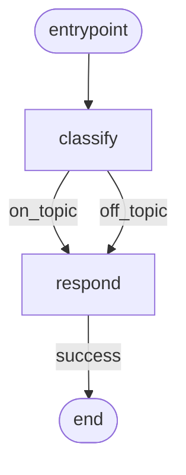

# Example: Linear DAG

A minimal two-node chain: `classify → respond → END`. Demonstrates the core pattern: define a state class, implement nodes, build a DAG config, and await the execution.

## Flow



## Code

```ts
/**
 * 01-linear — minimal node chain.
 *
 *   classify → respond → END
 *
 * Run: npx tsx examples/01-linear.ts
 */

import {
  NodeStateBase,
  Dagonizer,
} from '../src/index.js';
import type { DAG, NodeInterface } from '../src/index.js';

class ChatState extends NodeStateBase {
  input = '';
  reply = '';
  topic: 'on_topic' | 'off_topic' = 'on_topic';
}

const classify: NodeInterface<ChatState, 'on_topic' | 'off_topic'> = {
  "name": 'classify',
  "outputs": ['on_topic', 'off_topic'],
  async execute(state) {
    state.topic = state.input.toLowerCase().includes('weather') ? 'off_topic' : 'on_topic';
    return { "output": state.topic };
  },
};

const respond: NodeInterface<ChatState, 'success'> = {
  "name": 'respond',
  "outputs": ['success'],
  async execute(state) {
    state.reply = state.topic === 'on_topic'
      ? `Echo: ${state.input}`
      : `I only talk about coding, not the weather.`;
    return { "output": 'success' };
  },
};

const dag: DAG = {
  "name": 'chat',
  "version": '1',
  "entrypoint": 'classify',
  "nodes": [
    { "type": 'single', "name": 'classify', "node": 'classify',
      "outputs": { "on_topic": 'respond', "off_topic": 'respond' } },
    { "type": 'single', "name": 'respond', "node": 'respond',
      "outputs": { "success": null } },
  ],
};

const dispatcher = new Dagonizer<ChatState>();
dispatcher.registerNode(classify);
dispatcher.registerNode(respond);
dispatcher.registerDAG(dag);

const state = new ChatState();
state.input = 'How do I declare a const in TypeScript?';
await dispatcher.execute('chat', state);
process.stdout.write(`${state.reply}\n`);
```

## What it demonstrates

- `NodeStateBase` subclass with typed domain fields (`input`, `reply`, `topic`).
- `NodeInterface<TState, TOutput>` with a narrowed output union (`'on_topic' | 'off_topic'`).
- Both outputs of `classify` route to the same next node — conditional branching does not require separate downstream nodes.
- `await dispatcher.execute(...)` is the one-shot pattern. The state is mutated in place; read it after the await.
- `result.cursor === null` after a normal completion — no resume needed.

## See also

- [Subclassing State](../guide/subclassing)
- [DAGBuilder](../guide/builder) — same DAG via the chainable API → [Example 06](./06-builder)

## Related reference

- [Reference: Dagonizer](../reference/dagonizer)
- [Reference: Entities — `SingleNode`](../reference/entities)
