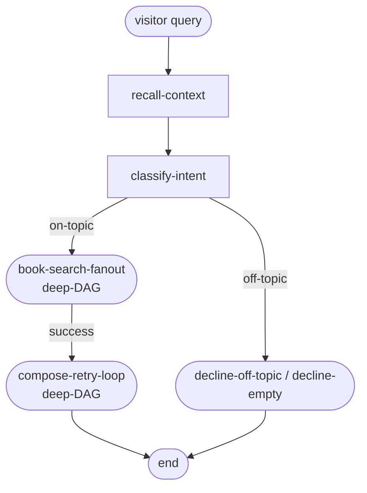

# Phase 01 · Linear intake

The simplest slice of [The Archivist](./the-archivist): wire a dispatcher, register its nodes and DAGs in dependency order, execute one visitor query, and read the lifecycle result. The full runner is below — this is the real code.

## Flow

## Code

The `#linear-run` region covers the dispatcher construction, molecular deep-DAG registration, and the `execute` call that drives the full flow:

<<< ../../examples/the-archivist/runArchivist.ts#linear-run

## What it demonstrates

⦿ **Molecular registration order** — deep-DAG nodes must be registered before their DAG is registered (`registerBookSearchFanoutNodes` → `dispatcher.registerDAG(BookSearchFanoutDAG)`), and both deep-DAGs before the parent `archivistDAG`. The dispatcher validates all node references at registration time.
⦿ **Single execute call** — `dispatcher.execute('the-archivist', visitor)` drives the entire multi-branch flow. The caller sees one `ExecutionResult<ArchivistState>` containing the final state and lifecycle.
⦿ **Lifecycle result** — `result.state.lifecycle.kind` is `'completed'`, `'cancelled'`, or `'timed_out'`. Nodes never throw; the dispatcher always returns.
⦿ **Services bag** — every node receives `context.services` (LLM, search tools, memory, logger). Nodes never construct their own clients.

See this in action in the [Archivist live demo](./the-archivist).
