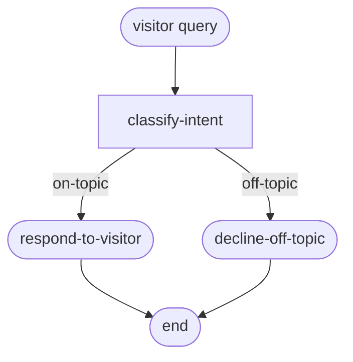

# Phase 01 · Linear intake

The simplest slice of [The Archivist](./the-archivist): classify the visitor's question, then route to one of two terminal nodes — answer the question or politely decline.

## Flow



## Code

```ts
import { Dagonizer } from '@noocodex/dagonizer';
import type { DAG } from '@noocodex/dagonizer';

import { ArchivistState } from '../the-archivist/ArchivistState.ts';
import { classifyIntent } from '../the-archivist/nodes/classifyIntent.ts';
import { declineOffTopic, respondToVisitor } from '../the-archivist/nodes/respondToVisitor.ts';
import type { ArchivistServices } from '../the-archivist/services.ts';

const dag: DAG = {
  name: 'archivist-intake',
  version: '1.0',
  entrypoint: 'classify-intent',
  nodes: [
    { type: 'single', name: 'classify-intent', node: 'classify-intent',
      outputs: { 'on-topic': 'respond', 'off-topic': 'decline' } },
    { type: 'single', name: 'respond', node: 'respond-to-visitor',
      outputs: { success: null } },
    { type: 'single', name: 'decline', node: 'decline-off-topic',
      outputs: { success: null } },
  ],
};

const dispatcher = new Dagonizer<ArchivistState, ArchivistServices>({ services });
dispatcher.registerNode(classifyIntent);
dispatcher.registerNode(respondToVisitor);
dispatcher.registerNode(declineOffTopic);
dispatcher.registerDAG(dag);

const visitor = new ArchivistState();
visitor.query = "What's a good cosmic-horror novella?";
const result = await dispatcher.execute('archivist-intake', visitor);

console.log(result.state.intent);          // 'search'
console.log(result.state.lifecycle.kind);  // 'completed'
```

## What it demonstrates

- **Single-node placements** with explicit output routing.
- **Narrowed `TOutput` union** on `NodeInterface<ArchivistState, 'on-topic' | 'off-topic', ArchivistServices>` — TypeScript exhaustiveness-checks the `outputs` map at compile time.
- **Terminal routing** with `null` — the dispatcher stops cleanly when an output routes to nothing.
- **The services bag** — `classifyIntent` calls `context.services.llm.classifyIntent(state.query)`; the node never instantiates its own LLM client.

## See also

- [Running domain: The Archivist](./the-archivist)
- [Phase 02 · Fan-out scout](./02-fanout) — add the parallel scout layer
- [DAGBuilder](../guide/builder)
- [Reference: Dagonizer](../reference/dagonizer)
- [Reference: Entities — `SingleNode`](../reference/entities)
