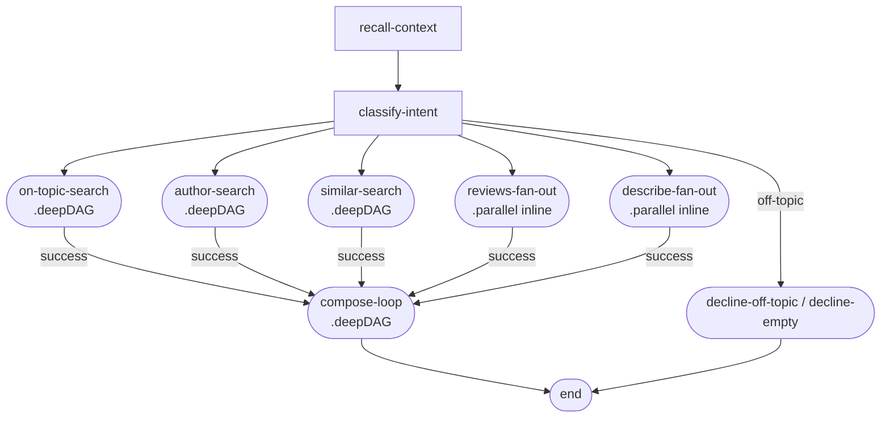

# Phase 02 · DAGBuilder

The same [Archivist](./the-archivist) DAG, authored with the chainable `DAGBuilder` API. The builder is a thin layer over plain-object DAG configs — `.build()` returns the exact same `DAG` data structure the dispatcher consumes. The win is compile-time exhaustiveness: each `.node(name, nodeImpl, routes)` call narrows `routes` to the node's `TOutput` union, so TypeScript flags any missing or stray output mapping before the code ships.

## Flow

## Code

The complete `archivistDAG` — the parent DAG as a single DAGBuilder chain. The full source file includes inline branches for reviews and describe (which use distinct post-scout ranking steps):

<<< ../../examples/the-archivist/dag.ts

## What it demonstrates

- **Chainable authoring** — every `.node()`, `.parallel()`, and `.deepDAG()` returns `this` for fluent composition. The chain calls `build()` once at the end to produce the plain `DAG` object.
- **Compile-time route exhaustiveness** — the `routes` argument is typed as `Record<TOutput, null | string>`. TypeScript catches missing outputs (forgot `'error'`) and stray outputs (typo in output name) at compile time.
- **Auto-entrypoint** — the first `.node()` call (`'recall-context'`) sets the DAG entrypoint automatically. Override with `.entrypoint(name)` if needed.
- **Deep-DAG placements via `.deepDAG()`** — `on-topic-search`, `author-search`, `similar-search`, and `compose-loop` are deep-DAG placements. Each references a registered child DAG by name and declares its `stateMapping.output`.
- **Parallel nodes via `.parallel()`** — `reviews-fan-out` and `describe-fan-out` run four scouts concurrently per branch (inlined because they use `rankByRating` / `pickBestMatch` instead of the standard `rankCandidates`).
- **Same output as a literal `DAG`** — `.build()` returns the identical wire shape `Dagonizer.load()` expects. The builder is a convenience layer, not a separate runtime.

See this in action in the [Archivist live demo](./the-archivist).
