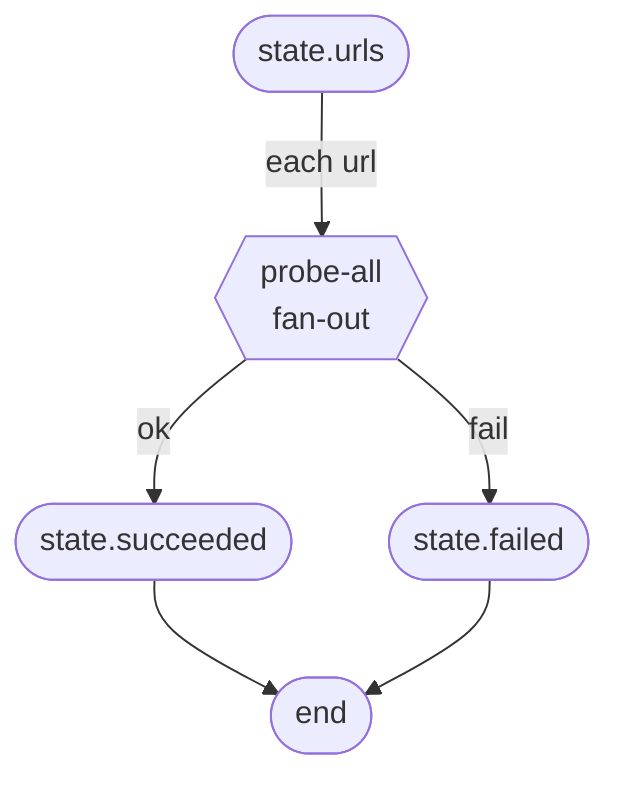

# Example: Fan-Out + Fan-In

Process an array of items in parallel (concurrency 2), partition results into separate state fields by output name.

## Flow



## Code

```ts
/**
 * 02-fanout — fan-out + fan-in.
 *
 * Fans out over an array of URLs (concurrency 2), classifies each as
 * `ok | fail`, partitions results into separate state buckets.
 *
 * Run: npx tsx examples/02-fanout.ts
 */

import {
  NodeStateBase,
  Dagonizer,
} from '../src/index.js';
import type { DAG, NodeInterface } from '../src/index.js';

class ScrapeState extends NodeStateBase {
  urls: string[] = [];
  succeeded: string[] = [];
  failed: string[] = [];
}

const probe: NodeInterface<ScrapeState, 'ok' | 'fail'> = {
  "name": 'probe',
  "outputs": ['ok', 'fail'],
  async execute(state) {
    const url = state.getMetadata<string>('url') ?? '';
    // Fake: even-length URLs succeed, odd fail.
    return { "output": url.length % 2 === 0 ? 'ok' : 'fail' };
  },
};

const dag: DAG = {
  "name": 'scrape',
  "version": '1',
  "entrypoint": 'probe-all',
  "nodes": [
    {
      "type": 'fan-out',
      "name": 'probe-all',
      "node": 'probe',
      "source": 'urls',
      "itemKey": 'url',
      "concurrency": 2,
      "fanIn": { "strategy": 'partition', "partitions": { "ok": 'succeeded', "fail": 'failed' } },
      "outputs": { 'all-success': null, 'partial': null, 'all-error': null, 'empty': null },
    },
  ],
};

const dispatcher = new Dagonizer<ScrapeState>();
dispatcher.registerNode(probe);
dispatcher.registerDAG(dag);

const state = new ScrapeState();
state.urls = ['https://a.example', 'https://bb.example', 'https://ccc.example', 'https://dddd.example'];
await dispatcher.execute('scrape', state);
process.stdout.write(`OK: ${JSON.stringify(state.succeeded)}\n`);
process.stdout.write(`FAIL: ${JSON.stringify(state.failed)}\n`);
```

## What it demonstrates

- The `fan-out` node type reads `state.urls` (dotted path `'urls'`), creates one node call per item.
- `itemKey: 'url'` — each item is written into `state.metadata.url` for the node to read via `state.getMetadata<string>('url')`.
- `concurrency: 2` — at most two items run simultaneously.
- `fanIn.strategy: 'partition'` — results are grouped by output name and written to the dotted paths `state.succeeded` and `state.failed`.
- Aggregate output is `all-success`, `partial`, or `all-error` depending on item counts. All four aggregate outputs route to `null` here (single terminal node).

## See also

- [State accessors](../guide/state-accessor) — `source` and `partitions` paths run through the accessor
- [DAGBuilder — `.fanOut(...)`](../guide/builder)

## Related reference

- [Reference: Core — `FanInStrategy`](../reference/core)
- [Reference: Entities — `FanOutNode`, `FanInConfig`](../reference/entities)
