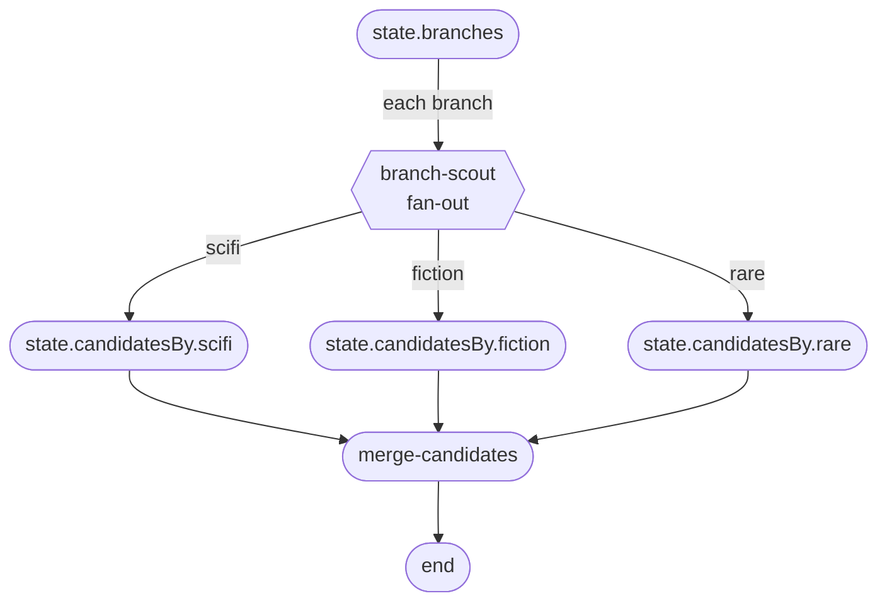

# Phase 02 · Fan-out scout

The [Archivist](./the-archivist) talks to several in-stock catalog branches at once — local sci-fi, local fiction, the rare-books annex. Each branch is independent and reports back a per-branch candidate list. Fan-out runs the catalog scout once per branch with bounded concurrency; fan-in partitions the results into named state buckets so the downstream merge sees them grouped by branch.

## Flow



## Code

```ts
import { Dagonizer } from '@noocodex/dagonizer';
import type { DAG, NodeInterface } from '@noocodex/dagonizer';

import { ArchivistState } from '../the-archivist/ArchivistState.ts';
import { mergeCandidates } from '../the-archivist/nodes/mergeCandidates.ts';
import type { ArchivistServices } from '../the-archivist/services.ts';
import type { Candidate } from '../the-archivist/entities/Book.ts';

// One catalog scout, dispatched per branch the fan-out node fans over.
const branchScout: NodeInterface<ArchivistState, 'scifi' | 'fiction' | 'rare', ArchivistServices> = {
  name: 'branch-scout',
  outputs: ['scifi', 'fiction', 'rare'],
  async execute(state, context) {
    const branch = state.getMetadata<'scifi' | 'fiction' | 'rare'>('branch') ?? 'fiction';
    const hits = await context.services.catalog.search(state.terms);
    // The fan-in 'partition' strategy reads per-output `output` values
    // and pushes the corresponding items into state.candidatesBy[output].
    state.setMetadata('hits', hits.map<Candidate>((book) => ({
      book, source: 'local-catalog', score: book.inStock === true ? 0.95 : 0.7,
    })));
    return { output: branch };
  },
};

const dag: DAG = {
  name: 'archivist-fanout',
  version: '1.0',
  entrypoint: 'branch-scout-all',
  nodes: [
    {
      type: 'fan-out',
      name: 'branch-scout-all',
      node: 'branch-scout',
      source: 'branches',                // state.branches: readonly Branch[]
      itemKey: 'branch',                  // metadata key the worker reads
      concurrency: 3,                     // up to 3 branches at once
      fanIn: {
        strategy: 'partition',
        partitions: {
          scifi:   'candidatesBy.scifi',
          fiction: 'candidatesBy.fiction',
          rare:    'candidatesBy.rare',
        },
      },
      outputs: {
        'all-success': 'merge',
        'partial':     'merge',
        'all-error':   'merge',
        'empty':       'merge',
      },
    },
    { type: 'single', name: 'merge', node: 'merge-candidates',
      outputs: { ranked: null, empty: null } },
  ],
};

const dispatcher = new Dagonizer<ArchivistState, ArchivistServices>({ services });
dispatcher.registerNode(branchScout);
dispatcher.registerNode(mergeCandidates);
dispatcher.registerDAG(dag);

const visitor = new ArchivistState();
visitor.query = 'something like Piranesi';
visitor.terms = ['piranesi', 'labyrinth', 'house'];
(visitor as ArchivistState & { branches: readonly string[] }).branches = ['scifi', 'fiction', 'rare'];

await dispatcher.execute('archivist-fanout', visitor);
```

## What it demonstrates

- **Fan-out placement** — reads `state.branches`, dispatches `branch-scout` once per item with `concurrency: 3`.
- **Partition fan-in strategy** — each per-item `output` ('scifi' / 'fiction' / 'rare') routes the item's metadata into a distinct dotted path on state. Downstream `merge-candidates` reads the unified set without caring which branch produced what.
- **Aggregate routing** — the fan-out node itself reports one of `'all-success' | 'partial' | 'all-error' | 'empty'` so the parent flow can branch on the overall outcome (here all four route to the same merge).
- **State path resolution via `StateAccessor`** — partition targets use dotted paths the dispatcher's accessor walks; swap the accessor to change the path language.

## See also

- [Running domain: The Archivist](./the-archivist)
- [Phase 01 · Linear intake](./01-linear)
- [Phase 03 · Sub-DAG fallback](./03-subflows)
- [Reference: Core — `FanInStrategies`](../reference/core)
- [Reference: Entities — `FanOutNode`, `FanInConfig`](../reference/entities)
