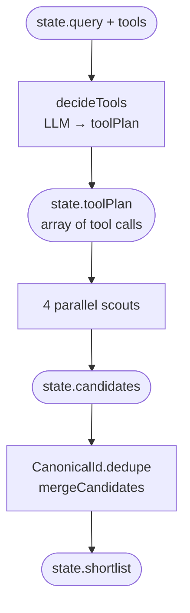

# Phase 03 · Tool schemas

[The Archivist](./the-archivist) exposes its capabilities to the LLM as typed tools with JSON Schema 2020-12 `inputSchema` definitions. `decideTools` hands these schemas to the LLM and asks it to produce a `toolPlan` — a list of `{ name, arguments }` calls the scouts then execute. The schema design principles used here apply to any Dagonizer tool.

## Flow

## Code

### SubjectSearchTool: input schema

The `#tool-schema` region covers the `definition` constant — the tool name, description, and `inputSchema`. Note the `examples` fields: they are intentionally generic placeholders, not real titles or ISBNs. Some models quote schema examples verbatim into responses; shape-only examples prevent that:

<<< ../../examples/the-archivist/tools/SubjectSearchTool.ts#tool-schema

### CanonicalId: cross-source deduplication

Every tool produces `Candidate[]` with a `book.isbn` field set by `CanonicalId.pick`. The same work indexed by OpenLibrary key, Google Books volumeId, and Wikipedia title still deduplicates because `CanonicalId` normalises all three to one stable identifier:

<<< ../../examples/the-archivist/tools/CanonicalId.ts

## What it demonstrates

⦿ **`additionalProperties: true`** — the schema lets the LLM pass extra OpenLibrary parameters (`lang`, `first_publish_year`) without a schema change. Strict mode on input validation would reject them; `additionalProperties: true` allows pass-through.
⦿ **Shape-only `examples`** — `'<subject-or-theme>'`, `'<plot-motif>'` are descriptive placeholders. Never use real data in `examples` fields when the LLM will see the schema — it may copy them back verbatim into responses.
⦿ **`strict: true`** — signals to the Gemini API that the tool definition should be treated as a strict JSON schema. The field is passed through to the model's function declaration.
⦿ **`CanonicalId.pick`** — resolves ISBN-13 → ISBN-10 → `urn:work:<slug>` in priority order. All four scouts call it so `CanonicalId.dedupe` in `mergeCandidates` can collapse cross-source duplicates by the same stable key.
⦿ **`CanonicalId.merge`** — when two candidates share the same canonical id, `merge` unions their authors, subjects, publishers, and `_sources[]` arrays, keeping the richer description and higher score.

See this in action in the [Archivist live demo](./the-archivist).
