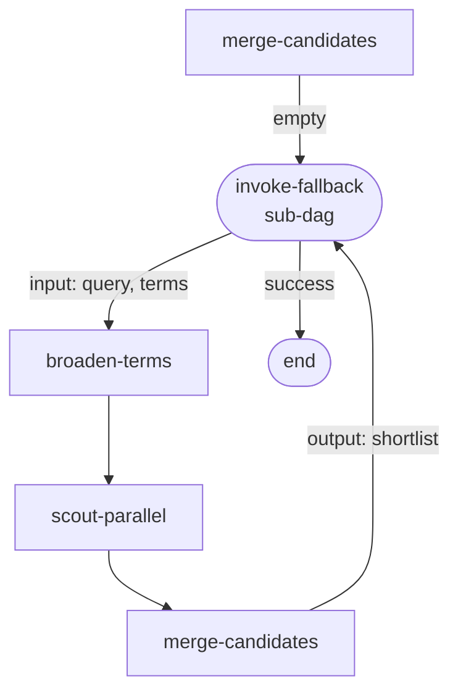

# Phase 03 · Sub-DAG fallback

When [The Archivist](./the-archivist)'s merge returns an empty shortlist, the main flow routes to a nested fallback DAG that broadens the search vocabulary and re-runs the scouts. The fallback runs in isolated state — `stateMapping.input` copies the original query in, `stateMapping.output` writes the broadened candidate set back.

## Flow



## Code

```ts
import { Dagonizer } from '@noocodex/dagonizer';
import type { DAG, NodeInterface } from '@noocodex/dagonizer';

import { ArchivistState } from '../the-archivist/ArchivistState.ts';
import { mergeCandidates } from '../the-archivist/nodes/mergeCandidates.ts';
import { externalRagScout, localCatalogScout } from '../the-archivist/nodes/scouts.ts';
import type { ArchivistServices } from '../the-archivist/services.ts';

// Broaden the search terms — drop short tokens, add synonyms.
const broadenTerms: NodeInterface<ArchivistState, 'success', ArchivistServices> = {
  name: 'broaden-terms',
  outputs: ['success'],
  async execute(state) {
    const broader = state.terms.flatMap((term) =>
      term === 'house'    ? ['house', 'home', 'dwelling']
      : term === 'cosmic' ? ['cosmic', 'eldritch', 'liminal']
      : [term],
    );
    state.terms = [...new Set(broader)];
    return { output: 'success' };
  },
};

// Child DAG — broaden, re-scout, re-merge.
const fallbackDAG: DAG = {
  name: 'archivist-fallback',
  version: '1.0',
  entrypoint: 'broaden',
  nodes: [
    { type: 'single', name: 'broaden', node: 'broaden-terms',
      outputs: { success: 'scout-local' } },
    { type: 'single', name: 'scout-local', node: 'local-catalog-scout',
      outputs: { success: 'scout-rag', empty: 'scout-rag' } },
    { type: 'single', name: 'scout-rag', node: 'external-rag-scout',
      outputs: { success: 'merge', empty: 'merge' } },
    { type: 'single', name: 'merge', node: 'merge-candidates',
      outputs: { ranked: null, empty: null } },
  ],
};

// Parent DAG — primary merge; on empty, invoke the fallback sub-DAG.
const parentDAG: DAG = {
  name: 'archivist-with-fallback',
  version: '1.0',
  entrypoint: 'merge',
  nodes: [
    { type: 'single', name: 'merge', node: 'merge-candidates',
      outputs: { ranked: null, empty: 'fallback' } },
    {
      type: 'sub-dag',
      name: 'fallback',
      dag: 'archivist-fallback',
      stateMapping: {
        // Copy the original query + terms into the child execution.
        input:  { query: 'query', terms: 'terms' },
        // Copy the broadened shortlist back into the parent.
        output: { shortlist: 'shortlist' },
      },
      outputs: { success: null, error: null },
    },
  ],
};

const dispatcher = new Dagonizer<ArchivistState, ArchivistServices>({ services });
dispatcher.registerNode(broadenTerms);
dispatcher.registerNode(localCatalogScout);
dispatcher.registerNode(externalRagScout);
dispatcher.registerNode(mergeCandidates);
dispatcher.registerDAG(fallbackDAG);
dispatcher.registerDAG(parentDAG);

const visitor = new ArchivistState();
visitor.query = 'something cosmic about a house';
visitor.terms = ['cosmic', 'house'];
// (Pretend the primary scouts returned nothing.)

await dispatcher.execute('archivist-with-fallback', visitor);
console.log(visitor.shortlist.length); // broadened candidates from the fallback
```

## What it demonstrates

- **Sub-DAG placement** — the parent dispatches a registered child DAG as a nested call.
- **`stateMapping.input` / `output`** — explicit field copies between parent and child state. Other parent fields stay isolated from the child's mutations.
- **Errors and warnings bubble up** — anything the child collects via `state.collectError` / `state.collectWarning` reaches the parent's accumulators automatically.
- **Same node registry** — `merge-candidates` is registered once and reused in both DAGs.

## See also

- [Running domain: The Archivist](./the-archivist)
- [Phase 02 · Fan-out scout](./02-fanout)
- [State accessors](../guide/state-accessor) — `stateMapping` paths route through the accessor
- [Reference: Entities — `SubDAGNode`](../reference/entities)
