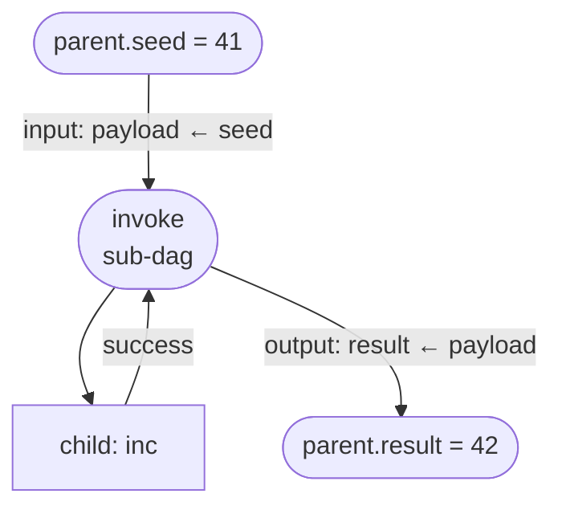

# Example: Sub-DAGs

Invoke a child DAG from a parent DAG with input/output node state mapping. `stateMapping.input` copies fields from the parent node state into the child node state before the sub-DAG runs. `stateMapping.output` copies fields from the child node state back into the parent after the sub-DAG returns.

## Flow



## Code

```ts
/**
 * 03-subflows — nested DAG with input/output node state mapping.
 *
 *   parent: dispatch → enrich(sub-DAG) → END
 *
 * The sub-DAG increments a number; parent maps its `seed` in and `result` out.
 *
 * Run: npx tsx examples/03-subflows.ts
 */

import {
  NodeStateBase,
  Dagonizer,
} from '../src/index.js';
import type { DAG, NodeInterface } from '../src/index.js';

class S extends NodeStateBase {
  seed = 0;
  result = 0;
  payload = 0;
}

const increment: NodeInterface<S, 'success'> = {
  "name": 'increment',
  "outputs": ['success'],
  async execute(state) {
    state.payload = state.payload + 1;
    return { "output": 'success' };
  },
};

const child: DAG = {
  "name": 'child',
  "version": '1',
  "entrypoint": 'inc',
  "nodes": [
    { "type": 'single', "name": 'inc', "node": 'increment', "outputs": { "success": null } },
  ],
};

const parent: DAG = {
  "name": 'parent',
  "version": '1',
  "entrypoint": 'invoke',
  "nodes": [
    {
      "type": 'sub-dag',
      "name": 'invoke',
      "dag": 'child',
      "stateMapping": {
        // stateMapping.input copies fields from the parent node state into the
        // child node state before the sub-DAG runs.
        "input": { "payload": 'seed' },
        // stateMapping.output copies fields from the child node state back into
        // the parent after the sub-DAG returns.
        "output": { "result": 'payload' },
      },
      "outputs": { "success": null, "error": null },
    },
  ],
};

const dispatcher = new Dagonizer<S>();
dispatcher.registerNode(increment);
dispatcher.registerDAG(child);
dispatcher.registerDAG(parent);

const state = new S();
state.seed = 41;
await dispatcher.execute('parent', state);
process.stdout.write(`seed=${state.seed} → result=${state.result}\n`); // 41 → 42
```

## What it demonstrates

- `sub-dag` node invokes a second registered DAG as a nested call.
- `stateMapping.input` copies fields from the parent node state into the child node state before the sub-DAG runs. Here `parentState.seed` is written into `childState.payload`.
- `stateMapping.output` copies fields from the child node state back into the parent after the sub-DAG returns. Here `childState.payload` is written back into `parentState.result`.
- The child operates on a cloned node state — changes to the child's lifecycle and errors do not propagate automatically (errors and warnings do bubble up, lifecycle does not).
- Both child and parent DAGs use the same node registry — register `increment` once.

## See also

- [State accessors](../guide/state-accessor) — `stateMapping` paths route through the accessor
- [DAGBuilder — `.subDAG(...)`](../guide/builder)

## Related reference

- [Reference: Entities — `SubDAGNode`](../reference/entities)
