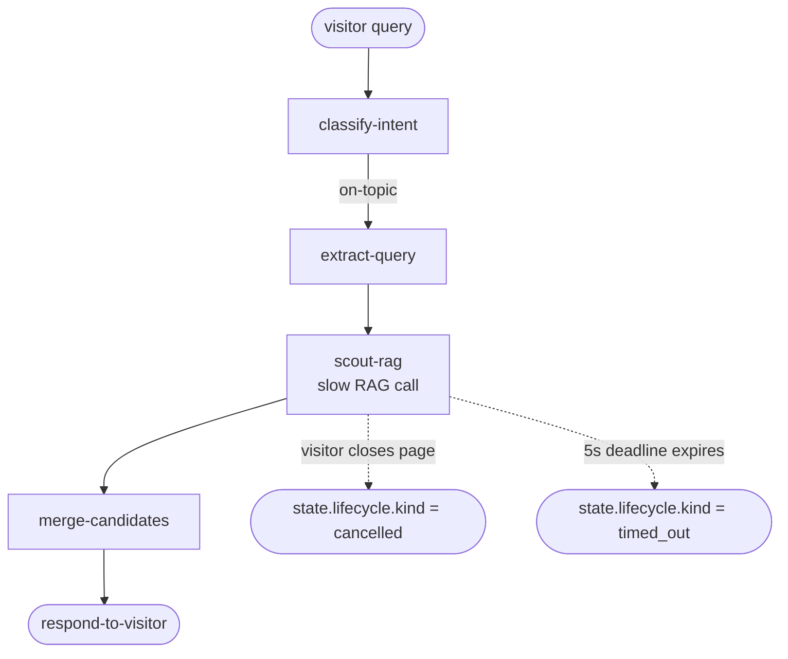

# Phase 04 · Cancellation

[The Archivist](./the-archivist) sometimes talks to a slow external RAG provider. When the visitor closes the page, the dispatcher must abort cleanly — every node sees the signal flip and skips its work, the state's lifecycle marks `cancelled`, and the cursor records exactly where the run stopped so a later resume is possible.

## Flow



## Code

```ts
import { Dagonizer } from '@noocodex/dagonizer';
import { archivistDAG } from '../the-archivist/dag.ts';
// ... register all nodes from the runArchivist demo ...

const controller = new AbortController();

// Caller-driven abort — fire 800ms in.
setTimeout(() => controller.abort('visitor closed page'), 800);

const visitor = new ArchivistState();
visitor.query = 'something about a labyrinth';

const result = await dispatcher.execute('the-archivist', visitor, {
  signal:     controller.signal,
  deadlineMs: 5000,                   // hard 5s budget regardless
});

const lc = result.state.lifecycle;
switch (lc.kind) {
  case 'completed':
    console.log('responded:', result.state.draft);
    break;
  case 'cancelled':
    console.log('visitor abandoned the request:', lc.reason);
    break;
  case 'timed_out':
    console.log('hit the 5s deadline at', lc.finishedAt);
    break;
}

// result.cursor tells us where to resume from if we want to.
if (result.cursor !== null) {
  console.log(`stopped at ${result.cursor} — checkpointable`);
}
```

## What it demonstrates

- **Signal + deadline composition** — `SignalComposer` combines `signal` and `deadlineMs` into a single `AbortSignal` passed to every node via `context.signal`.
- **Nodes propagate the signal** — `externalRagScout` passes `context.signal` to its `RetryPolicy.run` call, so retries abort instead of waiting through the backoff window.
- **Lifecycle records the exact terminal state** — `cancelled` carries the abort `reason`; `timed_out` carries the deadline-finished timestamp.
- **`result.cursor`** records the next node that would have run — pair with `Checkpoint.from` (see [Phase 08](./08-checkpoint)) to resume in a later process.

## See also

- [Running domain: The Archivist](./the-archivist)
- [Cancellation guide](../guide/cancellation)
- [Phase 05 · Retry compose](./05-retry) — `RetryPolicy.run` honors the same signal
- [Phase 08 · Checkpoint + resume](./08-checkpoint)
- [Reference: Runtime — `SignalComposer`](../reference/runtime)
- [Reference: Lifecycle](../reference/lifecycle)
