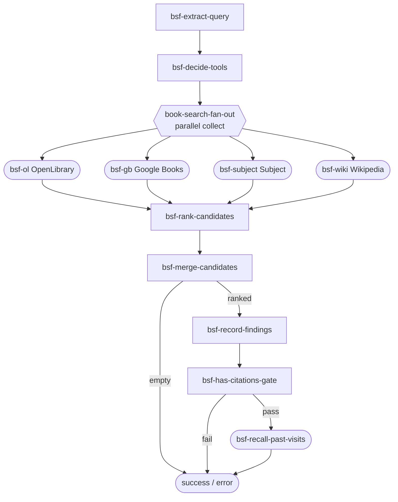

# Phase 04 · Fan-out scout

[The Archivist](./the-archivist) queries four book sources at once: OpenLibrary keyword search, Google Books, OpenLibrary subject search, and Wikipedia enrichment. All four scouts run in a `parallel` placement with `combine: 'collect'` — the fan-in waits for all four and merges their `state.candidates` mutations before routing forward to rank and merge. The `BookSearchFanoutDAG` packages this entire cluster as a reusable deep-DAG.

## Flow

## Code

The complete `BookSearchFanoutDAG` — the actual deep-DAG the Archivist places three times for on-topic, author, and similar-search branches:

<<< ../../examples/the-archivist/deepdags/BookSearchFanoutDAG.ts

## What it demonstrates

⦿ **`parallel` placement** — `.parallel('book-search-fan-out', ['bsf-ol', 'bsf-gb', 'bsf-subject', 'bsf-wiki'], 'collect', routes)` runs all four scout nodes concurrently. `combine: 'collect'` waits for every branch and merges their state mutations before routing forward.
⦿ **Scout gating via `state.toolPlan`** — each scout checks `state.toolPlan` before making a network call. `decideTools` (an LLM call) populates the plan; scouts that find no matching plan entry return `'empty'` immediately. `wikipediaScout` is the exception — it runs on terms alone, always.
⦿ **`scoutRetry` pass-through** — every scout calls `scoutRetry.run(() => tool.execute(..., context.signal), context.signal)`. The signal propagates from the dispatcher through the retry policy — if the parent flow is cancelled, retries abort mid-backoff.
⦿ **Aggregate routing** — the `parallel` node reports `'success'`, `'error'`, or a partial aggregate once all branches settle. Both `'success'` and `'error'` route to `bsf-rank-candidates` here — the cluster always attempts ranking regardless of partial failures.
⦿ **Molecular `registerBookSearchFanoutNodes`** — the exported helper registers the exact node set the deep-DAG needs. Call it before `dispatcher.registerDAG(BookSearchFanoutDAG)`.

See this in action in the [Archivist live demo](./the-archivist).
