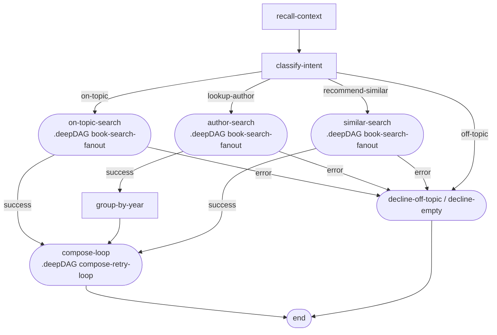

# Phase 05 · Deep-DAG composition

[The Archivist](./the-archivist) uses two packaged deep-DAGs:

⦿ **`book-search-fanout`** — the full 4-source scout cluster (extract query, decide tools, 4 parallel scouts, rank, merge, record, gate, recall). Placed three times in the parent: `on-topic-search`, `author-search`, and `similar-search`.
⦿ **`compose-retry-loop`** — the compose / validate / retry / respond terminal. Placed once as `compose-loop`; every successful search branch converges on it.

The parent DAG references both deep-DAGs by name via `.deepDAG(placementName, dagName, routes, options)`. Each placement has its own `stateMapping.output` that copies the deep-DAG's writes back into the named parent state fields.

## Flow

## Deep-DAG: the packaged fan-out cluster

<<< ../../examples/the-archivist/deepdags/BookSearchFanoutDAG.ts

## Parent DAG: the deep-DAG placements

The `#deepdag-placements` region covers only the `.deepDAG(...)` calls — the three placements of `book-search-fanout` and the one placement of `compose-retry-loop`:

<<< ../../examples/the-archivist/dag.ts#deepdag-placements

## What it demonstrates

⦿ **`.deepDAG(name, dagName, routes, options)`** — the placement references the deep-DAG by its registered name. The parent and child run in the same dispatcher; the child shares the same node registry.
⦿ **`stateMapping.output`** — after the deep-DAG completes, the dispatcher copies the listed fields from the child's final state back into the parent state. Fields not listed stay isolated.
⦿ **One definition, three placements** — `book-search-fanout` is registered once and placed three times with distinct placement names. Each placement routes its `'success'` / `'error'` outputs differently (`compose-loop`, `group-by-year`, or `decline-empty`).
⦿ **Errors bubble up** — anything the child collects via `state.collectError` reaches the parent's error accumulator automatically. The `executeDeepDAG` router uses child-state errors to decide the `'error'` output.
⦿ **`registerBookSearchFanoutNodes` / `registerComposeRetryLoopNodes`** — each deep-DAG module exports a helper that registers exactly the nodes it needs. Call both before registering the parent DAG.

See this in action in the [Archivist live demo](./the-archivist).
