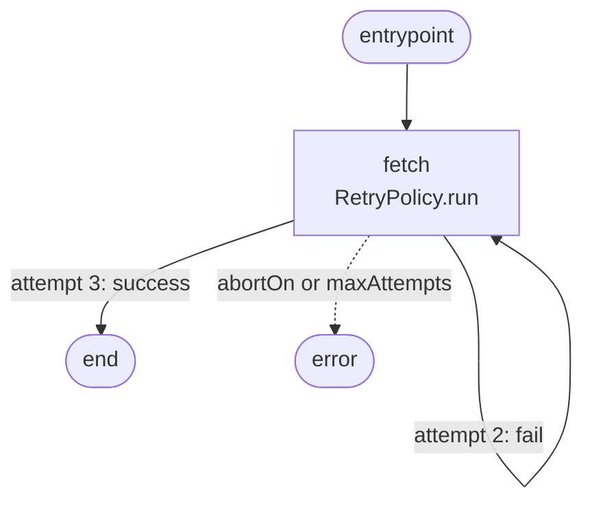

# Example: Retry

A flaky downstream that fails twice then succeeds. The node wraps the call in `RetryPolicy.run()`, which cooperates with the dispatcher's abort signal.

## Flow



## Code

```ts
/**
 * 05-retry — `RetryPolicy` inside a node.
 *
 * A flaky downstream fails twice then succeeds. The node wraps the call
 * in `RetryPolicy.run()` which cooperates with the dispatcher's abort signal.
 *
 * Run: npx tsx examples/05-retry.ts
 */

import {
  BackoffStrategy,
  NodeStateBase,
  Dagonizer,
  RetryPolicy,
} from '../src/index.js';
import type { DAG, NodeInterface } from '../src/index.js';

class TransientError extends Error { constructor() { super('transient'); } }

let flakyAttempts = 0;
const flakyDownstream = async (): Promise<string> => {
  flakyAttempts++;
  if (flakyAttempts < 3) throw new TransientError();
  return 'OK';
};

class S extends NodeStateBase {
  result = '';
}

const fetchNode: NodeInterface<S, 'success' | 'error'> = {
  "name": 'fetch',
  "outputs": ['success', 'error'],
  async execute(state, context) {
    const policy = new RetryPolicy({
      "maxAttempts": 5,
      "strategy": BackoffStrategy.EXPONENTIAL,
      "baseDelay": 50,
      "jitterFactor": 0,
      "retryOn": [TransientError],
    });
    try {
      state.result = await policy.run(flakyDownstream, context.signal);
      return { "output": 'success' };
    } catch {
      return { "output": 'error' };
    }
  },
};

const dag: DAG = {
  "name": 'retry-dag',
  "version": '1',
  "entrypoint": 'fetch',
  "nodes": [
    { "type": 'single', "name": 'fetch', "node": 'fetch',
      "outputs": { "success": null, "error": null } },
  ],
};

const dispatcher = new Dagonizer<S>();
dispatcher.registerNode(fetchNode);
dispatcher.registerDAG(dag);

const state = new S();
await dispatcher.execute('retry-dag', state);
process.stdout.write(`attempts=${flakyAttempts} result=${state.result}\n`);
```

## What it demonstrates

- `RetryPolicy` is instantiated inside `execute()`. Each node call gets a fresh policy instance — nodes are stateless.
- `retryOn: [TransientError]` — only `TransientError` instances trigger a retry. Other errors propagate immediately.
- `context.signal` is passed to `policy.run()` — if the dispatcher's abort signal fires during a backoff wait, the wait resolves early and the retry loop stops.
- `jitterFactor: 0` disables random jitter for reproducible delays in examples and tests. In production, leave jitter enabled to spread retry traffic.
- The node returns `'error'` if all attempts are exhausted. The DAG routes both `'success'` and `'error'` to `null` — the caller inspects `state.result` after execution.

## See also

- [Retry](../guide/retry)
- [Cancellation](../guide/cancellation)

## Related reference

- [Reference: Runtime — `RetryPolicy`, `BackoffStrategy`](../reference/runtime)
- [Reference: Contracts — `RetryPolicyOptionsInterface`](../reference/contracts)
