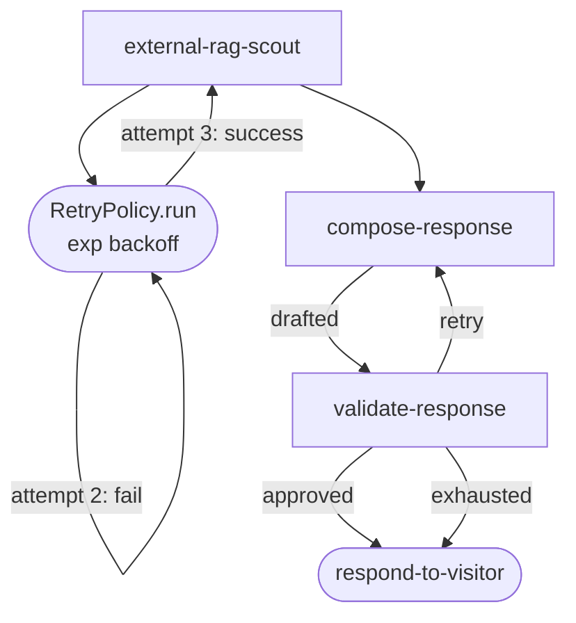

# Phase 05 · Retry compose

[The Archivist](./the-archivist) exercises two distinct retry shapes:

1. **Per-call retry** — `externalRagScout` wraps its RAG fetch in `RetryPolicy.run`, so a flaky upstream is automatically retried with exponential backoff before the node reports `success` or `empty`.
2. **DAG-level retry loop** — `validateResponse` routes back to `compose-response` when the draft fails the quality check, bounded by `state.attempts.compose` so the loop terminates instead of spinning.

Two different shapes, neither one throws — the dispatcher always sees a named output.

## Flow



## Code

### Per-call retry (inside the node)

```ts
import { BackoffStrategy, RetryPolicy } from '@noocodex/dagonizer/runtime';

const ragRetry = new RetryPolicy({
  maxAttempts: 2,
  strategy: BackoffStrategy.EXPONENTIAL,
  baseDelay: 250,
});

export const externalRagScout: NodeInterface<ArchivistState, 'success' | 'empty', ArchivistServices> = {
  name: 'external-rag-scout',
  outputs: ['success', 'empty'],
  async execute(state, context) {
    try {
      const candidates = await ragRetry.run(
        () => context.services.rag.retrieve(state.terms),
        context.signal,                  // cooperates with the dispatcher's abort
      );
      state.candidates = [...state.candidates, ...candidates];
      return { output: candidates.length > 0 ? 'success' : 'empty' };
    } catch (error) {
      state.collectError({
        code: 'RAG_RETRIEVE_FAILED',
        message: error instanceof Error ? error.message : String(error),
        operation: 'external-rag-scout',
        recoverable: true,
        timestamp: new Date().toISOString(),
      });
      return { output: 'empty' };
    }
  },
};
```

### DAG-level retry loop (compose ↔ validate)

```ts
const composeLoopDAG: DAG = {
  name: 'archivist-compose-loop',
  version: '1.0',
  entrypoint: 'compose',
  nodes: [
    { type: 'single', name: 'compose', node: 'compose-response',
      outputs: { drafted: 'validate' } },
    { type: 'single', name: 'validate', node: 'validate-response',
      outputs: {
        approved:  'respond',
        retry:     'compose',              // route back — bounded by state.attempts.compose
        exhausted: 'respond',               // best-effort response
      } },
    { type: 'single', name: 'respond', node: 'respond-to-visitor',
      outputs: { success: null } },
  ],
};
```

## What it demonstrates

- **`RetryPolicy.run(task, signal)`** — composable per-call retry with `EXPONENTIAL` / `LINEAR` / `CONSTANT` / `DECORRELATED_JITTER` backoff. Aborts mid-wait when the signal fires.
- **Bounded loop modeled in the DAG itself** — the validate node routes back to compose; the bound is read off `state.attempts.compose`. No special "loop" placement type.
- **Best-effort fallback** — `validateResponse` distinguishes `retry` (try again) from `exhausted` (give up but still respond). The visitor always gets something.
- **`RetryPolicy.retryOn` / `abortOn`** — filter which error classes retry; an `AuthError` aborts immediately.

## See also

- [Running domain: The Archivist](./the-archivist)
- [Retry guide](../guide/retry)
- [Phase 04 · Cancellation](./04-cancellation)
- [Reference: Runtime — `RetryPolicy`, `BackoffStrategy`](../reference/runtime)
- [Reference: Contracts — `RetryPolicyOptionsInterface`](../reference/contracts)
