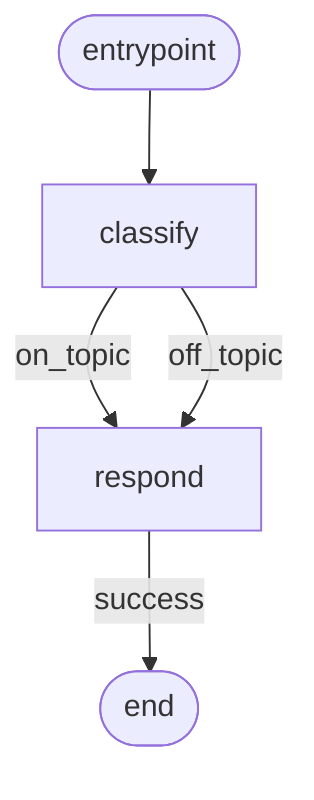

# Example: DAGBuilder

Builds the same DAG as the linear example using the chainable `DAGBuilder` API. Output routing is exhaustiveness-checked at compile time.

## Flow



## Code

```ts
/**
 * 06-builder — `DAGBuilder` chainable API.
 *
 * Builds the same DAG as 01-linear but via the builder. Outputs are
 * exhaustiveness-checked at compile time when the node declares a
 * narrow TOutput union.
 *
 * Run: npx tsx examples/06-builder.ts
 */

import {
  NodeStateBase,
  Dagonizer,
  DAGBuilder,
} from '../src/index.js';
import type { NodeInterface } from '../src/index.js';

class ChatState extends NodeStateBase {
  input = '';
  reply = '';
  topic: 'on_topic' | 'off_topic' = 'on_topic';
}

const classify: NodeInterface<ChatState, 'on_topic' | 'off_topic'> = {
  "name": 'classify',
  "outputs": ['on_topic', 'off_topic'],
  async execute(state) {
    state.topic = state.input.toLowerCase().includes('weather') ? 'off_topic' : 'on_topic';
    return { "output": state.topic };
  },
};

const respond: NodeInterface<ChatState, 'success'> = {
  "name": 'respond',
  "outputs": ['success'],
  async execute(state) {
    state.reply = state.topic === 'on_topic'
      ? `Echo: ${state.input}`
      : `I only talk about coding, not the weather.`;
    return { "output": 'success' };
  },
};

const dag = new DAGBuilder('chat', '1')
  .node('classify', classify, { "on_topic": 'respond', "off_topic": 'respond' })
  .node('respond', respond, { "success": null })
  .build();

const dispatcher = new Dagonizer<ChatState>();
dispatcher.registerNode(classify);
dispatcher.registerNode(respond);
dispatcher.registerDAG(dag);

const state = new ChatState();
state.input = 'What is a generic type parameter?';
await dispatcher.execute('chat', state);
process.stdout.write(`${state.reply}\n`);
```

## What it demonstrates

- `new DAGBuilder('chat', '1')` starts the chain. The first `.node()` call automatically sets the entrypoint.
- `.node(name, dagNode, routes)` — the third argument is typed as `Record<TOutput, string | null>`, so missing output keys are TypeScript errors at the call site.
- `.build()` materializes the accumulated nodes into a `DAG`. The returned value is identical to a hand-written plain object.
- The builder is a thin layer — nodes are still registered on the dispatcher separately.

## See also

- [DAGBuilder](../guide/builder)
- [Example 01: Linear DAG](./01-linear) — same flow, written as a plain object

## Related reference

- [Reference: Entities — `DAG`, `SingleNode`](../reference/entities)
