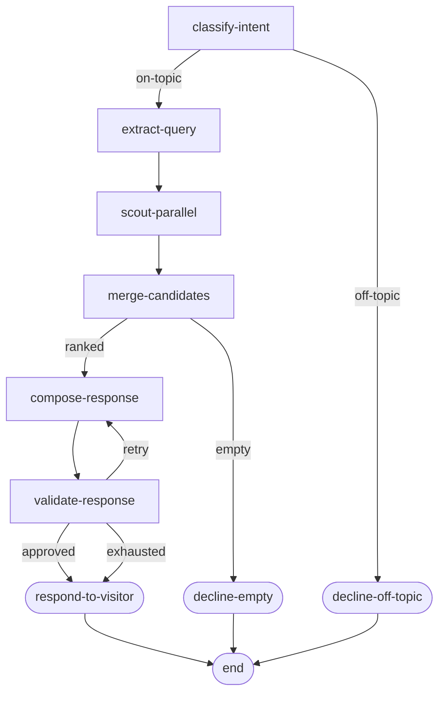

# Phase 06 · DAGBuilder

The same [Archivist](./the-archivist) DAG, authored with the chainable `DAGBuilder` API. The builder is a thin layer over plain-object DAG configs — `.build()` returns the exact same `DAG` data structure the dispatcher consumes. The win is compile-time exhaustiveness: each `.node(name, dagNode, routes)` call narrows `routes` to the node's `TOutput` union, so TypeScript flags any missing or stray output mapping.

## Flow



## Code

```ts
import { DAGBuilder, Dagonizer } from '@noocodex/dagonizer';

import { ArchivistState } from '../the-archivist/ArchivistState.ts';
import { classifyIntent } from '../the-archivist/nodes/classifyIntent.ts';
import { composeResponse, validateResponse } from '../the-archivist/nodes/composeResponse.ts';
import { extractQuery } from '../the-archivist/nodes/extractQuery.ts';
import { mergeCandidates } from '../the-archivist/nodes/mergeCandidates.ts';
import { declineEmpty, declineOffTopic, respondToVisitor } from '../the-archivist/nodes/respondToVisitor.ts';
import { externalRagScout, localCatalogScout } from '../the-archivist/nodes/scouts.ts';
import type { ArchivistServices } from '../the-archivist/services.ts';

const dag = new DAGBuilder('the-archivist', '1.0')
  .node('classify',   classifyIntent,   { 'on-topic': 'extract', 'off-topic': 'decline-off' })
  .node('extract',    extractQuery,     { success: 'scout-group' })
  .parallel('scout-group', ['scout-local', 'scout-rag'], 'collect',
    { success: 'merge', error: 'merge' })
  .node('scout-local', localCatalogScout, { success: null, empty: null })
  .node('scout-rag',   externalRagScout,  { success: null, empty: null })
  .node('merge',       mergeCandidates,   { ranked: 'compose', empty: 'decline-empty' })
  .node('compose',     composeResponse,   { drafted: 'validate' })
  .node('validate',    validateResponse,  { approved: 'respond', retry: 'compose', exhausted: 'respond' })
  .node('respond',     respondToVisitor,  { success: null })
  .node('decline-off', declineOffTopic,   { success: null })
  .node('decline-empty', declineEmpty,    { success: null })
  .build();

const dispatcher = new Dagonizer<ArchivistState, ArchivistServices>({ services });
// ...register nodes...
dispatcher.registerDAG(dag);
```

## What it demonstrates

- **Chainable authoring** — every `.node()` / `.parallel()` / `.fanOut()` / `.subDAG()` returns `this` for fluent composition.
- **Compile-time route exhaustiveness** — the `routes` argument is typed as `Record<TOutput, null | string>`. Drop a route, TypeScript fails. Add a stray output, TypeScript fails.
- **Same output as a literal `DAG`** — `.build()` returns the same plain object the dispatcher consumes. The builder is a convenience layer, not a separate runtime.
- **Auto-entrypoint** — the first `.node()` call sets the entrypoint. Override with `.entrypoint(name)` if needed.

## See also

- [Running domain: The Archivist](./the-archivist)
- [DAGBuilder guide](../guide/builder)
- [Phase 07 · JSON DAG load](./07-schema) — same DAG loaded from a JSON file instead
- [Reference: Entities — `DAG`, `SingleNode`, `ParallelNode`](../reference/entities)
