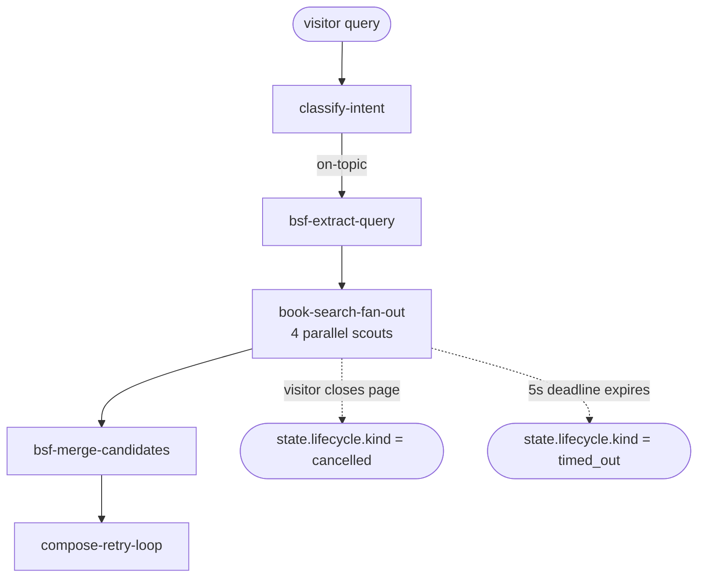

# Phase 06 · Cancellation

[The Archivist](./the-archivist) sometimes talks to slow external APIs. When the visitor closes the page, the dispatcher aborts cleanly — every node that is mid-network call sees the signal flip, skips its work, and the lifecycle records `cancelled` with the abort reason. A `deadlineMs` cap adds a hard ceiling regardless of the signal.

## Flow

## Code

### Dispatcher + signal + deadline

The `#cancellation-run` region shows the `AbortController`, the `signal` + `deadlineMs` execute options, and the lifecycle switch that reads the terminal state:

<<< ../../examples/the-archivist/runArchivist.ts#cancellation-run

### Scout signal pass-through

The `#signal-scout` region shows how `openLibraryScout` propagates `context.signal` through the `scoutRetry` policy and into the tool call — when the signal fires, the retry policy aborts mid-backoff instead of waiting:

<<< ../../examples/the-archivist/nodes/scouts.ts#signal-scout

## What it demonstrates

⦿ **`signal` + `deadlineMs` composition** — `SignalComposer` combines the caller-supplied `AbortSignal` with the deadline into one internal signal passed to every node via `context.signal`. Neither option is required; both can be used together.
⦿ **Nodes propagate the signal** — every scout passes `context.signal` as the second argument to `scoutRetry.run(task, signal)`. The retry policy aborts mid-wait when the signal fires, so scouts do not wait through the full backoff window.
⦿ **Lifecycle records the exact terminal state** — `cancelled` carries the abort `reason` string; `timed_out` carries the deadline-finished timestamp. `completed` means all nodes ran to their terminal outputs.
⦿ **`result.cursor`** — records the next node that would have run. When non-null, the flow was interrupted. Pair with `Checkpoint.from` (see [Phase 08](./08-checkpoint)) to resume in a later process.

See this in action in the [Archivist live demo](./the-archivist) — the cancel button fires the same `AbortController.abort()` path.
