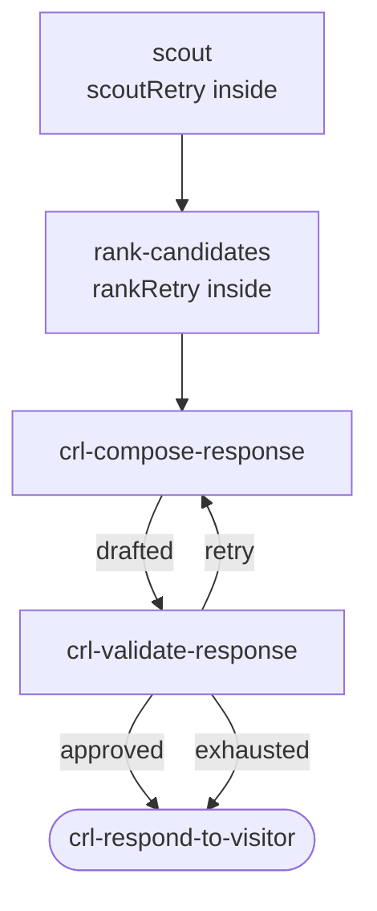

# Phase 07 · Retry

[The Archivist](./the-archivist) exercises two distinct retry shapes:

1. **Per-call retry** — every scout and the LLM ranker wrap their external calls in `RetryPolicy.run`, so transient failures (network errors, malformed LLM JSON) are automatically retried with exponential backoff before the node reports its output.
2. **DAG-level retry loop** — `validateResponse` routes back to `compose-response` when the draft fails the quality check, bounded by `state.attempts.compose` so the loop terminates instead of spinning.

Neither shape throws. The dispatcher always sees a named output.

## Flow

## Code

### Per-call retry: scouts

The `#scout-retry` region shows the `scoutRetry` policy used by all four scouts — exponential backoff, 2 max attempts, signal-aware:

<<< ../../examples/the-archivist/nodes/scouts.ts#scout-retry

### Per-call retry: LLM ranking

The `#rank-retry` region shows the `rankRetry` policy used by `rankCandidates` — same shape, wrapping the LLM rank call so schema-violation responses get a second chance:

<<< ../../examples/the-archivist/nodes/rankCandidates.ts#rank-retry

### DAG-level retry loop

The complete `ComposeRetryLoopDAG` — a bounded compose → validate → retry loop built from plain `.node()` routes:

<<< ../../examples/the-archivist/deepdags/ComposeRetryLoopDAG.ts

## What it demonstrates

- **`RetryPolicy.run(task, signal)`** — composable per-call retry with `EXPONENTIAL` / `LINEAR` / `CONSTANT` / `DECORRELATED_JITTER` backoff. The second argument is `context.signal`; the policy aborts mid-backoff when the signal fires (see [Phase 06](./06-cancellation)).
- **Bounded loop modeled in the DAG itself** — `validateResponse` routes `'retry'` back to `'crl-compose-response'`. The bound is tracked on `state.attempts.compose` inside the node — no special loop placement type.
- **Best-effort fallback** — `'exhausted'` and `'approved'` both route to `crl-respond-to-visitor`. The visitor always gets a response; the dispatcher never throws on exhaustion.
- **Ranking is best-effort too** — if `rankRetry` exhausts without a valid score, the `catch` block routes `'ranked'` with zero-scored candidates so `mergeCandidates` can still soft-gate.

See this in action in the [Archivist live demo](./the-archivist).
