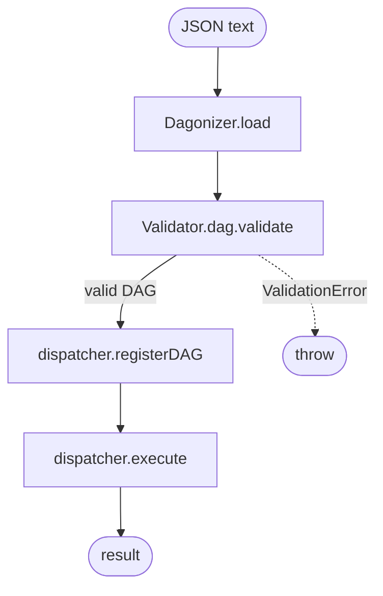

# Example: Schema Loading

Load a DAG from a JSON string, validate against `DAGSchema`, then execute. Demonstrates error handling for malformed input and a round-trip serialization check.

## Flow



## Code

```ts
/**
 * 07-schema — load a DAG from a JSON string, validate against
 * `DAGSchema`, then execute.
 *
 * The runtime validator catches malformed JSON at the ingest boundary
 * before any semantic checks. ValidationError carries every Ajv failure as
 * a formatted `<instancePath>: <message>` line.
 *
 * Run: npx tsx examples/07-schema.ts
 */

import {
  NodeStateBase,
  Dagonizer,
  ValidationError,
} from '../src/index.js';
import type { NodeInterface } from '../src/index.js';

const echo: NodeInterface<NodeStateBase, 'success'> = {
  "name": 'echo',
  "outputs": ['success'],
  async execute(state) {
    state.setMetadata('seen', true);
    return { "output": 'success' };
  },
};

const dagJson = `{
  "name": "from-json",
  "version": "1",
  "entrypoint": "echo",
  "nodes": [
    { "type": "single", "name": "echo", "node": "echo", "outputs": { "success": null } }
  ]
}`;

const dag = Dagonizer.load(dagJson);
process.stdout.write(`loaded: ${dag.name} v${dag.version}\n`);

const dispatcher = new Dagonizer<NodeStateBase>();
dispatcher.registerNode(echo);
dispatcher.registerDAG(dag);

const state = new NodeStateBase();
await dispatcher.execute('from-json', state);
process.stdout.write(`ran DAG; seen = ${String(state.getMetadata('seen'))}\n`);

// Round-trip: serialize → load yields an equivalent DAG.
const roundTripped = Dagonizer.load(Dagonizer.serialize(dag));
process.stdout.write(`round-trip equal: ${String(JSON.stringify(roundTripped) === JSON.stringify(dag))}\n`);

// Malformed input is rejected with a ValidationError listing each Ajv failure.
try {
  Dagonizer.load('{ "name": "broken" }');
} catch (error) {
  if (error instanceof ValidationError) {
    process.stdout.write(`validation error path works: ${error.message.split('\n')[0]}\n`);
  }
}
```

## What it demonstrates

- `Dagonizer.load(text)` is the single permitted ingest boundary for external DAG JSON. It calls `JSON.parse`, then validates against `DAGSchema` (Ajv 2020-12).
- `ValidationError` carries a multi-line message with one `<instancePath>: <message>` entry per Ajv failure.
- `Dagonizer.serialize(dag)` serializes a validated DAG to pretty-printed JSON. The round-trip produces an equivalent object.
- The `Dagonizer.fromValue(obj)` variant accepts an already-parsed value (e.g., from a YAML loader).
- `state.setMetadata` / `state.getMetadata` are the correct way for nodes to store untyped cross-node data.

## See also

- [Schema & JSON loading](../guide/schema)
- [DAGBuilder](../guide/builder) — author in code instead of loading JSON

## Related reference

- [Reference: Validation — `Validator.dag`](../reference/validation)
- [Reference: Errors — `ValidationError`](../reference/errors)
