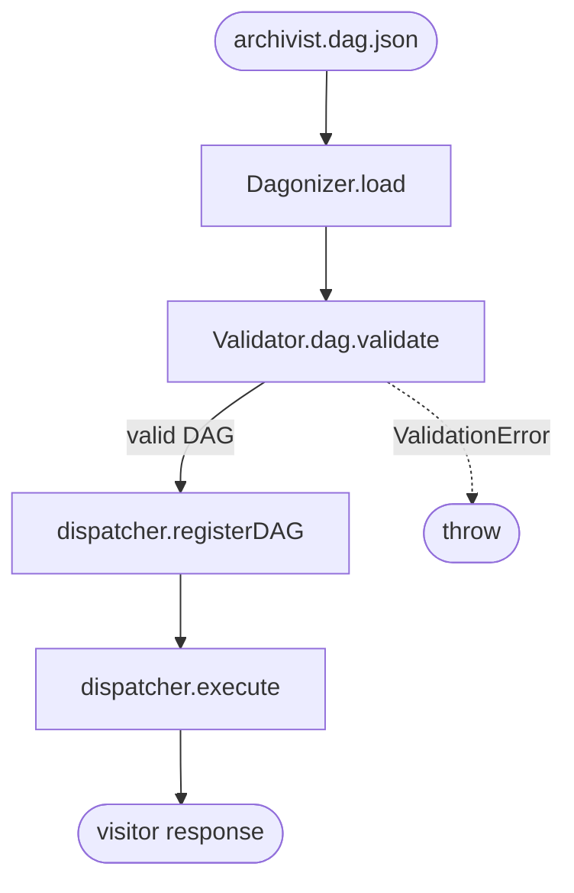

# Phase 07 · JSON DAG load

[The Archivist](./the-archivist) DAG can live in version control as a JSON document — useful when the DAG topology changes per deployment (different shops carry different scout backends). `Dagonizer.load(json)` parses + validates against `DAGSchema` in one call; `Validator.dag.is(value)` is the predicate alternative that doesn't throw.

## Flow



## Code

```ts
import { readFileSync } from 'node:fs';
import { Dagonizer, ValidationError } from '@noocodex/dagonizer';
import { Validator } from '@noocodex/dagonizer/validation';

import { ArchivistState } from '../the-archivist/ArchivistState.ts';
import type { ArchivistServices } from '../the-archivist/services.ts';

const json = readFileSync('./archivist.dag.json', 'utf8');

try {
  const dag = Dagonizer.load(json);
  const dispatcher = new Dagonizer<ArchivistState, ArchivistServices>({ services });
  // ...register every Archivist node...
  dispatcher.registerDAG(dag);
  await dispatcher.execute('the-archivist', new ArchivistState());
} catch (error) {
  if (error instanceof ValidationError) {
    console.error('archivist DAG schema error:', error.message);
    process.exit(1);
  }
  throw error;
}

// Predicate alternative — doesn't throw.
const raw: unknown = JSON.parse(json);
if (Validator.dag.is(raw)) {
  // raw is narrowed to DAG here
}
```

### Sample `archivist.dag.json`

```json
{
  "name": "the-archivist",
  "version": "1.0",
  "entrypoint": "classify-intent",
  "nodes": [
    { "type": "single", "name": "classify-intent", "node": "classify-intent",
      "outputs": { "on-topic": "extract-query", "off-topic": "decline-off-topic" } },
    { "type": "single", "name": "extract-query", "node": "extract-query",
      "outputs": { "success": "scout-parallel" } },
    { "type": "parallel", "name": "scout-parallel",
      "nodes": ["scout-local", "scout-rag"], "combine": "collect",
      "outputs": { "success": "merge-candidates", "error": "merge-candidates" } },
    { "type": "single", "name": "merge-candidates", "node": "merge-candidates",
      "outputs": { "ranked": "compose-response", "empty": "decline-empty" } }
  ]
}
```

## What it demonstrates

- **`Dagonizer.load(json)`** — single boundary that runs `JSON.parse` + `Validator.dag.validate` and returns a typed `DAG`. The only place `unknown` enters the package.
- **`ValidationError` vs `DAGError`** — schema failures throw `ValidationError` (subclass of `DAGError` with `code: 'VALIDATION_ERROR'`). Semantic failures (unknown node refs, output wiring gaps, circular sub-DAG refs) throw `DAGError`.
- **`Validator.dag.is(value)`** — typed predicate for callers who want to inspect without throwing.
- **`registerDAG` runs the schema pre-pass internally** so even hand-built DAGs are validated before being trusted.

## See also

- [Running domain: The Archivist](./the-archivist)
- [Schema & JSON loading guide](../guide/schema)
- [Phase 06 · DAGBuilder](./06-builder) — the same DAG authored in code
- [Reference: Validation — `Validator.dag`](../reference/validation)
- [Reference: Errors — `ValidationError`](../reference/errors)
