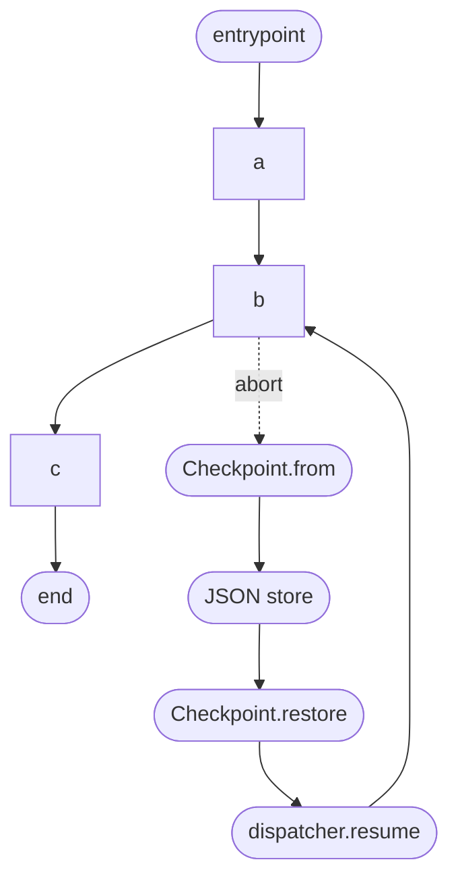

# Example: Checkpoint Resume

Full checkpoint cycle: run partway, abort, persist the checkpoint as JSON, restore the state, and resume from the cursor. Final state matches a non-interrupted run.

## Flow



## Code

```ts
/**
 * 08-checkpoint — abort → snapshot → restore → resume.
 *
 * Demonstrates the full checkpoint cycle: run partway, abort, persist the
 * checkpoint (as JSON), parse it back, rehydrate state, and resume from
 * the cursor. Final state matches a non-interrupted run.
 *
 * Run: npx tsx examples/08-checkpoint.ts
 */

import type { JsonObject } from '../src/entities/json.js';
import {
  NodeStateBase,
  Checkpoint,
  Dagonizer,
} from '../src/index.js';
import type { DAG, NodeInterface } from '../src/index.js';

class CountingState extends NodeStateBase {
  count = 0;
  log: string[] = [];

  protected override snapshotData(): JsonObject {
    return { "count": this.count, "log": [...this.log] };
  }

  protected override restoreData(snapshot: JsonObject): void {
    const c = snapshot['count'];
    if (typeof c === 'number') this.count = c;
    const l = snapshot['log'];
    if (Array.isArray(l)) this.log = l.filter((x): x is string => typeof x === 'string');
  }
}

const inc: NodeInterface<CountingState, 'success'> = {
  "name": 'inc',
  "outputs": ['success'],
  async execute(state) {
    state.count++;
    state.log.push(`tick:${state.count}`);
    return { "output": 'success' };
  },
};

const dag: DAG = {
  "name": 'count',
  "version": '1',
  "entrypoint": 'a',
  "nodes": [
    { "type": 'single', "name": 'a', "node": 'inc', "outputs": { "success": 'b' } },
    { "type": 'single', "name": 'b', "node": 'inc', "outputs": { "success": 'c' } },
    { "type": 'single', "name": 'c', "node": 'inc', "outputs": { "success": null } },
  ],
};

const dispatcher = new Dagonizer<CountingState>();
dispatcher.registerNode(inc);
dispatcher.registerDAG(dag);

// Partial run: abort after the first node.
const ctl = new AbortController();
const initial = new CountingState();
const execution = dispatcher.execute('count', initial, { "signal": ctl.signal });
let stages = 0;
for await (const _stage of execution) {
  stages++;
  if (stages === 1) ctl.abort(new Error('pause'));
}
const partial = await execution;
process.stdout.write(`partial: count=${partial.state.count} cursor=${partial.cursor}\n`);

// Persist the checkpoint as JSON.
const checkpoint = Checkpoint.from('count', partial);
const persisted = Checkpoint.toJson(checkpoint);

// ... time passes, process restarts, etc. ...

// Restore + resume.
const parsed = JSON.parse(persisted) as unknown;
const { state, dagName, cursor } = Checkpoint.restore(parsed, (snap) => CountingState.restore(snap));
process.stdout.write(`restored: count=${state.count} cursor=${cursor}\n`);

const resumed = await dispatcher.resume(dagName, state, cursor);
process.stdout.write(`resumed: count=${resumed.state.count} log=${JSON.stringify(resumed.state.log)}\n`);
```

## What it demonstrates

- `CountingState` overrides `snapshotData()` to include domain fields in the checkpoint, and `restoreData()` to restore them.
- The execution is iterated in streaming mode. After the first node completes, `ctl.abort()` stops the DAG. The `for await` loop ends; `await execution` returns the cached partial result.
- `Checkpoint.from('count', partial)` throws if `partial.cursor` is `null` — this example aborts after exactly one node so the cursor is always `'b'`.
- `Checkpoint.toJson(checkpoint)` produces a JSON string. In a real system, store it in a database, KV store, or message envelope.
- `Checkpoint.restore(parsed, factory)` validates the raw JSON against `CheckpointDataSchema`, then calls the factory to rehydrate the state class.
- `dispatcher.resume(dagName, state, cursor)` is identical to `execute()` except it begins at `cursor` instead of the DAG's entrypoint. The resumed execution is a fresh lifecycle run from `pending`.
- Final `resumed.state.count === 3` and `resumed.state.log` contains all three ticks, matching a non-interrupted run.

## See also

- [Checkpoint](../guide/checkpoint)
- [Persistence](../guide/persistence) — `CheckpointStore` + `Checkpoint.persist` / `Checkpoint.recall`
- [Cancellation](../guide/cancellation) — produce the cursor that gets checkpointed

## Related reference

- [Reference: Checkpoint](../reference/checkpoint)
- [Reference: Contracts — `CheckpointStore`](../reference/contracts)
