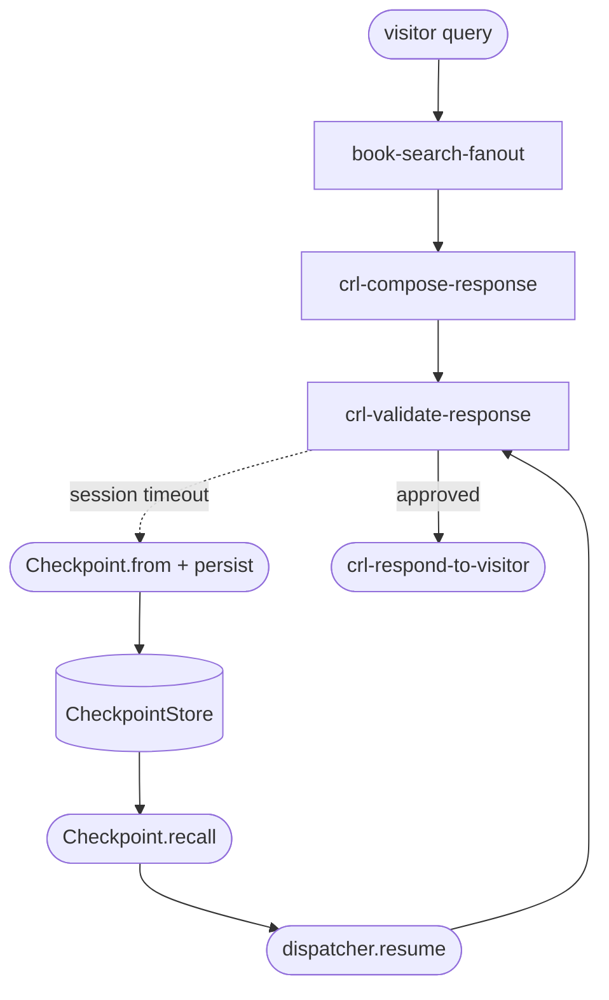

# Phase 08 · Checkpoint + resume

The compose / validate loop in [The Archivist](./the-archivist) is the most expensive segment — multiple LLM calls per attempt. If the visitor's session times out mid-loop, the dispatcher records the cursor (`crl-compose-response` or `crl-validate-response`), the partial draft, and the attempt counter. A later process recalls the checkpoint and finishes the response without paying for the upstream scouts again.

The `ArchivistState` makes this possible by overriding `snapshotData()` and `restoreData()` — the two methods `NodeStateBase` calls during `Checkpoint.from` and `Checkpoint.recall`.

## Flow



## Code

### State snapshot round-trip

The `#snapshot-restore` region covers `snapshotData()` and `restoreData()` — the two methods that serialize and rehydrate the domain fields (`query`, `intent`, `terms`, `candidates`, `shortlist`, `draft`, `approved`, `attempts`, `recalledContext`, `memoryDigest`):

<<< ../../examples/the-archivist/ArchivistState.ts#snapshot-restore

### Cancellation → checkpoint → resume

The `#cancellation-run` region in the runner shows the execute call with `signal` and `deadlineMs`, the cursor check after cancellation, and how to read the lifecycle kind:

<<< ../../examples/the-archivist/runArchivist.ts#cancellation-run

## Persist and resume (illustrative)

The persist and resume calls below use the standard `Checkpoint` API with `MemoryCheckpointStore` — swap to any `CheckpointStore` implementation (Postgres, Redis, S3) without changing the calling code:

```ts
// illustrative — runtime equivalent in examples/the-archivist/runArchivist.ts
import { Checkpoint, MemoryCheckpointStore } from '@noocodex/dagonizer/checkpoint';

const store = new MemoryCheckpointStore();

// After a cancelled/timed-out execute call:
if (result.cursor !== null) {
  const data = Checkpoint.from('the-archivist', result);
  await Checkpoint.persist(store, `archivist:${result.state.query}`, data);
}

// In a later process:
const recalled = await Checkpoint.recall(
  store,
  `archivist:${visitor.query}`,
  (snap) => ArchivistState.restore(snap),  // rehydrates via restoreData()
);

if (recalled !== null) {
  const final = await dispatcher.resume(
    recalled.dagName,
    recalled.state,
    recalled.cursor,                       // 'crl-validate-response'
  );
  console.log(final.state.draft);          // validated response
  console.log(final.state.lifecycle.kind); // 'completed'
}
```

## What it demonstrates

- **`ArchivistState.snapshotData()` / `restoreData()`** — domain-specific serialization. `NodeStateBase` calls `snapshotData` during `Checkpoint.from` and `restoreData` during `Checkpoint.recall`. The lifecycle resets to `pending` on restore; the resumed execution is a fresh lifecycle run on the recovered state data.
- **`Checkpoint.from(dagName, result)`** — produces a `CheckpointData` record only when `result.cursor !== null` (an in-progress flow). A completed flow produces no cursor.
- **`CheckpointStore` adapter contract** — `MemoryCheckpointStore` is the test-time implementation. Swap to Postgres / Redis / S3 without touching the dispatcher or state.
- **`Checkpoint.persist` / `Checkpoint.recall`** — codec + store in one call per side. `Checkpoint.recall` returns `null` when nothing is stored under the key.
- **`dispatcher.resume(dagName, state, cursor)`** — starts from the recalled cursor instead of the DAG's entrypoint. The compose/validate retry counter (`state.attempts.compose`) survives the round-trip so the loop is still bounded.

See this in action in the [Archivist live demo](./the-archivist).

## See also

- [Running domain: The Archivist](./the-archivist)
- [Checkpoint guide](../guide/checkpoint)
- [Persistence guide](../guide/persistence) — Postgres example for `CheckpointStore`
- [Phase 04 · Cancellation](./04-cancellation) — produces the cursor that this phase checkpoints
- [Reference: Checkpoint](../reference/checkpoint)
- [Reference: Contracts — `CheckpointStore`](../reference/contracts)
