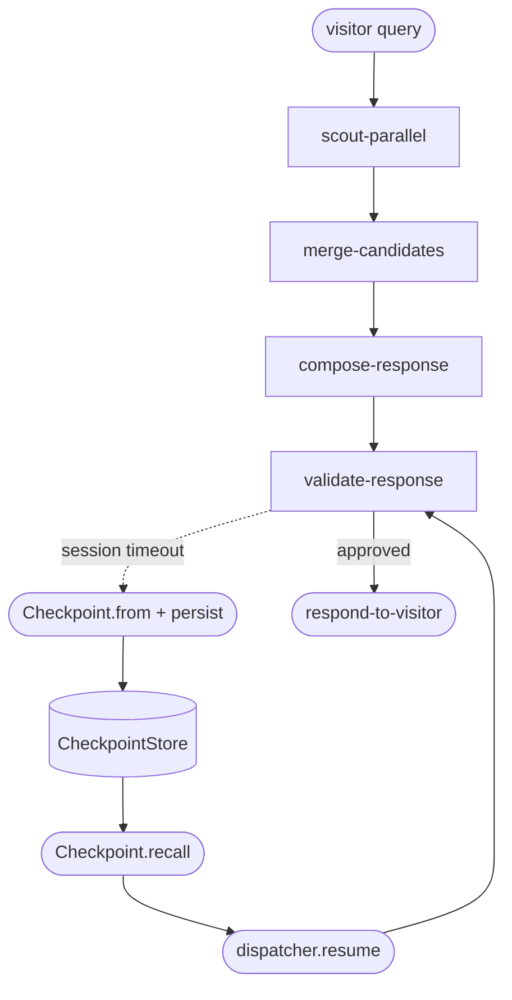

# Phase 08 · Checkpoint + resume

The compose / validate loop in [The Archivist](./the-archivist) is the most expensive segment — multiple LLM calls per attempt. If the visitor's session times out mid-loop, the dispatcher records the cursor (`compose-response` or `validate-response`), the partial draft, and the attempt counter; a later process recalls the checkpoint and finishes the response without paying for the upstream scouts again.

## Flow



## Code

### Persist mid-flow

```ts
import { Checkpoint, MemoryCheckpointStore } from '@noocodex/dagonizer/checkpoint';
import { archivistDAG } from '../the-archivist/dag.ts';

const store = new MemoryCheckpointStore();
const controller = new AbortController();

// Simulate the visitor's session ending while compose/validate runs.
setTimeout(() => controller.abort('session timeout'), 2000);

const visitor = new ArchivistState();
visitor.query = 'something like Piranesi';

const result = await dispatcher.execute('the-archivist', visitor, {
  signal: controller.signal,
});

if (result.cursor !== null) {
  // result.cursor is e.g. 'validate-response' — the next node that would run.
  const data = Checkpoint.from('the-archivist', result);
  await Checkpoint.persist(store, `archivist:${result.state.query}`, data);
}
```

### Recall + resume

```ts
const recalled = await Checkpoint.recall(
  store,
  `archivist:${visitor.query}`,
  (snap) => ArchivistState.restore(snap),       // rehydrates domain fields via snapshotData / restoreData
);

if (recalled !== null) {
  const final = await dispatcher.resume(
    recalled.dagName,
    recalled.state,
    recalled.cursor,                           // 'validate-response'
  );
  console.log(final.state.draft);              // the validated response
  console.log(final.state.lifecycle.kind);     // 'completed'
}
```

### State snapshot round-trip

`ArchivistState.snapshotData()` and `restoreData()` serialize the domain fields (`query`, `intent`, `terms`, `candidates`, `shortlist`, `draft`, `approved`, `attempts`) so the resumed execution sees the same data the aborted one mutated:

```ts
protected override snapshotData(): JsonObject {
  return {
    query: this.query,
    intent: this.intent,
    terms: [...this.terms],
    candidates: this.candidates.map(/* … */),
    shortlist: this.shortlist.map(/* … */),
    draft: this.draft,
    approved: this.approved,
    attempts: { ...this.attempts },
  };
}
```

## What it demonstrates

- **`Checkpoint.from(dagName, result)`** — produces a `CheckpointData` record when `result.cursor !== null` (an in-progress flow).
- **`CheckpointStore` adapter contract** — swap `MemoryCheckpointStore` for a Postgres / Redis / S3 implementation; the dispatcher doesn't care.
- **`Checkpoint.persist` / `Checkpoint.recall`** — codec + store in one call per side. `Checkpoint.recall` returns `null` when nothing is stored under the key.
- **State subclasses round-trip via `snapshotData` / `restoreData`** — Lifecycle resets to `pending` on restore; the resumed execution is a fresh lifecycle run on the recovered state data.
- **`dispatcher.resume(dagName, state, cursor)`** — start from the recalled cursor instead of the DAG's entrypoint. The compose/validate retry counter survives the round-trip so the loop is still bounded.

## See also

- [Running domain: The Archivist](./the-archivist)
- [Checkpoint guide](../guide/checkpoint)
- [Persistence guide](../guide/persistence) — Postgres example for `CheckpointStore`
- [Phase 04 · Cancellation](./04-cancellation) — produces the cursor that this phase checkpoints
- [Reference: Checkpoint](../reference/checkpoint)
- [Reference: Contracts — `CheckpointStore`](../reference/contracts)
