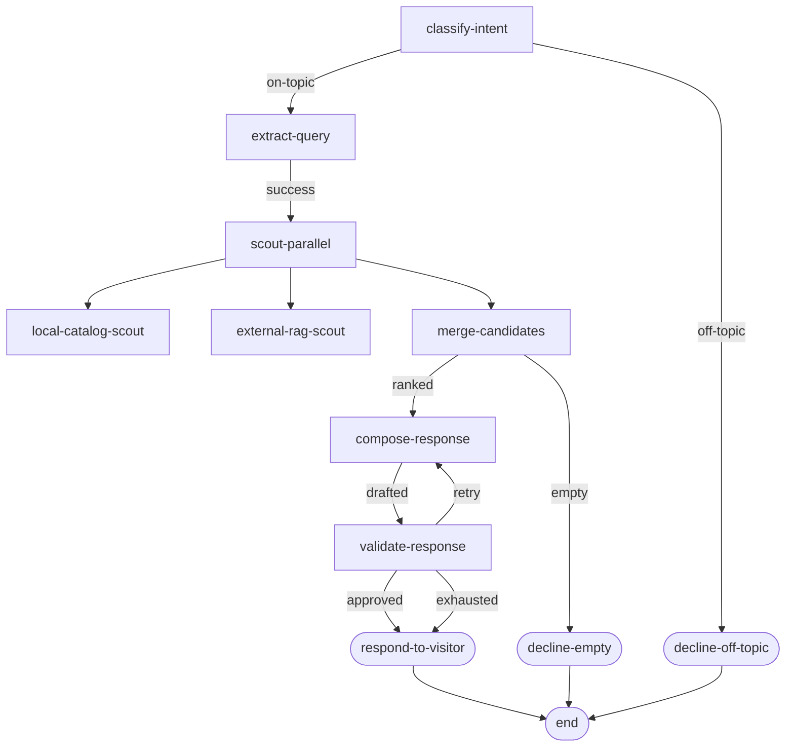

# The Archivist

The Archivist is the running demo every Dagonizer example refers to. It is a bookstore help-bot — a visitor describes a book or asks for a recommendation, and the Archivist composes a response by classifying the question, fanning out across the shop's local catalog and an external RAG provider, merging the candidates, and composing + validating a draft response in a bounded retry loop.

Try it live below — the demo runs in your browser. The runner detects the best LLM backend available (Chrome's built-in Gemini Nano, your Gemini AI Studio key, or the offline stub) and surfaces which one is answering. The DAG itself executes the same nodes shipped in [`examples/the-archivist/`](https://github.com/Studnicky/Dagonizer/tree/main/examples/the-archivist).

## Live demo

<ArchivistRunner />

Watch the **DAG** pane: each node lights cyan while executing, then settles to "completed" with the taken edge highlighted. The **Memory** pane mirrors `state.intent`, `state.terms`, `state.shortlist`, `state.attempts.compose` as the dispatcher mutates them. Everything is driven by the dispatcher's `onFlowStart` / `onNodeStart` / `onNodeEnd` / `onError` / `onFlowEnd` hooks — there is no timer-based animation, the runner is a pure observer of the state machine.

Same shape as Nocturne's concierge / scout pattern, applied to one coherent domain that touches every Dagonizer feature: hard gates, soft gates, parallel placements, retry-loop nodes, services container, checkpoint round-trip, and the Mermaid renderer.

The vocabulary (`Book`, `Isbn`, `Title`, `Money`) mirrors json-tology's [Bookstore domain](https://studnicky.github.io/json-tology/bookstore-domain) so the two demos cross-reference cleanly.

## Flow



## Branches and gates

Three exit conditions, each carrying a different outcome.

| Path | Trigger | Terminal node | What happens |
|------|---------|---------------|--------------|
| **Off-topic hard gate** | `classifyIntent` returns `off-topic` | `decline-off-topic` | Politely redirects the visitor to a book-related question. |
| **Empty soft gate** | `mergeCandidates` produces zero candidates | `decline-empty` | Asks the visitor for more detail; collects a `EMPTY_SHORTLIST` warning. |
| **Best-effort response** | `validateResponse` exhausts `MAX_COMPOSE_ATTEMPTS` | `respond-to-visitor` | Sends the last draft anyway — the dispatcher never throws. |
| **Approved response** | `validateResponse` returns `approved` | `respond-to-visitor` | Normal happy path. |
| **Retry loop** | `validateResponse` returns `retry` | back to `compose-response` | Bounded by the counter on `state.attempts.compose`. |

## Domain files

The full implementation lives under [`examples/the-archivist/`](https://github.com/Studnicky/Dagonizer/tree/main/examples/the-archivist) in the repo. Every docs snippet is excerpted from those files; clone and run them directly.

```
examples/the-archivist/
├── ArchivistState.ts       # NodeStateBase subclass — query, intent, candidates, draft, attempts, toolPlan
├── services.ts             # CatalogReader, RagReader, WebSearchTool, MemoryStore, LlmClient
├── dag.ts                  # Canonical DAG declaration
├── runArchivist.ts         # End-to-end demo runner — picks the best LLM backend at boot
├── entities/
│   └── Book.ts             # Book / Money / Candidate — mirrors json-tology bookstore
├── memory/
│   └── MemoryStore.ts      # n3.js triple store + SPARQL-style ASK/SELECT helpers
├── tools/
│   ├── ToolDefinition.ts   # Tool / ToolDefinition / ToolCall (nocturne contract)
│   └── OpenLibrarySearchTool.ts # Real web search via openlibrary.org (CORS-friendly)
├── logger/
│   └── ConsoleLogger.ts    # Logger service — Node stdout + browser subscriber stream
├── nodes/
│   ├── ArchivistNode.ts    # NodeKind tagging (deterministic vs non-deterministic)
│   ├── classifyIntent.ts   # Entry classifier — hard-gates off-topic
│   ├── extractQuery.ts     # Free-text → search terms
│   ├── decideTools.ts      # LLM decides which tools to invoke (native function-calling)
│   ├── scouts.ts           # localCatalogScout + externalRagScout + webSearchScout (LLM-gated)
│   ├── mergeCandidates.ts  # Dedupe + rank + soft-gate empty
│   ├── recordFindings.ts   # Memory write — triples to the n3 store
│   ├── hasCitationsGate.ts # SPARQL ASK gate — pass only when shortlist is sourced
│   ├── composeResponse.ts  # composeResponse + validateResponse (bounded loop)
│   └── respondToVisitor.ts # 3 terminal nodes
└── providers/
    ├── index.ts                  # detectBackends + pickBestBackend + instantiateProvider
    ├── BaseLlmClient.ts          # Single LlmClient impl on top of any LlmAdapter
    ├── prompts.ts                # Composable directives + prompt builders + output schemas
    └── adapters/                 # ── Provider-agnostic adapter pattern ──
        ├── LlmAdapter.ts           # ChatRequest / ChatResponse / ToolDefinition contract
        ├── LlmError.ts             # Error taxonomy + classifyHttp
        ├── BaseAdapter.ts          # Retry plumbing (RetryPolicy + Retry-After honour)
        ├── GeminiApiAdapter.ts     # Native functionDeclarations + JSON schema
        ├── GeminiNanoAdapter.ts    # Chrome on-device, responseConstraint JSON schema
        ├── WebLlmAdapter.ts        # WebGPU Phi-3.5 via response_format json_object
        └── StubAdapter.ts          # Pattern-match tool calls; canned text otherwise
```

## Running it for real

The Archivist runs against a real model in any of these environments — `detectBackends()` probes each and picks the highest-priority runnable backend:

| Priority | Backend | What it needs |
|---|---|---|
| 1 | **Gemini Nano** (Chrome built-in, local) | Chrome 138+ stable, or any Chrome with the flags below. No key, no network, ~2 GB one-shot model download by Chrome. |
| 2 | **Gemini API** (Google AI Studio free tier) | `GEMINI_API_KEY` env var (Node) or paste-into-form (browser). Free 15 RPM / 1500 RPD on `gemini-2.0-flash`. CORS open from any origin. |
| 3 | **WebLLM** (in-browser, WebGPU) | Browser with `navigator.gpu`. Lazy-loads `@mlc-ai/web-llm` + Phi-3.5 mini (~780 MB) on first use; cached after. |
| 4 | **Stub** | Always available. Hand-coded canned answers. |

### Enable Gemini Nano + tool calling in Chrome

The Archivist asks the LLM to **invoke tools** (currently `web_search_books`,
backed by openlibrary.org). Gemini API uses native `functionDeclarations`;
Chrome's on-device Gemini Nano honours the same plan via the Prompt API's
`responseConstraint` JSON-schema field, which arrived behind feature flags.

1. **Open `chrome://flags`** and enable each of:
   - `#prompt-api-for-gemini-nano` → **Enabled**
   - `#prompt-api-for-gemini-nano-multimodal-input` → **Enabled** (newer flag name in some channels)
   - `#optimization-guide-on-device-model` → **EnabledBypassPerfRequirement**
2. **Restart Chrome.**
3. **Trigger the download.** Visit any page that calls `LanguageModel.create()`
   (this demo will, but you can also paste the snippet below into DevTools):
   ```js
   await LanguageModel.create();
   ```
   Chrome downloads ~2 GB. Status is visible at `chrome://components` — look for
   *Optimization Guide On Device Model*. The widget on this page also surfaces
   `availability()` as **"downloading…"** until ready.
4. **Reload this page** — the backend banner should now read
   *Gemini Nano (Chrome on-device)*.

If the model is still `downloadable` rather than `available` after the steps
above, leave Chrome open for a few minutes — the download runs in the
background and is gated by Chrome's network-condition heuristics.

### Bring-your-own Gemini API key

When Gemini Nano is unavailable, the next-best option is the **Google AI Studio
free tier**:

1. Go to [aistudio.google.com/apikey](https://aistudio.google.com/apikey) and
   click *Create API key*. The free tier covers 15 requests/min and
   1500 requests/day on `gemini-2.0-flash` — plenty for the demo.
2. Paste the key into the *Bring your own Gemini API key* drawer below the
   backend picker. It's stored in `localStorage` only; the request itself
   goes straight from your browser to Google.
3. The runner picks `gemini-api` automatically once a key is present.

CORS is open on the Gemini REST endpoint, so this works from GitHub Pages
or any other static host without a proxy.

### Use the offline stub

If you just want to watch the DAG animate without an LLM, pick
*Canned responses (offline stub)* from the backend dropdown. The stub adapter
pattern-matches the visitor's query and emits a `web_search_books` tool call
when it sees ISBN-like patterns or quoted titles — exercising the same
tool-calling path the real models take, just without the GPU.

---

```bash
# CLI — picks the offline stub when no key is set, Gemini REST when GEMINI_API_KEY is present.
npx tsx examples/the-archivist/runArchivist.ts

# Force Gemini REST with your key:
GEMINI_API_KEY=AIza... npx tsx examples/the-archivist/runArchivist.ts
```

In the browser the umbrella widget surfaces a backend banner ("Running on Gemini Nano (local)" / "Running on Gemini 2.0 Flash (your key)" / etc.) and exposes a dropdown to override the auto-pick.

## Services bag

The Archivist depends on three injected readers:

```ts
interface ArchivistServices {
  readonly catalog: CatalogReader; // local in-stock database
  readonly rag:     RagReader;     // external retrieval-augmented provider
  readonly llm:     LlmClient;     // classify / extract / compose / validate
  readonly logger:  { info, warn };
}
```

Constructed once and handed to `Dagonizer<ArchivistState, ArchivistServices>({ services })`. Every node receives the same reference through `context.services`. Swap stubs for real clients in production; the DAG never changes.

## State

`ArchivistState` extends `NodeStateBase` and adds the per-execution fields the nodes mutate: `query`, `intent`, `terms`, `candidates`, `shortlist`, `draft`, `approved`, `attempts`. `snapshotData()` and `restoreData()` round-trip the domain fields so `Checkpoint.from` / `Checkpoint.restore` work without losing the visitor's question or the half-composed draft.

## Run it

```bash
npx tsx docs/.examples/the-archivist/runArchivist.ts
```

The runner ships stub services that produce a small in-process catalog and a single mock RAG hit, so the demo runs offline.

## What each phase example covers

The eight per-phase example pages each isolate one Dagonizer feature against this domain:

| Phase | Feature | Page |
|-------|---------|------|
| 01 | Linear intake + terminal routing | [Phase 01 · Linear intake](./01-linear) |
| 02 | Fan-out scout with partition fan-in | [Phase 02 · Fan-out scout](./02-fanout) |
| 03 | Sub-DAG fallback for empty results | [Phase 03 · Sub-DAG fallback](./03-subflows) |
| 04 | Abortable visitor request | [Phase 04 · Cancellation](./04-cancellation) |
| 05 | RetryPolicy against the LLM composer | [Phase 05 · Retry compose](./05-retry) |
| 06 | DAGBuilder authoring | [Phase 06 · DAGBuilder](./06-builder) |
| 07 | Loading the DAG from JSON config | [Phase 07 · JSON DAG load](./07-schema) |
| 08 | Checkpoint mid-draft and resume | [Phase 08 · Checkpoint + resume](./08-checkpoint) |

Every page starts from the same `ArchivistState` + `services` + node set; only the DAG variation and the registered subset change.

## See also

- [Concepts](../concepts) — Dagonizer vocabulary the Archivist exercises
- [Architecture](../architecture) — three-tier interface taxonomy
- [Contract-derived flows](../guide/derive) — generate the Archivist DAG from `OperationContract`s
- [Visualization](../guide/visualization) — render the Archivist DAG with `MermaidRenderer.render(dag)`
- [Persistence](../guide/persistence) — wire `Checkpoint.persist` / `Checkpoint.recall` to a `CheckpointStore`
- [json-tology Bookstore domain](https://studnicky.github.io/json-tology/bookstore-domain) — the schema vocabulary the Archivist's `Book` entity mirrors
