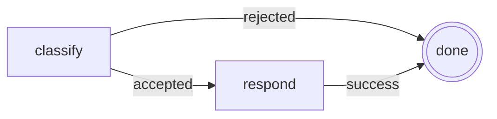

# Getting Started

## What It Is

Getting Started is the shortest honest path from install to a running Dagonizer flow. It uses the same two-node DAG that powers [Example 02: DAGBuilder](./examples/02-builder), then shows the JSON-LD shape it compiles to in [Example 01: Linear DAG](./examples/01-linear).

Read this page when you want one clean loop in your hands: install the package, define a tiny state object, build a DAG, register it, execute it, and understand what comes back. The rest of the docs scale that same loop into browser demos, embedded DAGs, plugin-defined flows, scatter/gather, streaming producers, and checkpoint resume.

## How It Works

Dagonizer splits a workflow into two things that are easy to reason about separately. The **DAG document** declares placement IRIs, entrypoints, and routes. The **registered nodes** contain the TypeScript behavior. The dispatcher joins them at runtime: it validates the graph, looks up registered nodes by their expanded IRI, runs the entrypoint placement, and follows the output route returned by each node.

That separation is the whole trick. You can author with `DAGBuilder`, ship JSON-LD over the wire, inspect the shape as Mermaid, and still keep your actual work in normal TypeScript classes. The tiny example here is a classify/respond chain, but the same registration pattern is what the Archivist, Cartographer, and Dispatcher demos use for real agent and data-pipeline flows. The builder is the spellbook; JSON-LD is the sigil the engine actually reads after `DAGDocument.load(json)` validates it.

### What `execute` returns

`dispatcher.execute()` returns an `Execution<TState>` that is both awaitable and async-iterable.

Awaitable form:

<<< @/../examples/01-linear.ts#execute-await

Async-iterable form, one event per node:

<<< @/../examples/01-linear.ts#execute-iterable

## Diagrams, Examples, and Outputs

The first runnable graph is intentionally small: a start node routes to a response node, then the DAG ends. The point is not the business logic; it is the shape of a Dagonizer flow.



The builder version and the JSON-LD version register the same topology. That is the mental model to keep: builder code is the ergonomic authoring surface, JSON-LD is the canonical assembly, absolute placement IRIs are runtime identity, and Mermaid is the readable shape generated from that same assembly. Names stay for display and observability.

### Next Places To Open

Follow these pages in order if you want the quickstart to expand without changing concepts:

- [Example 02: DAGBuilder](./examples/02-builder) - the fluent builder version used below.
- [Example 01: Linear DAG](./examples/01-linear) - the same flow as direct JSON-LD.
- [The Archivist demo](./examples/the-archivist) - the same engine running an LLM-agent bookstore assistant.
- [The Cartographer demo](./examples/the-cartographer) - the same engine running streaming ETL with no LLM.

## What It Lets You Do

This page gets you to the first useful checkpoint: a DAG you can run, inspect, and modify. After that, the rest of the system stops looking abstract. Scatter is “run this body for each item.” Gather is “join these producer IRIs at a visible barrier.” Embedded DAGs are “call this registered subflow.” Plugins are “ship reusable registered DAG parts.” Checkpointing is “persist the cursor and state when execution stops early.”

It also gives you the right DevEx habit early: keep graph shape explicit. That matters for LLM agents, data science pipelines, ETL jobs, and service orchestration because reviewers can see the route map instead of reverse-engineering control flow from nested callbacks.

## Code Samples

### Install

```bash
npm install @studnicky/dagonizer
```

Requires Node.js 24 or later and TypeScript 5.6 or later with `strict: true`.

### Smallest DAG that runs

The docs use runnable examples as the source of truth. The smallest focused runner is `examples/02-builder.ts`: a two-node chain that picks a route at the first node and ends at the second. It is deliberately small, but it is still a real executable example, not a separate doc-only topology.

`DAGBuilder` (from `@studnicky/dagonizer/builder`) is the recommended authoring surface: a compile-checked fluent API that catches unwired outputs and invalid routing at compile time, before any schema validation runs. The same pattern scales directly into [The Archivist](/examples/the-archivist), [The Cartographer](/examples/the-cartographer), and [The Dispatcher](/examples/the-dispatcher), where the built DAGs are the canonical JSON-LD inputs consumed by the dispatcher.

The focused builder walkthrough ships in the repo as `examples/dags/02-builder.topology.ts` and `examples/02-builder.ts`.

State and nodes:

<<< @/../examples/dags/02-builder.topology.ts#imports

<<< @/../examples/dags/02-builder.topology.ts#nodes

The DAG definition, built via `DAGBuilder`:

<<< @/../examples/dags/02-builder.topology.ts#builder

Register, then execute:

<<< @/../examples/02-builder.ts#run

Run it directly:

```bash
npx tsx examples/02-builder.ts
```

See the [DAGBuilder guide](/guide/builder) for the full API including scatter, `.embed()`, and phase placements.

### The same DAG as JSON-LD

`DAGBuilder.build()` returns a plain JSON-LD document — the canonical wire format `DAGDocument.load(json)` accepts before `dispatcher.registerDAG(dag)` stores it. The DAG built above is identical, field for field, to this hand-written literal (from `examples/dags/01-linear.ts`, the same two-node classify/respond chain):

<<< @/../examples/dags/01-linear.ts#dag

Author the wire format directly for advanced use: hand-authored fixtures, interop with non-TypeScript tooling that emits or consumes JSON-LD, or understanding exactly what ships over the wire. Both forms register and execute identically:

<<< @/../examples/01-linear.ts#run

## Details for Nerds

The quickstart hides almost nothing. `DAGBuilder` is not a separate runtime; it produces the JSON-LD document the dispatcher already accepts. The dispatcher does not scan your module graph; it only runs nodes and DAGs you register. The graph is portable data, and the behavior stays in normal TypeScript classes.

This is closer to a small in-process workflow engine than to a prompt-chain helper. There is no external scheduler, no mandatory queue, and no invisible global registry. When you need those things, you compose them around Dagonizer: a web handler, a worker, Temporal, a database-backed checkpoint store, or a plugin package that exports reusable DAG IRIs.

### Next destination

Three in-browser demos show the same engine in different domains:

- [The Archivist](/examples/the-archivist) — LLM agents. A multi-stage bibliographic-assistant DAG that exercises tool DAGs, embedded search bodies, retry, cancellation, and checkpoint resume.
- [The Cartographer](/examples/the-cartographer) — data orchestration / ETL / streaming. Multiple source entrypoints feed a first-class intake gather, then scatter through typed event pipelines with conditional routing, geo-resolution, GDPR redaction, and streaming backpressure. No LLM.
- [The Dispatcher](/examples/the-dispatcher) — HITL support workflow. Customer messages route through routine AI response, operator escalation with park/resume, or off-topic decline.

## Related Concepts

Read these next based on what you want to build:

- [Concepts](./concepts) - the vocabulary behind nodes, placements, lifecycle, scatter, state, and checkpoints.
- [Architecture](./architecture) - how the dispatcher, lifecycle machine, validators, and public subpaths fit together.
- [DAGBuilder](./guide/builder) - the fluent authoring API used in the quickstart.
- [Example 02: DAGBuilder](./examples/02-builder) - focused runnable example for the quickstart pattern.
- [The Archivist](./examples/the-archivist) - browser runnable for agent memory, tools, retry, and response composition.
- [The Cartographer](./examples/the-cartographer) - browser runnable for streaming data orchestration, scatter/gather, and plugin-style DAG parts.
