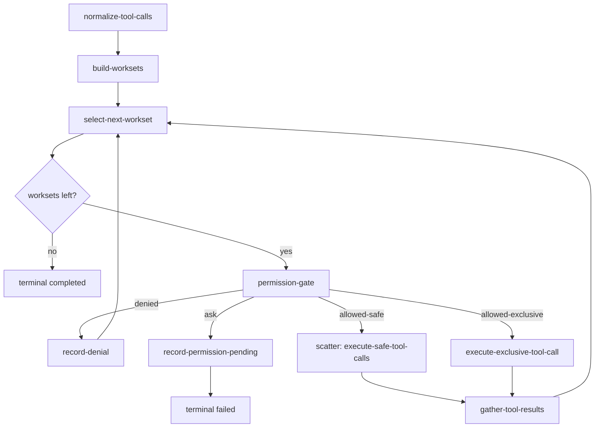
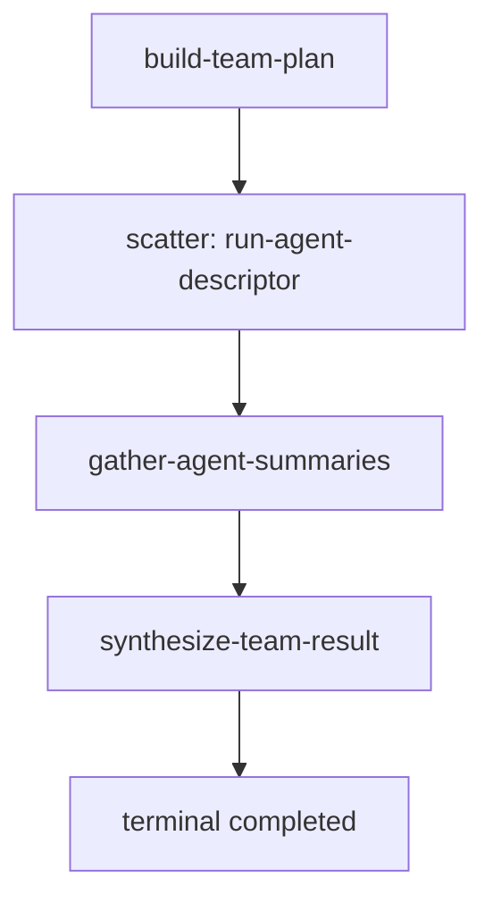
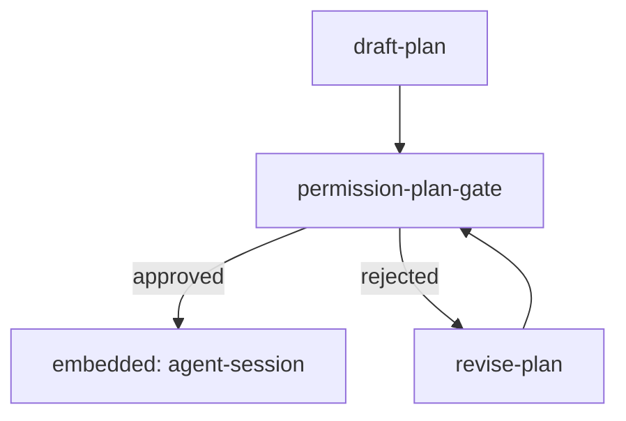

# Agent Harness Architecture Plan

Goal: build a local coding-agent harness on Dagonizer, expressed as DAGs, nodes, tools, services, stores, and adapters. The harness should support the major concepts expected from a modern agent runtime: LLM turn loops, native and text-channel tool calls, permission gates, subagents, teams, memory, compaction, background tasks, MCP, remote sessions, retry, salvage, cancellation, streaming, checkpoint, and resume.

Do not build a monolithic query engine. The Dagonizer version should be a bundle of small DAGs with explicit routing.

## Example Patterns To Reuse

| Dagonizer example | Pattern to adopt |
|-------------------|------------------|
| `examples/dags/24-llm-adapter.ts` | `ScalarNode` builds a `ChatRequestType`, calls `LlmAdapterInterface`, and routes on text vs tool response. |
| `examples/dags/26-tool-use.ts` | `ToolInterface` registry, `ToolCallCodec`, LLM tool definitions, and a tool dispatch node. |
| `examples/the-archivist/dag.ts` | Molecular composition: intent classifier, branch routing, embedded sub-DAGs, shared terminal response path. |
| `examples/the-archivist/embedded-dags/ComposeRetryLoopDAG.ts` | Reusable compose/validate/retry loop as an `EmbeddedDAGNode` target. Retry is a flow edge, not hidden inside one node. |
| `examples/the-archivist/nodes/scouts.ts` | Heterogeneous scatter: scatter source is a descriptor array; one body node dispatches by `currentItem`; custom gather merges clone results. |
| `examples/the-archivist/nodes/decideTools.ts` | LLM tool-choice node with deterministic shortcuts, safety-net post-processing, retry, and salvage outputs. |
| `examples/dags/17-scatter-async-source.ts` | Bounded pull/backpressure for streaming work sources. |
| `examples/dags/08-checkpoint.ts` | Capture cursor, state snapshot, and store snapshots for deterministic resume. |
| `examples/dags/12-workers.ts` and `13-multibackend.ts` | Optional contained child DAG execution through container roles. |

## Architecture Principles

| Principle | Decision |
|-----------|----------|
| Agent behavior is graph structure | Loops, retries, planning, tool use, and subagents are DAG routes and embedded DAGs. |
| LLM providers stay behind adapters | Every model call uses `LlmAdapterInterface`, `ChatRequestBuilder`, and adapter capabilities. |
| Tools are not nodes by default | Tools implement `ToolInterface`; generic tool-dispatch nodes invoke them. |
| Long-lived objects are services | LLM adapters, tool registries, MCP clients, permission providers, and workspace managers live in `context.services`. |
| Durable runtime data is state or stores | Transcript, tool calls, task records, memory refs, and permission records are JSON-safe state or named `SnapshottableInterface` stores. |
| UI is not orchestration | Terminal, web, or IDE UI consumes execution events and permission requests; it does not own the flow. |
| Subagents are embedded DAGs | A subagent is a child `AgentSessionDAG`, optionally run in a container or handoff channel. |
| Parallel agents are scatter | Team execution is a `ScatterNode` over agent descriptors with a child DAG body and a custom gather. |
| Failure recovery is explicit | Nodes route `retry`, `salvage`, `denied`, `timeout`, or `error`; fallback nodes produce deterministic recovery output. |

## Package Shape

| Package | Responsibility |
|---------|----------------|
| `@studnicky/dagonizer-agent-harness` | Core state, services, DAGs, nodes, gather strategies, reducers, observer events. |
| `@studnicky/dagonizer-agent-tools-fs` | File read/write/edit, glob, grep, notebook edit, diff helpers as `ToolInterface` implementations. |
| `@studnicky/dagonizer-agent-tools-shell` | Bash/PowerShell execution, command classifier hooks, subprocess progress, timeout, cancellation. |
| `@studnicky/dagonizer-agent-tools-web` | Web fetch/search tools and URL permission classification. |
| `@studnicky/dagonizer-agent-mcp` | MCP client service, dynamic tool/resource adapters, auth flow nodes. |
| `@studnicky/dagonizer-agent-memory` | Project/user/team/session memory stores and memory nodes. |
| `@studnicky/dagonizer-agent-models` | Model registry, provider profiles, self-hosted endpoint adapters, parser codecs, and request defaults. |
| `@studnicky/dagonizer-agent-eval` | Evaluation runs, candidate promotion gates, rollback, and skill/memory improvement loops. |
| `@studnicky/dagonizer-agent-governance` | Auth, tenancy, RBAC/ABAC, DLP, audit, and policy gates. |
| `@studnicky/dagonizer-agent-connectors` | External connectors, OAuth flows, Vault-backed secrets, and health checks. |
| `@studnicky/dagonizer-agent-federation` | A2A, mesh, edge sync, proxy, and cross-org trust adapters. |
| `@studnicky/dagonizer-agent-remote` | Optional remote session, bridge, handoff channel, and remote container adapters. |

The first package should not depend on any concrete tool implementation. It should only depend on Dagonizer core, adapter contracts, and tool contracts.

## Core State

`AgentHarnessState` extends `NodeStateBase`. It must snapshot cleanly, so keep instances and live clients out of it.

| Field | Shape | Purpose |
|-------|-------|---------|
| `sessionId` | `string` | Stable correlation id for transcript, permission, task, and child-agent records. |
| `input` | `{ text, attachments, cwd, source }` | User prompt and request metadata. |
| `messages` | `AgentMessage[]` | Normalized user/assistant/tool/system/compact transcript. |
| `context` | `AgentContextSnapshot` | System prompt parts, project context, memory snippets, cwd, model choice, active tool names. |
| `llm` | `{ responseRaw, finishReason, usage }` | Last adapter response and usage metadata. |
| `pendingToolCalls` | `AgentToolCall[]` | Tool calls from the last assistant response. |
| `toolWorksets` | `ToolWorkset[]` | Ordered safe/exclusive groups to execute. |
| `toolResults` | `Record<toolCallId, ToolResultRecord>` | Normalized result or denial per call. |
| `permissions` | `PermissionRequestRecord[]` | Pending/resolved permission requests, including ask-mode pause records. |
| `agents` | `AgentRunRecord[]` | Child agent/task/team status and summaries. |
| `tasks` | `TaskRef[]` | Background task ids and output keys. |
| `memory` | `{ loaded, extracted, persisted }` | Memory refs and compact digests, not large blobs. |
| `compaction` | `{ threshold, lastCompactMessageId, summary }` | Context-window management state. |
| `usage` | `{ inputTokens, outputTokens, toolCount, cost }` | Accounting and gates. |
| `result` | `{ finalText, status }` | Final assistant response or terminal status. |

Large tool output, shell logs, screenshots, and remote transcripts should live in stores. State carries stable keys.

## Service Bag

```ts
interface AgentHarnessServices {
  readonly llm: LlmAdapterInterface;
  readonly models: ModelRegistryService;
  readonly inference?: InferenceRuntimeService;
  readonly tools: ToolRegistryService;
  readonly permissions: PermissionService;
  readonly hooks: HookRegistryService;
  readonly memory: MemoryService;
  readonly mcp: McpService;
  readonly tasks: TaskService;
  readonly workspace: WorkspaceService;
  readonly evaluation?: EvaluationService;
  readonly governance?: GovernanceService;
  readonly connectors?: ConnectorService;
  readonly federation?: FederationService;
  readonly observer: AgentObserver;
  readonly observability?: ObservabilityService;
  readonly clock?: ClockProviderInterface;
}
```

| Service | Contract notes |
|---------|----------------|
| `llm` | Any Dagonizer LLM adapter or cascade. Nodes build `ChatRequestType` and pass `context.signal`. |
| `models` | Resolves model metadata, provider capability profiles, request defaults, and context/cost limits. |
| `inference` | Optional lifecycle service for self-hosted endpoints, health checks, and capacity probes. |
| `tools` | Lists `ToolDefinitionType`, resolves `ToolInterface`, exposes metadata: read-only, concurrency-safe, permission class, result limits. |
| `permissions` | Evaluates rules and creates/resolves ask-mode permission records. |
| `hooks` | Runs ordered observer, transform, blocking, and patch hooks with source metadata and error policy. |
| `memory` | Loads ranked context, writes extracted memories, snapshots backing stores. |
| `mcp` | Connects clients, discovers tools/resources, wraps MCP tools as `ToolInterface`. |
| `tasks` | Registers background jobs, output refs, status, stop signals. |
| `workspace` | Manages cwd, worktree isolation, cleanup, git context. |
| `evaluation` | Optional service for running eval suites, comparing metrics, and staging self-improvement candidates. |
| `governance` | Evaluates identity, tenant scope, policy, DLP, audit, and security gates. |
| `connectors` | Manages external integrations, OAuth, and secrets-backed connection lifecycles. |
| `federation` | Handles A2A, mesh, edge, proxy, and partner trust flows. |
| `observer` | Receives neutral harness events for UI/logging/tracing. |
| `observability` | Emits trace/span records through host-selected telemetry adapters. |

## Top-Level DAGs

### `agent-session`

This is the main conversation turn loop.

```mermaid
flowchart TD
  setup[pre: setup-session] --> context[assemble-context]
  context --> maybeMemory{need memory?}
  maybeMemory -- yes --> memory[load-memory]
  maybeMemory -- no --> request[build-chat-request]
  memory --> request
  request --> call[call-llm]
  call --> normalize[normalize-assistant-message]
  normalize --> toolGate{tool calls?}
  toolGate -- no --> final[finalize-response]
  toolGate -- yes --> tools[embedded: tool-execution]
  tools --> append[append-tool-results]
  append --> compactGate{compact?}
  compactGate -- yes --> compact[embedded: compact-session]
  compact --> request
  compactGate -- no --> request
  final --> done[terminal completed]
```

Placements:

| Placement | Type | Backing node/DAG | Outputs |
|-----------|------|------------------|---------|
| `setup-session` | `PhaseNode` | `SetupSessionNode` | none |
| `assemble-context` | `SingleNode` | `AssembleContextNode` | `ready`, `blocked` |
| `load-memory` | `EmbeddedDAGNode` | `memory-context` | `success`, `error` |
| `build-chat-request` | `SingleNode` | `BuildChatRequestNode` | `ready` |
| `call-llm` | `SingleNode` | `CallLlmNode` | `assistant`, `retry`, `salvage`, `error` |
| `normalize-assistant-message` | `SingleNode` | `NormalizeAssistantMessageNode` | `tool-calls`, `final-text`, `empty` |
| `tool-execution` | `EmbeddedDAGNode` | `tool-execution` | `success`, `permission-pending`, `error` |
| `append-tool-results` | `SingleNode` | `AppendToolResultsNode` | `continue`, `compact` |
| `compact-session` | `EmbeddedDAGNode` | `compact-session` | `success`, `error` |
| `finalize-response` | `SingleNode` | `FinalizeResponseNode` | `done` |
| `persist-session` | `PhaseNode` | `PersistSessionNode` | none |

### `tool-execution`

Executes the pending tool calls from one assistant turn.



Important execution rule: consecutive concurrency-safe calls may run together, but a mutating or exclusive call is an ordering barrier. This maps to `BuildToolWorksetsNode`, then scatter only inside one safe workset.

### `agent-child-session`

Same node family as `agent-session`, but scoped for child agents.

Differences:

| Difference | Implementation |
|------------|----------------|
| Scoped prompt | Parent maps task prompt, agent type, and allowed tools into child state. |
| Scoped tools | `FilterAgentToolsNode` builds a child tool registry view. |
| Scoped MCP | Child pre-phase connects agent-specific MCP servers; post-phase closes only child-owned clients. |
| Summary return | Child `SummarizeAgentResultNode` writes summary, status, tool count, token count. |
| Parent mapping | Parent `EmbeddedDAGNode.stateMapping.output` copies child summary into `state.agents`. |

### `team-run`

Runs multiple child agents in parallel.



Use `ScatterNode` over `state.team.descriptors`, body `{ dag: 'agent-child-session' }`, and a custom gather strategy that appends child summaries in descriptor order while preserving failures.

### `memory-context`

Retrieves memory before a model call.

| Step | Node | Role |
|------|------|------|
| `load-project-memory` | `LoadProjectMemoryNode` | Read project instructions and local memory files. |
| `load-user-memory` | `LoadUserMemoryNode` | Read user-level persistent memory. |
| `rank-memory` | `RankMemoryNode` | Use embeddings or lexical scoring to choose relevant snippets. |
| `inject-memory-context` | `InjectMemoryContextNode` | Write selected snippets into `state.context`. |

### `compact-session`

Reduces context pressure.

| Step | Node | Role |
|------|------|------|
| `estimate-tokens` | `EstimateTokensNode` | Compute current window pressure. |
| `should-compact` | `CompactGateNode` | Route `compact` or `skip`. |
| `summarize-transcript` | `SummarizeTranscriptNode` | Call the adapter to summarize old messages. |
| `write-compact-boundary` | `WriteCompactBoundaryNode` | Replace old messages with a compact boundary and digest. |
| `extract-session-memory` | `ExtractSessionMemoryNode` | Optional durable facts extraction. |

### `plan-and-execute`

Replicates plan mode without making planning a UI mode.



Plan approval is a permission decision stored in state. The UI only supplies the decision.

## Node Catalog

### Core LLM Nodes

| Node | Base | Outputs | Role |
|------|------|---------|------|
| `AssembleContextNode` | `ScalarNode` | `ready`, `blocked` | Build system/user context from state, memory, workspace, and configured tools. |
| `BuildChatRequestNode` | `ScalarNode` | `ready` | Create a `ChatRequestType` with messages, tool definitions, tool choice, model hints. |
| `CallLlmNode` | `ScalarNode` | `assistant`, `retry`, `salvage`, `error` | Call `context.services.llm.chat(request)` and store response. |
| `NormalizeAssistantMessageNode` | `ScalarNode` | `tool-calls`, `final-text`, `empty` | Normalize text/tools/mixed response variants and decode text-channel calls with `ToolCallCodec`. |
| `StructuredDecisionNode<T>` | `ScalarNode` | domain-specific | Generic structured-output LLM decision node, like Archivist intent and tool planning. |
| `QualityGateNode` | `ScalarNode` | `approved`, `retry`, `exhausted` | Validate a draft and route retry/salvage explicitly. |
| `FinalizeResponseNode` | `ScalarNode` | `done` | Commit final answer and clear transient fields. |

### Tool Nodes

| Node | Base | Outputs | Role |
|------|------|---------|------|
| `NormalizeToolCallsNode` | `ScalarNode` | `valid`, `invalid` | Validate tool call ids, names, arguments, and max counts. |
| `BuildToolWorksetsNode` | `ScalarNode` | `ready`, `empty` | Partition calls into ordered safe/exclusive groups. |
| `SelectToolWorksetNode` | `ScalarNode` | `safe`, `exclusive`, `done` | Pop/peek the next workset. |
| `PermissionGateNode` | `ScalarNode` | `allow`, `deny`, `ask` | Evaluate tool permissions before execution. |
| `RecordPermissionPendingNode` | `ScalarNode` | `paused` | Write ask-mode record for checkpoint/resume. |
| `DispatchToolNode` | `ScalarNode` | `success`, `error`, `cancelled` | Resolve a `ToolInterface` and call `execute(input, { signal })`. |
| `ExecuteExclusiveToolNode` | `MonadicNode` | `success`, `error`, `cancelled` | Run exactly one exclusive workset item. |
| `RecordToolDenialNode` | `ScalarNode` | `done` | Convert denial into transcript-ready tool result. |
| `NormalizeToolResultNode` | `ScalarNode` | `done` | Enforce size limits, redact, summarize, and store large payload refs. |

### Gather Strategies And Reducers

| Extension | Purpose |
|-----------|---------|
| `tool-result-gather` | Append safe scatter results in original call order, preserving tool call ids. |
| `agent-summary-gather` | Merge child agent summaries, warnings, and failures from team scatter. |
| `memory-snippet-gather` | Merge ranked memory results from multiple memory scopes. |
| `any-tool-success` reducer | Continue when at least one optional tool succeeded. |
| `all-required-tools` reducer | Error when any required tool failed. |

### Permission Nodes

| Node | Outputs | Role |
|------|---------|------|
| `LoadPermissionRulesNode` | `ready` | Pre-phase load rules from settings/policy. |
| `PermissionGateNode` | `allow`, `deny`, `ask` | Main per-tool gate. |
| `ApplyPermissionDecisionNode` | `allow`, `deny`, `missing` | Resume after an external answer arrives. |
| `PersistPermissionUpdateNode` | `done`, `error` | Save approved rule updates. |
| `PlanApprovalGateNode` | `approved`, `rejected`, `ask` | Batch permission approval for planning mode. |

### Agent And Task Nodes

| Node | Outputs | Role |
|------|---------|------|
| `ResolveAgentDefinitionNode` | `found`, `missing`, `denied` | Select child agent type, prompt, model, and tool policy. |
| `PrepareChildAgentStateNode` | `ready` | Map parent task into child `AgentHarnessState`. |
| `RunSubagentNode` | `success`, `error` | Thin wrapper only when not using an `EmbeddedDAGNode` placement directly. |
| `SummarizeAgentResultNode` | `done` | Produce child summary for parent transcript. |
| `CreateBackgroundTaskNode` | `created`, `error` | Register a child run and return a task ref without blocking parent. |
| `PollTaskNode` | `running`, `completed`, `failed`, `missing` | Read task status. |
| `StopTaskNode` | `stopped`, `missing`, `error` | Abort background task/controller/container. |

### Memory And Context Nodes

| Node | Outputs | Role |
|------|---------|------|
| `LoadProjectMemoryNode` | `loaded`, `empty`, `error` | Read project instructions and memory docs. |
| `LoadUserMemoryNode` | `loaded`, `empty`, `error` | Read user memory. |
| `RankMemoryNode` | `ranked`, `empty` | Rank snippets against current task. |
| `InjectMemoryNode` | `done` | Add selected memory to prompt context. |
| `ExtractMemoryNode` | `extracted`, `empty` | Extract durable facts from transcript. |
| `PersistMemoryNode` | `saved`, `skipped`, `error` | Write approved memory records. |

### MCP Nodes

| Node | Outputs | Role |
|------|---------|------|
| `ConnectMcpServersNode` | `connected`, `partial`, `error` | Start configured MCP clients. |
| `DiscoverMcpToolsNode` | `found`, `empty` | Add MCP tools to tool registry. |
| `ListMcpResourcesNode` | `found`, `empty`, `error` | Resource discovery. |
| `ReadMcpResourceNode` | `loaded`, `error` | Resource content import. |
| `McpAuthNode` | `authenticated`, `pending`, `failed` | OAuth/auth flow records. |

## Tool Catalog To Adopt

These should be `ToolInterface` implementations, not bespoke node classes. The generic tool DAG dispatches them.

| Tool family | Tools |
|-------------|-------|
| Filesystem read | `FileRead`, `Glob`, `Grep`, `ListDirectory`, `ReadNotebook` |
| Filesystem write | `FileWrite`, `FileEdit`, `NotebookEdit`, `PatchApply` |
| Shell | `Bash`, `PowerShell`, `ProcessStatus`, `BackgroundShell` |
| Web | `WebFetch`, `WebSearch` |
| Git | `GitStatus`, `GitDiff`, `GitCommit`, `GitBranch`, `GitApplyPatch` |
| MCP | `McpTool`, `ListMcpResources`, `ReadMcpResource`, `McpAuth`, `ToolSearch` |
| LSP | `Diagnostics`, `GoToDefinition`, `FindReferences`, `SymbolSearch` |
| Task | `TaskCreate`, `TaskList`, `TaskGet`, `TaskOutput`, `TaskStop` |
| User interaction | `AskUserQuestion`, `RequestPermission`, `PlanApproval` |
| Agent | `SpawnAgent`, `SendAgentMessage`, `CreateTeam`, `DeleteTeam` |

Special cases:

- `SpawnAgent` can be exposed as an LLM tool, but internally it should create an embedded DAG run, task, handoff, or scatter descriptor.
- `ToolSearch` should mutate the tool registry view for the next LLM request, not execute arbitrary discovered tools inline.
- `Bash` and file edit tools need strong permission metadata because they are ordering barriers and high-risk operations.

## Core Concept Mapping

| Harness concept | Dagonizer implementation |
|-----------------|--------------------------|
| Query engine | `agent-session` DAG plus `tool-execution`, `compact-session`, and `memory-context` embedded DAGs. |
| Tool loop | Self-loop from `append-tool-results` back to `build-chat-request`. |
| Streaming tool executor | Workset partitioning plus safe scatter and exclusive serial nodes. |
| Tool schema and UI rendering | `ToolInterface.definition`; UI is external observer rendering. |
| Permissions | `PermissionGateNode`, permission store, checkpointable ask-mode resume. |
| Plan mode | `plan-and-execute` DAG with `PlanApprovalGateNode`. |
| Subagent | `EmbeddedDAGNode` running `agent-child-session`. |
| Background agent | Task service plus handoff/container execution. |
| Team/swarm | `ScatterNode` over agent descriptors with `agent-child-session` body. |
| Memory files | Memory stores plus `memory-context` DAG. |
| Auto-compaction | `compact-session` embedded DAG selected by token gate. |
| MCP tools | MCP service wraps remote tools into `ToolInterface` and resource tools. |
| Remote bridge | Optional channel/container/session adapter around the same DAGs. |
| Slash commands | Command adapter that starts a DAG template or injects prompt/context. |
| Skills | DAG bundles or prompt/context preprocessors. |

## Collected Harness Plans

Each plan below should become a small set of DAG assets, services, tests, and examples. The Dagonizer version should expose graph structure and keep runtime dependencies behind adapters.

### Turn Lifecycle And Save Points

| Capability | Dagonizer target | Proposed assets |
|------------|------------------|-----------------|
| Turn snapshot | Freeze messages, model, tools, resources, stream options, and system prompt before each provider request. | `CreateTurnSnapshotNode`, `TurnSnapshotRecord`, `turn-snapshot` store entry. |
| Save point | After assistant message and tool results, flush queued writes and rebuild context for the next request. | `SavePointNode`, `FlushPendingWritesNode`, `PrepareNextTurnNode`. |
| Steering queue | Let external input inject messages at safe points without mutating the in-flight request. | `SteeringQueueStore`, `DrainSteeringQueueNode`, `QueueModePolicy`. |
| Follow-up queue | Continue the loop when queued user messages arrive after the model would otherwise stop. | `FollowUpQueueStore`, `DrainFollowUpQueueNode`, outer `agent-session` loop route. |
| Abort barrier | Abort current transport/tool work, preserve durable queues, and write terminal status. | `AbortGateNode`, `AbortRunNode`, `RecordAbortNode`. |

### Provider And Model Runtime

| Capability | Dagonizer target | Proposed assets |
|------------|------------------|-----------------|
| Model registry | Host can register models with provider, context window, input modes, reasoning support, costs, and headers. | `ModelRegistryService`, `RegisterModelProviderNode`, `ResolveModelNode`. |
| Provider adapters | Custom providers stay behind `LlmAdapterInterface` and can be selected per turn. | `ProviderAdapterRegistry`, `ResolveLlmAdapterNode`, `ProviderCapabilityProbeNode`. |
| Auth and OAuth | Auth flows produce credentials and API keys without leaking providers into the harness. | `ProviderAuthDAG`, `RefreshProviderCredentialsNode`, `ResolveProviderAuthNode`. |
| Thinking/reasoning levels | Clamp requested reasoning effort to model capabilities before building the request. | `ResolveReasoningLevelNode`, `ModelCapabilityGateNode`. |
| Cost and context accounting | Track cost, cache usage, token pressure, and overflow decisions as state. | `UsageAccountingNode`, `ContextOverflowGateNode`, `CostBudgetGateNode`. |
| Stream options | Snapshot timeout, retries, cache hints, headers, and metadata per request. | `BuildStreamOptionsNode`, `BeforeProviderRequestHookNode`. |

### Self-Hosted Long-Context Model Runtime

| Capability | Dagonizer target | Proposed assets |
|------------|------------------|-----------------|
| Serving profiles | Model profiles describe endpoint type, local serving engine, parser support, sampling defaults, context window, and hardware capacity. | `InferenceProfileRegistry`, `ResolveInferenceProfileNode`, `ModelServingProfile`. |
| Local endpoint lifecycle | Optional runtime tasks can start, health-check, and stop local OpenAI-compatible servers. | `StartInferenceServerTaskNode`, `HealthCheckInferenceEndpointNode`, `StopInferenceServerTaskNode`. |
| Parser capability selection | Prefer native tool-call and reasoning parsers when the server supports them; fall back to text-channel parsing when it does not. | `ToolCallParserCapabilityNode`, `ReasoningParserCapabilityNode`, `ToolCallCodecRegistry`. |
| XML tool-call fallback | Some models emit tagged tool calls when served without native parser support. Parse those through a provider-scoped codec before generic tool execution. | `XmlToolCallCodec`, `DecodeTextToolCallsNode`, `ValidateDecodedToolCallsNode`. |
| Chat template fallback | Raw completions and low-level transformer runtimes need a chat-template renderer that injects messages and tool definitions. | `ChatTemplateRegistry`, `RenderChatTemplateNode`, `ToolDefinitionTemplateNode`. |
| Reasoning normalization | Reasoning blocks, hidden thinking, and final answer text should become separate normalized message content parts. | `NormalizeReasoningContentNode`, `ReasoningContentPolicy`, `StripOrRetainThinkingNode`. |
| Long-context admission | Admission should account for both per-sequence context limits and aggregate server KV-cache capacity. | `ContextAdmissionGateNode`, `ServerCapacityProbeNode`, `LongContextBudgetStore`. |
| Model defaults | Sampling defaults and provider-specific request options should be data in the model profile, not hard-coded in nodes. | `ApplyModelDefaultsNode`, `RequestOptionProfile`, `SamplingPolicy`. |
| Endpoint variants | API-hosted, local server, managed endpoint, and raw transformer modes should all satisfy the same adapter interface. | `EndpointAdapterFactory`, `OpenAiCompatibleAdapter`, `RawGenerationAdapter`. |

### Evaluation And Self-Improvement Plan

| Capability | Dagonizer target | Proposed assets |
|------------|------------------|-----------------|
| Experiment loops | The harness can run proposed prompt, skill, tool, or code changes through isolated evaluation DAGs. | `ExperimentPlanDAG`, `RunEvaluationSuiteNode`, `EvaluationResultStore`. |
| Failure trajectory analysis | Failed runs are summarized into actionable traces without exposing raw large logs to the next model call. | `FailureTrajectorySummarizerNode`, `EvaluationTraceStore`, `ExtractFailureFeaturesNode`. |
| Candidate generation | Model-generated improvements are staged as patch/tool/skill candidates, not applied directly. | `GenerateCandidateChangeNode`, `CandidateChangeStore`, `CandidateRiskClassifierNode`. |
| Metric comparison | Promote only when candidate metrics beat the baseline under configured thresholds. | `CompareEvaluationMetricsNode`, `PromotionGateNode`, `RegressionBudgetPolicy`. |
| Revert and rollback | Every self-improvement run must have a deterministic rollback path. | `CheckpointCandidateNode`, `RollbackCandidateNode`, `PromoteCandidateNode`. |
| Memory updates | New durable memories from experiments require ranking, validation, and approval policy. | `ExtractExperimentMemoryNode`, `MemoryApprovalGateNode`, `PersistApprovedMemoryNode`. |
| Skill synthesis | Generated skills become versioned resources with tests, provenance, and activation policy. | `SkillSynthesisDAG`, `ValidateSkillNode`, `RegisterSkillVersionNode`. |

### Durable Session And Resume

| Capability | Dagonizer target | Proposed assets |
|------------|------------------|-----------------|
| Append-only session log | Treat transcript, config changes, queues, compactions, branch summaries, and tool events as durable entries. | `SessionStoreInterface`, `AppendSessionEntryNode`, `SessionLogReducer`. |
| Runtime restore | Host recreates tools, models, auth, and plugins; harness validates restored ids against them. | `RestoreHarnessDAG`, `ValidateRuntimeDependenciesNode`, `RestoreActiveToolsNode`. |
| Pending writes | Writes accepted while busy are durably queued and flushed in deterministic order. | `PendingWriteStore`, `EnqueuePendingWriteNode`, `ApplyPendingWritesNode`. |
| Interrupted operations | Recovery marks unfinished turns interrupted unless a policy says retry is safe. | `RecoverInterruptedRunNode`, `RecoveryPolicyService`, `RecordInterruptedToolResultNode`. |
| Idempotent retry | Tool calls can declare retry-safety; only safe calls may rerun after crash. | `ToolRecoveryMetadata`, `RetrySafeToolGateNode`. |
| Branch navigation | Branch summary and leaf movement are structural session mutations with their own recovery rules. | `BranchSummaryDAG`, `NavigateSessionTreeNode`, `RecoverBranchMutationNode`. |

### Hook And Plugin Runtime

| Capability | Dagonizer target | Proposed assets |
|------------|------------------|-----------------|
| Observers | Read-only subscribers receive lifecycle events without mutating graph state. | `AgentObserver`, `EmitHarnessEventNode`, `ObserverRelayService`. |
| Transform hooks | Prompt/context/provider/tool-result transforms are explicit ordered nodes with reducers. | `HookRegistryService`, `RunHookChainNode`, `HookResultReducer`. |
| Blocking hooks | Permission, dirty-worktree, and session-mutation guards can cancel or ask. | `BeforeToolHookNode`, `BeforeSessionMutationHookNode`, `HookPermissionGateNode`. |
| Source metadata | Plugin provenance is tracked beside registered handlers, tools, providers, and commands. | `PluginScopeRecord`, `PluginRegistryService`, `PluginSourceMetadata`. |
| Cleanup and reload | Plugin-owned assets can be cleared and reloaded at idle boundaries. | `UnloadPluginNode`, `ReloadPluginsDAG`, `PluginCleanupStore`. |
| Error policy | Hosts choose continue, warn, or fail for plugin hook errors. | `HookErrorPolicy`, `RecordHookErrorNode`, `HookErrorGateNode`. |

### Dynamic Tool And Resource Runtime

| Capability | Dagonizer target | Proposed assets |
|------------|------------------|-----------------|
| Dynamic tools | Tools can be registered at session start or from commands, then appear in the next LLM request. | `DynamicToolRegistryNode`, `RegisterToolNode`, `ToolDefinitionDiffNode`. |
| Active tool set | Active tools are durable branch-scoped config and must validate against the runtime registry. | `SetActiveToolsNode`, `ActiveToolsStore`, `ValidateActiveToolsNode`. |
| Tool argument preparation | Compatibility shims can normalize raw model arguments before schema validation. | `PrepareToolArgumentsNode`, `ValidateToolArgumentsNode`. |
| Tool result patching | Hook chain can redact, summarize, or annotate tool output before transcript append. | `AfterToolResultHookNode`, `NormalizeToolResultNode`, `ToolResultPatchReducer`. |
| Resource discovery | Plugins and MCP servers can contribute files, prompts, skills, and remote resources. | `DiscoverResourcesDAG`, `ResourceRegistryService`, `ResourceProvenanceRecord`. |
| Resource snapshot | Resource lists are frozen per turn while loaders remain host-owned runtime dependencies. | `CreateResourceSnapshotNode`, `LoadResourceContentNode`. |

### Workspace Coding Tool Plan

| Capability | Dagonizer target | Proposed assets |
|------------|------------------|-----------------|
| Filesystem capability | Host supplies backend-independent file operations; failures are structured results. | `WorkspaceService`, `FileSystemService`, `FileErrorCode`. |
| Shell capability | Shell runs stream stdout/stderr, support timeout and abort, and normalize failures. | `ShellExecutionService`, `ShellExecutionTool`, `ShellOutputStore`. |
| File mutation queue | Edits and writes can be staged, permissioned, applied, and audited. | `FileMutationQueueService`, `ApplyFileMutationNode`, `MutationAuditRecord`. |
| Project trust | Project-local agents, prompts, extensions, and tools are gated by trust policy. | `ProjectTrustService`, `ProjectTrustGateNode`, `ResolveProjectAssetsNode`. |
| Read-only mode | Planning/exploration flows restrict tools and shell commands to inspection behavior. | `ReadOnlyToolFilterNode`, `ShellAllowlistGateNode`, `PlanWorkspacePolicy`. |
| Output limits | Large command/tool outputs are stored by ref and summarized for the model. | `LargeOutputStore`, `TruncateToolOutputNode`, `SummarizeLargeOutputNode`. |

### Prompt, Skill, And Template Plan

| Capability | Dagonizer target | Proposed assets |
|------------|------------------|-----------------|
| Skills | Skills are prompt/context bundles that may also provide DAG templates or tool filters. | `SkillRegistryService`, `SkillSelectNode`, `LoadSkillContentNode`. |
| Prompt templates | Commands and explicit invocations render templates into user messages. | `PromptTemplateRegistry`, `RenderPromptTemplateNode`, `StartTemplateDAGNode`. |
| System prompt assembly | Base prompt, project context, tools, skills, memory, and plugin transforms compose in order. | `BuildSystemPromptNode`, `SystemPromptTransformHookNode`. |
| Command adapters | Slash-style commands are host commands that start DAG templates or enqueue messages. | `CommandRegistryService`, `ResolveCommandNode`, `InvokeCommandDAG`. |
| Plan extraction | Plans can be parsed into durable task steps instead of remaining plain text. | `ExtractPlanStepsNode`, `PlanTaskStore`, `MarkPlanStepDoneNode`. |

### Subagent And Workflow Plan

| Capability | Dagonizer target | Proposed assets |
|------------|------------------|-----------------|
| Agent definitions | Agent prompts, model choices, tool policies, and trust scope are loaded as data. | `AgentDefinitionRegistry`, `ResolveAgentDefinitionNode`, `AgentTrustGateNode`. |
| Single delegation | Parent state maps task text into a child `agent-child-session` DAG. | `PrepareChildAgentStateNode`, `RunChildAgentDAG`, `SummarizeAgentResultNode`. |
| Parallel delegation | Multiple agent descriptors run through scatter with bounded concurrency. | `TeamPlanNode`, `ScatterNode`, `agent-summary-gather`. |
| Chained workflow | Sequential descriptors can reference prior summaries with deterministic substitution. | `WorkflowChainDAG`, `SubstitutePriorResultNode`, `WorkflowStepGateNode`. |
| Background delegation | Long-running child agents become task refs and stream progress through observers. | `CreateBackgroundAgentTaskNode`, `TaskProgressStore`, `PollTaskNode`. |
| Result caps | Child output sent back to the parent is summarized and capped, while full logs stay in stores. | `CapAgentResultNode`, `AgentTranscriptStore`, `SummarizeAgentTranscriptNode`. |

### Observability Plan

| Capability | Dagonizer target | Proposed assets |
|------------|------------------|-----------------|
| Vendor-neutral events | Emit stable start/end/error/event records without depending on one telemetry backend. | `ObservabilityService`, `TraceOperationNode`, `HarnessSpanRecord`. |
| Causal context | Trace id and parent span flow through embedded DAGs, scatter clones, tools, and provider calls. | `TraceContextStore`, `PropagateTraceContextNode`, `ScatterTraceGather`. |
| Provider spans | Every LLM request records model, provider, request options, usage, stop reason, and failures. | `ProviderRequestSpanNode`, `RecordProviderUsageNode`. |
| Tool spans | Tool start/update/end events include tool call id, tool name, result status, and output refs. | `ToolExecutionSpanNode`, `ToolUpdateEventNode`. |
| Session spans | Session append, checkpoint, replay, and compaction events are observable. | `SessionAppendSpanNode`, `CheckpointSpanNode`, `CompactionSpanNode`. |
| Runtime adapters | Node, browser, worker, and remote runtimes provide context propagation adapters. | `ObservabilityRuntimeAdapter`, `AsyncContextProviderInterface`. |

### Enterprise Control Plane Plan

| Capability | Dagonizer target | Proposed assets |
|------------|------------------|-----------------|
| Identity and tenancy | Authenticate users and resolve tenant scope before any protected DAG runs. | `AuthResolveNode`, `TenantScopeNode`, `IdentitySessionStore`. |
| RBAC and ABAC | Evaluate action and resource permissions using role rules and attribute policy. | `PermissionPolicyNode`, `RoleMatrixService`, `AttributePolicyGateNode`. |
| Token validation | Support dev-mode tokens, OIDC/JWKS, SAML assertion intake, MFA flags, and session IDs. | `TokenValidationDAG`, `JwksCacheService`, `SamlAssertionNode`, `MfaChallengeNode`. |
| Model routing | Pick a provider/model by capability, data class, cost, latency, geo, and circuit state. | `ModelRoutePlanNode`, `RoutingDecisionNode`, `CircuitBreakerService`, `FallbackChainNode`. |
| DLP scanning | Scan input, output, connector payloads, and federation messages before transit. | `DlpScanGateNode`, `DlpRedactionNode`, `DlpPolicyStore`. |
| Audit logging | Persist audit records for state changes, route decisions, policy checks, and deployments. | `AuditEventNode`, `AuditLogStore`, `StateChangeAuditReducer`. |
| Cost ledger | Track token usage and cost by tenant, department, user, agent, and model. | `CostLedgerNode`, `BudgetCheckNode`, `ChargebackReportDAG`, `ForecastCostNode`. |
| Connectors | Register OAuth-backed connectors, test them, and keep secrets in Vault-like stores. | `ConnectorRegistryNode`, `ConnectorOAuthDAG`, `ConnectorHealthNode`, `SecretsVaultAdapter`. |
| Federation | Carry out A2A, mesh, proxy, and partner handoff flows with trust levels and scan gates. | `FederationTrustNode`, `FederatedMessageNode`, `MeshTopologyNode`, `ProxyUpstreamNode`. |
| Edge runtime | Manage offline devices, secrets bundles, sync, and OTA manifests as durable tasks. | `EdgeDeviceNode`, `OfflineTokenNode`, `SyncConflictNode`, `OtaUpdateNode`. |
| MCP security | Authorize tools by scope, sandbox execution, and tool-version diffs before tool use. | `McpSecurityGateNode`, `SandboxExecutionNode`, `ToolVersionDiffNode`, `ConsentStore`. |
| Deployment lifecycle | Promote, demote, and roll back agent definitions across stages with health scoring. | `LifecycleTransitionNode`, `DeploymentStrategyNode`, `HealthScoreNode`, `RollbackNode`. |
| Security proxy | Normalize and classify inbound/outbound traffic through a credential-injecting proxy DAG. | `ProxyRequestNode`, `UpstreamCredentialNode`, `ContentClassificationNode`. |

## Build Sequence

| Phase | Deliverable | Acceptance check |
|-------|-------------|------------------|
| 1 | Core harness package with `AgentHarnessState`, service interfaces, and message/tool-call types | State snapshots to JSON and restores without live objects. |
| 2 | Minimal `agent-session` DAG: context, one LLM call, final text | Runs with any existing Dagonizer LLM adapter. |
| 3 | Tool definitions and single `DispatchToolNode` | Calculator-style tool round-trips through adapter tool calls. |
| 4 | Full `tool-execution` DAG with worksets | Safe calls scatter; exclusive calls preserve order. |
| 5 | Permission gate and checkpointable ask-mode | Run can pause with cursor and resume after decision record appears. |
| 6 | Retry/salvage loops for LLM nodes | Failures route through retry and deterministic salvage nodes. |
| 7 | `agent-child-session` embedded DAG | Parent receives child summary via state mapping. |
| 8 | `team-run` scatter | Multiple child agents run concurrently and gather summaries. |
| 9 | Memory and compaction DAGs | Token threshold triggers compaction and memory injection affects next request. |
| 10 | MCP dynamic tools | MCP tools appear in LLM request and execute through common tool dispatch. |
| 11 | Background task service | Background agent can be listed, stopped, and resumed. |
| 12 | Remote/container adapters | Same DAG can run child sessions in-process, worker, process, or remote. |
| 13 | Model profile registry and self-hosted endpoint profiles | Request defaults, context limits, parser support, and endpoint health are resolved before model calls. |
| 14 | Text-channel tool-call codec fallback | A model served without native tool parsing can emit tagged tool calls that decode into normal `AgentToolCall` records. |
| 15 | Evaluation and candidate rollback loop | Proposed prompt, skill, tool, or code changes are evaluated, compared, promoted, or rolled back through DAGs. |
| 16 | Auth, tenancy, and policy gate | Requests resolve identity and tenant scope before protected DAGs run. |
| 17 | Model routing and fallback chain | Model choice can be selected by policy, cost, data class, and circuit breaker state. |
| 18 | DLP and audit gates | Input, output, and connector/federation payloads are scanned and recorded before transit. |
| 19 | Connector and secret lifecycle | OAuth, Vault-backed secrets, and connector health are first-class DAG flows. |
| 20 | Federation and edge flows | Cross-org A2A, mesh, proxy, and edge sync are modeled as separate DAGs with trust controls. |
| 21 | MCP security and sandboxing | Tool authorization, sandbox execution, and tool-version diffs are enforced before tool use. |
| 22 | Deployment lifecycle and rollback | Agent promotion, stage gating, health scoring, and rollback are explicit operations. |

## Non-Goals For Core

| Exclude from core | Reason |
|-------------------|--------|
| Terminal components | They are presentation; Dagonizer should emit events and state. |
| Product analytics vocabulary | Keep observer events neutral. |
| Feature flag runtime | Keep package runtime conventional and host-controlled. |
| Terminal pane layout | Optional UI adapter, not orchestration. |
| Voice/onboarding/tips | Application layer. |
| Full clone of slash commands | Convert high-value commands to DAG templates one at a time. |

## Immediate Next Step

Start by implementing the harness skeleton with three DAGs:

1. `agent-session`
2. `tool-execution`
3. `compact-session`

Wire them to a stub `LlmAdapterInterface` and two tools: `CalculatorTool` from the tool-use example and a read-only `EchoTool`. Once the loop can make a model request, execute a tool call, append the result, and make the next request, the rest of the harness is additive.
