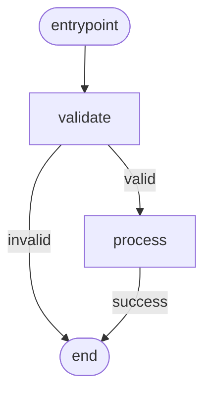

---
seeAlso:

  - text: 'Subclassing State'

    link: './subclassing'
    description: 'define the state class your nodes mutate'

  - text: 'Schema & JSON loading'

    link: './schema'
    description: 'load DAGs from JSON instead of building them in code'

  - text: 'Contract-derived flows'

    link: './derive'
    description: 'generate the same DAG shape from `OperationContract`s'

  - text: 'Visualization'

    link: './visualization'
    description: 'render the built DAG as Mermaid'
---

# DAGBuilder

`DAGBuilder` is a chainable authoring API for **deterministic workflows you control end-to-end** — ETL pipelines, transformation chains, fixed sequences where the order IS the spec. TypeScript narrows the `routes` map at each `.node()` call from the node's `TOutput` union, so misspelled routes are compile errors before the DAG runs.

If your flow is agent-style — operations declare data dependencies and you want the topology to fall out automatically — use [DAGDeriver](./derive) instead. See [Authoring DAGs](./authoring) for the decision matrix. Both surfaces produce the same canonical `DAG` JSON-LD object; pick the one that matches the mental model you use to describe the flow.

## Basic usage

The flow this snippet builds:



```ts
import { DAGBuilder, Dagonizer, NodeStateBase } from '@noocodex/dagonizer';
import type { NodeInterface } from '@noocodex/dagonizer';

class S extends NodeStateBase { value = 0; }

const validate: NodeInterface<S, 'valid' | 'invalid'> = {
  name: 'validate',
  outputs: ['valid', 'invalid'],
  async execute(state) {
    return { output: state.value > 0 ? 'valid' : 'invalid' };
  },
};

const process: NodeInterface<S, 'success'> = {
  name: 'process',
  outputs: ['success'],
  async execute(state) {
    state.value *= 2;
    return { output: 'success' };
  },
};

const dag = new DAGBuilder('pipeline', '1.0')
  .node('validate', validate, { valid: 'process', invalid: null })
  .node('process',  process,  { success: null })
  .build();

const dispatcher = new Dagonizer<S>();
dispatcher.registerNode(validate);
dispatcher.registerNode(process);
dispatcher.registerDAG(dag);
```

The first `.node()` call sets the entrypoint automatically. Call `.entrypoint('name')` to override.

## Type-safe output routing

When the node declares a narrow `TOutput` union, `.node()` enforces exhaustive routing at compile time:

```ts
// NodeInterface<S, 'ok' | 'warn' | 'error'>
.node('check', checkNode, {
  ok:    'save',
  warn:  'log',
  // error: ???   ← TypeScript error: property 'error' is missing
})
```

## ⦿ Contract-aware authoring

When the underlying `NodeInterface` carries a `contract` field (`hardRequired` + `produces`), `build()` runs the same dangling-read / dead-write validation that `DAGDeriver` runs at derive time — drift fails at build time, not run time.

- **Dangling read** — a non-entrypoint node declares `hardRequired: ['foo']` but no upstream node produces `'foo'`. Throws `DAGError`.
- **Dead write** — a node declares `produces: ['bar']` but no downstream node `hardRequires` `'bar'`. Fires the `onContractWarning` callback (non-fatal).

```ts
import { DAGBuilder, DAGError } from '@noocodex/dagonizer';
import type { NodeInterface } from '@noocodex/dagonizer';
import type { NodeStateBase } from '@noocodex/dagonizer';

const fetchNode: NodeInterface<NodeStateBase, 'success'> = {
  name: 'fetch',
  outputs: ['success'],
  contract: { hardRequired: ['url'], produces: ['raw'] },
  async execute(state) { return { output: 'success' }; },
};

const parseNode: NodeInterface<NodeStateBase, 'success'> = {
  name: 'parse',
  outputs: ['success'],
  // Deliberate mismatch: hardRequires 'data' but upstream only produces 'raw'
  contract: { hardRequired: ['data'], produces: ['record'] },
  async execute(state) { return { output: 'success' }; },
};

// Throws DAGError: node 'parse' hardRequires 'data' but no upstream node produces it.
new DAGBuilder('pipeline', '1.0')
  .node('fetch', fetchNode, { success: 'parse' })
  .node('parse', parseNode, { success: null })
  .build();
```

Pass an `onContractWarning` callback to capture dead writes:

```ts
const dag = new DAGBuilder('pipeline', '1.0')
  .node('fetch', fetchNode, { success: 'parse' })
  .node('parse', parseNode, { success: null })
  .build((message) => {
    console.warn('[contract]', message);
  });
```

Placements added via `.parallel()` or `.deepDAG()` do not receive a `NodeInterface` and are not tracked in the impl registry — they are silently skipped during contract validation, preventing false-positive dangling-read errors for node names declared elsewhere.

The `onContractWarning` hook on `build()` fires at construction time and is local to the builder call. When you register the resulting DAG with a `Dagonizer` subclass, the dispatcher's `onContractWarning` hook fires again at `registerDAG` time if the nodes carry co-located contracts. See [Contract-derived flows](./derive) and [Reference: contracts](../reference/contracts).

## ⦿ Bypassing the fluent API — `DAGBuilder.fromNodes()`

For the common case where your flow is linear and every node carries a contract, you can skip the fluent chain entirely:

```ts
import { DAGBuilder } from '@noocodex/dagonizer';

const dag = DAGBuilder.fromNodes({
  name: 'pipeline',
  version: '1.0',
  entrypoint: 'fetch',
  nodes: [fetchNode, parseNode, saveNode],
});
```

This is exactly equivalent to the fluent chain below — both produce the same canonical `DAG` document:

```ts
// Equivalent fluent form
const dag = new DAGBuilder('pipeline', '1.0')
  .node('fetch', fetchNode, { success: 'parse' })
  .node('parse', parseNode, { success: 'save'  })
  .node('save',  saveNode,  { success: null     })
  .build();
```

`DAGBuilder.fromNodes()` delegates to `DAGDeriver.derive({ nodes })` — the same deriver that powers contract-first topology. Use it when the shape is linear and all nodes carry contracts. Drop into the fluent `.node()` API when you need:

- Fan-out / fan-in placements
- Terminal routes to `null` mid-flow
- Deep-DAG (sub-DAG) compositions
- Explicit entrypoint overrides
- Non-contract nodes that still appear in the placement list

## ⦿ Parallel group

```ts
const dag = new DAGBuilder('enrich', '1')
  .node('fetch-a', fetchA, { success: null, error: null })
  .node('fetch-b', fetchB, { success: null, error: null })
  .parallel('enrich-both', ['fetch-a', 'fetch-b'], 'all-success', {
    success: 'save',
    error:   null,
  })
  .node('save', saveNode, { success: null })
  .entrypoint('enrich-both')
  .build();
```

Note: nodes listed in `parallel()` must already be declared. The builder does not validate this — `registerDAG` does.

## Fan-out

```ts
import type { FanInConfig } from '@noocodex/dagonizer';

const fanIn: FanInConfig = {
  strategy: 'partition',
  partitions: { success: 'processed', error: 'failed' },
};

const dag = new DAGBuilder('batch', '1')
  .fanOut('process-items', processNode, 'items', fanIn, {
    'all-success': null,
    'partial':     null,
    'all-error':   null,
    'empty':       null,
  }, { concurrency: 4 })
  .build();
```

## Sub-DAG

```ts
const dag = new DAGBuilder('parent', '1')
  .deepDAG('run-child', 'child-dag-name', { success: 'finalize', error: 'finalize' }, {
    stateMapping: {
      input:  { childKey: 'parent.value' },
      output: { 'parent.result': 'childResult' },
    },
  })
  .node('finalize', finalizeNode, { success: null })
  .build();
```

## `.terminal(name, outcome?)`

```ts
.terminal(name: string, outcome: 'completed' | 'failed' = 'completed'): this
```

Appends a `TerminalNode` placement. When the engine reaches it, the flow ends with the declared `outcome`. The default is `'completed'` — the flow resolves cleanly. Passing `'failed'` marks the state as failed before resolving.

TerminalNodes carry no `outputs` map. They are placement-only constructs with no backing `NodeInterface`.

### When to use an explicit terminal vs a null route

A null route (`{ ok: null }`) is the shortest form and is sufficient when the endpoint has no semantic meaning beyond "done." It is sugar for an implicit `completed` terminal.

Use `.terminal(name)` when:

- The endpoint name carries meaning (`end-ok`, `response-sent`) and you want it visible in the Mermaid diagram.
- The outcome is `'failed'` — null routes always mean `completed`; there is no null-route shorthand for a failed outcome.
- Multiple branches converge at named endpoints and legibility matters.

### Routing `deepDAG` outputs to a terminal placement

A `DeepDAGNode` placement may target a named terminal directly:

```ts
const dag = new DAGBuilder('parent', '1')
  .deepDAG('run-child', 'child-dag', {
    success: 'end-ok',
    error:   'end-fail',
  })
  .terminal('end-ok')
  .terminal('end-fail', 'failed')
  .build();
```

When the child DAG accumulates errors, the engine routes the deep-DAG placement to its `error` output, which arrives at `end-fail`, which marks the parent flow `failed`. Without a named terminal, the author would need a dedicated SingleNode just to call `state.markFailed()`. The terminal collapses that to one `.terminal(name, 'failed')` call.

### Example — two explicit terminals

```ts
import { DAGBuilder } from '@noocodex/dagonizer/builder';

class S extends NodeStateBase { shouldPass = true; }

const dag = new DAGBuilder('demo', '1')
  .node('check', checkNode, { pass: 'end-ok', fail: 'end-fail' })
  .terminal('end-ok')
  .terminal('end-fail', 'failed')
  .build();
```

Running with `state.shouldPass = true` produces `lifecycle.kind = 'completed'`; running with `false` produces `'failed'`.

## `.entrypoint()`

By default the first added node is the entrypoint. Override explicitly:

```ts
new DAGBuilder('dag', '1')
  .node('setup', setupNode, { success: 'main' })
  .node('main', mainNode, { success: null })
  .entrypoint('main')  // skip setup during a resume, for example
  .build();
```

## `.build()`

`build()` materializes the accumulated nodes and returns a `DAG`. It throws an `Error` if no entrypoint has been set (no nodes added and `.entrypoint()` not called).

The returned object is identical to one written by hand — pass it directly to `dispatcher.registerDAG()`.
## Related reference

- [Reference: Dagonizer](../reference/dagonizer)
- [Reference: Entities — `DAG`, `SingleNode`, `ParallelNode`, `FanOutNode`, `DeepDAGNode`](../reference/entities)
