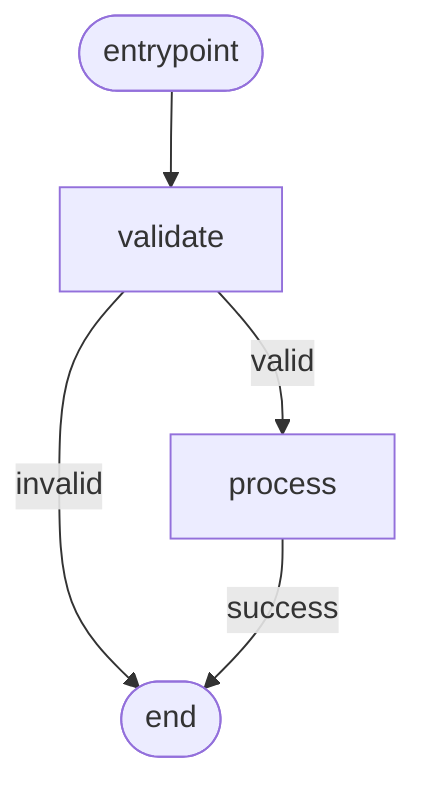

---
seeAlso:
  - text: 'Subclassing State'
    link: './subclassing'
    description: 'define the state class your nodes mutate'
  - text: 'Schema & JSON loading'
    link: './schema'
    description: 'load DAGs from JSON instead of building them in code'
  - text: 'Contract-derived flows'
    link: './derive'
    description: 'generate the same DAG shape from `OperationContract`s'
  - text: 'Visualization'
    link: './visualization'
    description: 'render the built DAG as Mermaid'
---

# DAGBuilder

`DAGBuilder` is a chainable authoring API for **deterministic workflows you control end-to-end** — ETL pipelines, transformation chains, fixed sequences where the order IS the spec. TypeScript narrows the `routes` map at each `.node()` call from the node's `TOutput` union, so misspelled routes are compile errors before the DAG runs.

If your flow is agent-style — operations declare data dependencies and you want the topology to fall out automatically — use [DAGDeriver](./derive) instead. See [Authoring DAGs](./authoring) for the decision matrix. Both surfaces produce the same canonical `DAG` JSON-LD object; pick the one that matches the mental model you use to describe the flow.

## Basic usage

The flow this snippet builds:



```ts
import { DAGBuilder, Dagonizer, NodeStateBase } from '@noocodex/dagonizer';
import type { NodeInterface } from '@noocodex/dagonizer';

class S extends NodeStateBase { value = 0; }

const validate: NodeInterface<S, 'valid' | 'invalid'> = {
  name: 'validate',
  outputs: ['valid', 'invalid'],
  async execute(state) {
    return { output: state.value > 0 ? 'valid' : 'invalid' };
  },
};

const process: NodeInterface<S, 'success'> = {
  name: 'process',
  outputs: ['success'],
  async execute(state) {
    state.value *= 2;
    return { output: 'success' };
  },
};

const dag = new DAGBuilder('pipeline', '1.0')
  .node('validate', validate, { valid: 'process', invalid: null })
  .node('process',  process,  { success: null })
  .build();

const dispatcher = new Dagonizer<S>();
dispatcher.registerNode(validate);
dispatcher.registerNode(process);
dispatcher.registerDAG(dag);
```

The first `.node()` call sets the entrypoint automatically. Call `.entrypoint('name')` to override.

## Type-safe output routing

When the node declares a narrow `TOutput` union, `.node()` enforces exhaustive routing at compile time:

```ts
// NodeInterface<S, 'ok' | 'warn' | 'error'>
.node('check', checkNode, {
  ok:    'save',
  warn:  'log',
  // error: ???   ← TypeScript error: property 'error' is missing
})
```

## Parallel group

```ts
const dag = new DAGBuilder('enrich', '1')
  .node('fetch-a', fetchA, { success: null, error: null })
  .node('fetch-b', fetchB, { success: null, error: null })
  .parallel('enrich-both', ['fetch-a', 'fetch-b'], 'all-success', {
    success: 'save',
    error:   null,
  })
  .node('save', saveNode, { success: null })
  .entrypoint('enrich-both')
  .build();
```

Note: nodes listed in `parallel()` must already be declared. The builder does not validate this — `registerDAG` does.

## Fan-out

```ts
import type { FanInConfig } from '@noocodex/dagonizer';

const fanIn: FanInConfig = {
  strategy: 'partition',
  partitions: { success: 'processed', error: 'failed' },
};

const dag = new DAGBuilder('batch', '1')
  .fanOut('process-items', processNode, 'items', fanIn, {
    'all-success': null,
    'partial':     null,
    'all-error':   null,
    'empty':       null,
  }, { concurrency: 4 })
  .build();
```

## Sub-DAG

```ts
const dag = new DAGBuilder('parent', '1')
  .deepDAG('run-child', 'child-dag-name', { success: 'finalize', error: 'finalize' }, {
    stateMapping: {
      input:  { childKey: 'parent.value' },
      output: { 'parent.result': 'childResult' },
    },
  })
  .node('finalize', finalizeNode, { success: null })
  .build();
```

## `.entrypoint()`

By default the first added node is the entrypoint. Override explicitly:

```ts
new DAGBuilder('dag', '1')
  .node('setup', setupNode, { success: 'main' })
  .node('main', mainNode, { success: null })
  .entrypoint('main')  // skip setup during a resume, for example
  .build();
```

## `.build()`

`build()` materializes the accumulated nodes and returns a `DAG`. It throws an `Error` if no entrypoint has been set (no nodes added and `.entrypoint()` not called).

The returned object is identical to one written by hand — pass it directly to `dispatcher.registerDAG()`.
## Related reference

⦿ [Reference: Dagonizer](../reference/dagonizer)
⦿ [Reference: Entities — `DAG`, `SingleNode`, `ParallelNode`, `FanOutNode`, `DeepDAGNode`](../reference/entities)
