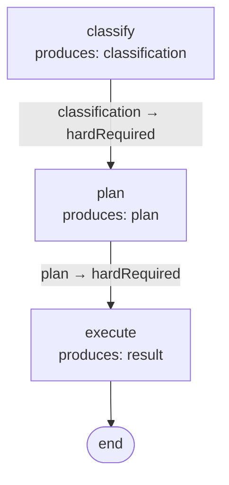

---
seeAlso:

  - text: 'Authoring DAGs'

    link: './authoring'
    description: 'when to use DAGBuilder vs DAGDeriver vs raw DAG literals'

  - text: 'DAGBuilder'

    link: './builder'
    description: 'imperative authoring for deterministic / ETL workflows'

  - text: 'Visualization'

    link: './visualization'
    description: 'render the derived DAG as Mermaid'

  - text: 'Schema & JSON loading'

    link: './schema'
    description: 'validate the derived DAG before registering'
---

# Contract-derived flows

`DAGDeriver` is the declarative authoring path for **agentic flows where reaching the final state matters more than authoring the order** — tool-driven agents, exploratory pipelines, workflows where the operation set changes per deployment, systems where adding a capability is one new contract and the topology rewires itself.

If your flow is a deterministic pipeline where you author the sequence end-to-end (ETL, transformation chains), [DAGBuilder](./builder) is the better fit. See [Authoring DAGs](./authoring) for the decision matrix.

`DAGDeriver.derive` builds a `DAG` from a registry of `OperationContract`s by matching `produces ↔ hardRequired`. Each operation declares the field paths it needs and the field paths it produces; an edge `A → B` exists when some path in `A.produces` appears in `B.hardRequired`. Same-topological-depth operations auto-group into a `ParallelNode` with `combine: 'collect'`; use the `parallels` annotation to override the grouping or pick a different combine strategy.

Adding an operation becomes a one-line registration. The flow topology updates automatically.

## OperationContract

```ts
import type { OperationContract } from '@noocodex/dagonizer/contracts';

const classify: OperationContract = {
  name: 'classify',
  hardRequired: ['input'],
  produces: ['classification'],
  outputs: ['success', 'off-topic'],
};
```

Four fields:

- `name` — matches `NodeInterface.name` used at registration with the dispatcher.
- `hardRequired` — field paths on state that must be present for the operation to run.
- `produces` — field paths the operation writes on success.
- `outputs` — output ports the operation can emit. Every port auto-wires to the next derived stage; `annotations.terminals` overrides individual ports per-operation.

## Deriving a DAG

The data graph (`produces ↔ hardRequired`) the snippet below derives:



```ts
import { DAGDeriver } from '@noocodex/dagonizer/derive';

const dag = DAGDeriver.derive({
  name: 'pipeline',
  version: '1.0',
  entrypoint: 'classify',
  contracts: [
    { name: 'classify', hardRequired: ['input'],          produces: ['classification'], outputs: ['success'] },
    { name: 'plan',     hardRequired: ['classification'], produces: ['plan'],           outputs: ['success'] },
    { name: 'execute',  hardRequired: ['plan'],           produces: ['result'],         outputs: ['success', 'cached', 'error'] },
  ],
});

dispatcher.registerDAG(dag);
```

Linear chains derive directly. Operations sharing a depth (no remaining unsatisfied prerequisites) are wrapped in a `parallel` placement that fires them concurrently and joins to the next depth. **Multi-port operations** — declare every port a node can emit in `outputs`; each port auto-wires to the next derived stage so a node with `outputs: ['success', 'cached', 'skipped', 'error']` doesn't need four separate terminal annotations.

## Annotations

Two routing patterns the data graph cannot express live in `annotations`:

### `terminals` — alternate exits

When an operation has output ports that should terminate the flow (or route to a non-default target) rather than continue to the next derived stage, use `terminals`. Each entry is one of two variants:

#### `target` variant (legacy form)

`target: null` ends the flow with an implicit `completed` outcome. `target: string` routes the output port to the named existing placement.

```ts
const dag = DAGDeriver.derive({
  name: 'gated',
  version: '1.0',
  entrypoint: 'classify',
  contracts: [
    { name: 'classify', hardRequired: ['input'],          produces: ['classification'], outputs: ['success', 'off-topic', 'error'] },
    { name: 'plan',     hardRequired: ['classification'], produces: ['plan'],           outputs: ['success'] },
  ],
  annotations: {
    terminals: {
      classify: [
        { outcome: 'off-topic', target: null },
        { outcome: 'error',     target: null },
      ],
    },
  },
});
```

#### `emit` variant — inline TerminalNode synthesis

Use `emit` when you need the flow to end with an **explicit** `failed` (or `completed`) lifecycle outcome rather than the implicit `completed` that `target: null` produces. The deriver materializes a [`TerminalNode`](../examples/09-terminals) placement and routes the operation's output port to it.

```ts
const dag = DAGDeriver.derive({
  name: 'gated',
  version: '1.0',
  entrypoint: 'classify',
  contracts: [
    { name: 'classify', hardRequired: ['input'],          produces: ['classification'], outputs: ['success', 'fail', 'error'] },
    { name: 'plan',     hardRequired: ['classification'], produces: ['plan'],           outputs: ['success'] },
  ],
  annotations: {
    terminals: {
      classify: [
        { outcome: 'fail',  emit: { name: 'end-fail',  outcome: 'failed' } },
        { outcome: 'error', emit: { name: 'end-error', outcome: 'failed' } },
      ],
    },
  },
});
```

The deriver adds two `TerminalNode` placements (`end-fail` and `end-error`) to `dag.nodes`. When the dispatcher reaches either placement it calls `state.markFailed(...)` and the run ends with `state.lifecycle.kind === 'failed'`.

**Deduplication and conflict detection:**

Multiple operations may declare `emit` entries sharing the same `name` — the deriver deduplicates and emits a single `TerminalNode`. If two `emit` entries share a name but disagree on `outcome`, `DAGDeriver.derive` throws `DAGError` identifying both the placement name and the conflicting outcomes.

**Name collision detection:**

An `emit.name` that matches an existing operation name throws `DAGError` at derive time.

**Mixing variants:**

Both variants can coexist on the same operation:

```ts
terminals: {
  classify: [
    { outcome: 'fail',  target: null },                                       // target: implicit completed
    { outcome: 'retry', emit: { name: 'end-retry-exhausted', outcome: 'failed' } }, // emit: explicit failed
  ],
},
```

Cross-link: [Builder `.terminal()`](./builder.md#terminal) for the imperative authoring equivalent; [09-terminals example](../examples/09-terminals).

Ports declared in `outputs` but absent from `terminals` auto-wire to the next derived stage. A terminal whose outcome doesn't appear in the contract's `outputs` throws `DAGError` at derive time — routing-shape mismatches fail fast.

### `fanouts` — fan-out roots

When an operation dispatches one execution per item from a state-array source, the `fanouts` annotation declares the source path, per-item key, registered node, and fan-in strategy. `DAGDeriverFanOut` is a **discriminated union over the fan-in strategy** — every variant carries its strategy-specific fields and only those.

#### Strategy `'custom'` — registered merge node

```ts
const dag = DAGDeriver.derive({
  name: 'scout-flow',
  version: '1.0',
  entrypoint: 'plan',
  contracts: [
    { name: 'plan',  hardRequired: ['input'],        produces: ['tasks'],        outputs: ['success'] },
    { name: 'scout', hardRequired: ['tasks'],        produces: ['scoutResults'], outputs: ['success'] },
    { name: 'merge', hardRequired: ['scoutResults'], produces: ['merged'],       outputs: ['success'] },
  ],
  annotations: {
    fanouts: {
      scout: {
        source:         'tasks',
        itemKey:        'currentTask',
        node:           'scout',
        concurrency:    3,
        strategy:       'custom',
        fanInOperation: 'merge',
        outcomes:       ['all-success', 'partial', 'all-error', 'empty'],
      },
    },
  },
});
```

The fan-in operation is registered with the dispatcher and invoked through the `custom` strategy; the dispatcher passes the `Record<outcome, item[]>` map to it via `state.metadata.fanInResults`.

#### Strategy `'partition'` — per-outcome state buckets

```ts
annotations: {
  fanouts: {
    scout: {
      source:     'tasks',
      itemKey:    'currentTask',
      node:       'scout',
      strategy:   'partition',
      partitions: { 'success': 'state.passed', 'error': 'state.failed' },
      outcomes:   ['success', 'error', 'empty'],
    },
  },
}
```

Every per-outcome item array writes to the declared state path. `partitions` keys must appear in `outcomes` (validated at derive time — out-of-band keys throw `DAGError`).

#### Strategy `'append'` — single flat output

```ts
annotations: {
  fanouts: {
    scout: {
      source:   'tasks',
      itemKey:  'currentTask',
      node:     'scout',
      strategy: 'append',
      target:   'state.allResults',
      outcomes: ['success', 'error'],
    },
  },
}
```

Every item result (regardless of outcome) is flattened into the array at `target`.

### `parallels` — explicit parallel grouping

By default, DAGDeriver auto-groups same-topological-depth operations into a `ParallelNode` with `combine: 'collect'`. The `parallels` annotation overrides that grouping — declare named groups with the consumer's chosen combine strategy:

```ts
annotations: {
  parallels: {
    'scout-cluster': {
      members: ['openLibraryScout', 'googleBooksScout', 'subjectScout', 'wikipediaScout'],
      combine: 'all-success',
    },
  },
}
```

- Every name in `members` must be a contract in the registry.
- Membership is exclusive — an operation can't appear in two `parallels` groups.
- A `parallels` member can't also appear in `fanouts` or `subDAGs` — placement kind must be unambiguous.
- `combine` is one of `'all-success' | 'any-success' | 'collect'`; the engine routes the parallel's aggregate output through the chosen reduction.

### `subDAGs` — sub-DAG composition

When an operation delegates execution to a nested registered DAG (plugin dispatch, phase composition, runtime-resolved child flows). The contract still declares `produces ↔ hardRequired` for topology derivation; the annotation only swaps the rendered placement from `SingleNode` to `DeepDAGNode`:

```ts
const dag = DAGDeriver.derive({
  name: 'page-pipeline',
  version: '1.0',
  entrypoint: 'fetch',
  contracts: [
    { name: 'fetch',    hardRequired: ['url'],     produces: ['html'],   outputs: ['success', 'cached', 'error'] },
    { name: 'parse',    hardRequired: ['html'],    produces: ['record'], outputs: ['success', 'error'] },
    { name: 'persist',  hardRequired: ['record'],  produces: ['saved'],  outputs: ['success'] },
  ],
  annotations: {
    subDAGs: {
      parse: {
        dag:     'aonprd:parse',         // registered DAG name
        outputs: ['success', 'error'],   // ports the deep-DAG can route on
        stateMapping: {
          input:  { html:   'parent.html' },
          output: { 'parent.record': 'record' },
        },
      },
    },
    terminals: {
      parse: [{ outcome: 'error', target: null }],
    },
  },
});
```

- The child DAG name (`'aonprd:parse'`) is resolved at `registerDAG` time. The parent must register the child DAG first; the dispatcher's existing cycle check rejects self-referential subDAGs.
- Every port in `subDAG.outputs` auto-wires to the next derived stage (same semantics as `contract.outputs`). `terminals` overrides individual ports.
- A terminal whose outcome isn't in `subDAG.outputs` throws `DAGError` at derive time.
- `stateMapping` is forwarded verbatim to the rendered `DeepDAGNode.stateMapping`; controls what crosses the parent/child state boundary.
- Deep-DAG placements cannot terminate the run — the parent DAG owns END. The deep-DAG step must route to another parent placement; if every port routes to `null` the engine rejects the DAG at registration.
- An operation cannot appear in both `fanouts` and `subDAGs`; the placement kind must be unambiguous.

#### Typed `stateMapping` via `DAGDeriverSubDAG<TChildState>`

Supply `TChildState` to narrow `stateMapping.input` keys to names that actually exist on the child state at compile time. The wire shape emitted to the rendered `DeepDAGNode` is always `Record<string, string>`; the generic is for authoring ergonomics only.

```ts
class ParseChildState extends NodeStateBase {
  html   = '';
  record = '';
}

annotations: {
  subDAGs: {
    parse: {
      dag:     'aonprd:parse',
      outputs: ['success', 'error'],
      stateMapping: {
        input:  { html:   'parent.html' },   // 'html' must be a key of ParseChildState
        output: { 'parent.record': 'record' }, // 'record' must be a key of ParseChildState
      },
    } satisfies DAGDeriverSubDAG<ParseChildState>,
  },
}
```

Omitting `TChildState` (using bare `DAGDeriverSubDAG`) preserves backward compatibility — the default accepts any string on both sides of the mapping.

A complete runnable demonstration ships in [`examples/derive.ts`](https://github.com/Studnicky/Dagonizer/blob/main/examples/derive.ts) — declares parent + child contracts, derives both DAGs, dispatches, prints the rendered placement order. Run with `npm run example:derive` or `npx tsx examples/derive.ts`.

## Co-located contracts

The standalone `contracts` array requires every operation to be declared twice — once as an `OperationContract` and once as a `NodeInterface` registered with the dispatcher. `name` and `outputs` must match by convention; drift is silent.

The co-located pattern eliminates that duplication. Declare `hardRequired` and `produces` directly on the node via `NodeInterface.contract`; the node's own `name` and `outputs` complete the full contract surface.

**Standalone (legacy)**

```ts
// Contract declared separately
const fetchContract: OperationContract = {
  name:         'fetch',
  hardRequired: ['url'],
  produces:     ['raw'],
  outputs:      ['success', 'cached', 'error'],
};

// Node declared separately — name and outputs must match by hand
const fetchNode: NodeInterface<MyState, 'success' | 'cached' | 'error'> = {
  name:    'fetch',
  outputs: ['success', 'cached', 'error'],
  async execute(state, ctx) { /* ... */ return { output: 'success' }; },
};

const dag = DAGDeriver.derive({
  name: 'pipeline', version: '1.0', entrypoint: 'fetch',
  contracts: [fetchContract, /* ... */],
});
dispatcher.registerNode(fetchNode);
```

**Co-located (recommended)**

```ts
// Contract lives on the node — single source of truth
const fetchNode = {
  name:    'fetch',
  outputs: ['success', 'cached', 'error'] as const,
  contract: {
    hardRequired: ['url'] as const,
    produces:     ['raw'] as const,
  },
  async execute(state: MyState, ctx) { /* ... */ return { output: 'success' as const }; },
} satisfies NodeInterface;

// Pass the node registry — no separate contracts array
const dag = DAGDeriver.derive({
  name: 'pipeline', version: '1.0', entrypoint: 'fetch',
  nodes: [fetchNode, planNode, executeNode],
});
dispatcher.registerNode(fetchNode);
```

`DAGDeriver.derive({ nodes })` and `DAGDeriver.derive({ contracts })` are mutually exclusive — supply exactly one. Nodes without a `contract` field are silently skipped in topology derivation; the dispatcher still registers and executes them.

Use `DAGDeriver.extractContracts(nodes)` to inspect the projected contracts before derivation:

```ts
const contracts = DAGDeriver.extractContracts([fetchNode, planNode, executeNode]);
// contracts is OperationContract[] — skips nodes without .contract
```

## Catching contract drift

Three mechanisms surface drift between what nodes declare they need and what others provide:

### Type-level: `Chainable<A, B>`

`Chainable<A, B>` is a compile-time utility type that resolves to `true` when `B`'s `hardRequired` set is fully satisfied by `A`'s `produces` set, and `never` otherwise. Use it in test helpers or contract authoring to catch drift before running the code.

Most useful when nodes are typed with `as const` literal-tuple contracts:

```ts
import type { Chainable } from '@noocodex/dagonizer/contracts';

const fetchNode = {
  name: 'fetch', outputs: ['success'] as const,
  contract: { hardRequired: ['url'] as const, produces: ['raw'] as const },
  async execute(state, ctx) { return { output: 'success' as const }; },
} satisfies NodeInterface;

const parseNode = {
  name: 'parse', outputs: ['success'] as const,
  contract: { hardRequired: ['raw'] as const, produces: ['record'] as const },
  async execute(state, ctx) { return { output: 'success' as const }; },
} satisfies NodeInterface;

// Compiles: 'raw' in fetchNode.produces satisfies parseNode.hardRequired
type FetchThenParse = Chainable<typeof fetchNode, typeof parseNode>; // true

// Would not compile: parseNode.produces is ['record'], not ['raw']
// type BackwardChain = Chainable<typeof parseNode, typeof fetchNode>; // never
```

### Registration-time: dangling reads

`ContractRegistryValidator` runs automatically during `Dagonizer.registerDAG` for DAGs derived from a `nodes` registry. If any non-entrypoint node `hardRequires` a path that no upstream node `produces`, registration throws a `DAGError`:

```
DAGError: ContractRegistryValidator: node 'plan' hardRequires 'classification'
but no upstream-in-DAG node produces it
```

The same check runs as a preflight inside `DAGDeriver.derive({ nodes })` so contract errors surface before the DAG is built.

The entrypoint node's `hardRequired` paths are treated as external initial state (seeded before execution) and are not checked.

### Registration-time: dead writes

When a node `produces` a path that no downstream node `hardRequires`, `ContractRegistryValidator` calls `Dagonizer.onContractWarning` (a no-op by default). Subclass `Dagonizer` and override `onContractWarning` to surface these warnings:

```ts
class ObservingDispatcher extends Dagonizer<MyState> {
  protected override onContractWarning(message: string): void {
    console.warn('[contract]', message);
  }
}
```

Dead-write warnings are non-fatal — the DAG registers and executes normally. They indicate an operation that writes state no downstream node consumes, which may be intentional (terminal outputs, observability writes) or an authoring oversight.

## Inspecting derived state

`DAGDeriver` also exposes the intermediate computations:

- `DAGDeriver.edges(contracts)` — the adjacency map.
- `DAGDeriver.depthBuckets(contracts, edges)` — operations grouped by topological depth.

Useful for tooling that wants to visualize or analyze the contract graph before producing a DAG.

## DAGDeriver vs DAGBuilder

The two share an output type (`DAG`) but differ in how the topology is authored:

- **DAGDeriver** — declarative. Each operation states what it `hardRequired`s and `produces`; the edge set falls out of the data graph. Adding a new operation is one contract; the topology rewires automatically. Multi-port nodes declare every port in `outputs`; all ports auto-wire to the next derived stage with one field. Best when the natural ordering is "X needs the output of Y" and the alternate exits are sparse enough to enumerate in `annotations.terminals`.

- **DAGBuilder** — imperative. Each `.node(name, nodeRef, routes)` call wires every port to a specific target by hand. Better when the routing is non-uniform across ports (different ports route to different next-stages), when topology depends on runtime conditions, or when the graph has cycles that the data-flow ordering would reject.

Multi-port nodes work in both: DAGDeriver auto-wires all ports uniformly + terminals for exceptions; DAGBuilder requires every port spelled out in `routes`. The break-even point is roughly: 3+ ports with mostly-uniform routing → DAGDeriver wins; 3+ ports with mostly-divergent routing → DAGBuilder wins.
## Related reference

- [Reference: Derive](../reference/derive)
- [Reference: Contracts — `OperationContract`](../reference/contracts)
