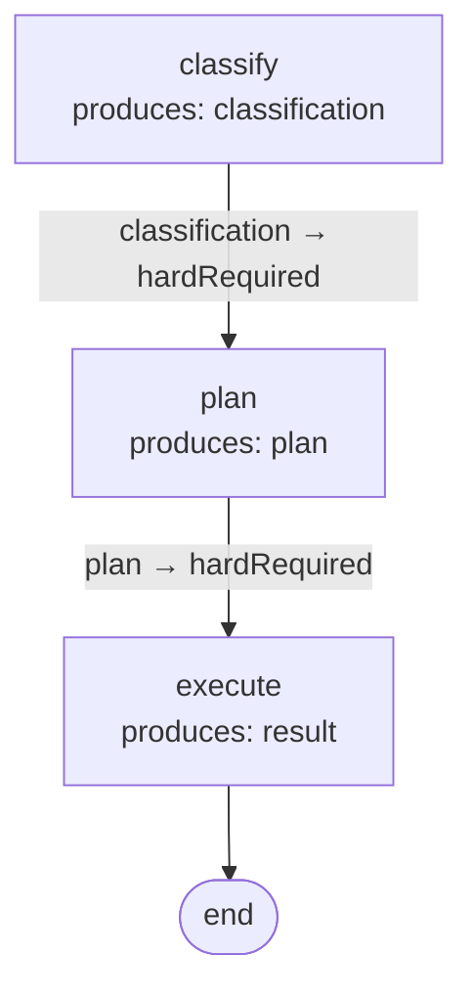

# Contract-derived flows

`FlowDeriver.derive` builds a `DAG` from a registry of `OperationContract`s by matching `produces ↔ hardRequired`. Each operation declares the field paths it needs and the field paths it produces; an edge `A → B` exists when some path in `A.produces` appears in `B.hardRequired`. The dispatcher executes operations in topological order; same-depth operations become a `parallel` placement.

Adding an operation becomes a one-line registration. The flow topology updates automatically.

## OperationContract

```ts
import type { OperationContract } from '@noocodex/dagonizer/contracts';

const classify: OperationContract = {
  name: 'classify',
  hardRequired: ['input'],
  produces: ['classification'],
};
```

Three fields:

- `name` — matches `NodeInterface.name` used at registration with the dispatcher.
- `hardRequired` — field paths on state that must be present for the operation to run.
- `produces` — field paths the operation writes on success.

## Deriving a DAG

The data graph (`produces ↔ hardRequired`) the snippet below derives:



```ts
import { FlowDeriver } from '@noocodex/dagonizer/derive';

const dag = FlowDeriver.derive({
  name: 'pipeline',
  version: '1.0',
  entrypoint: 'classify',
  contracts: [
    { name: 'classify', hardRequired: ['input'],          produces: ['classification'] },
    { name: 'plan',     hardRequired: ['classification'], produces: ['plan'] },
    { name: 'execute',  hardRequired: ['plan'],           produces: ['result'] },
  ],
});

dispatcher.registerDAG(dag);
```

Linear chains derive directly. Operations sharing a depth (no remaining unsatisfied prerequisites) are wrapped in a `parallel` placement that fires them concurrently and joins to the next depth.

## Annotations

Two routing patterns the data graph cannot express live in `annotations`:

### `terminals` — alternate exits

When an operation has non-success outputs that should terminate the flow rather than continue:

```ts
const dag = FlowDeriver.derive({
  name: 'gated',
  version: '1.0',
  entrypoint: 'classify',
  contracts,
  annotations: {
    terminals: {
      classify: [
        { outcome: 'off-topic', target: null },
        { outcome: 'error',     target: null },
      ],
    },
  },
});
```

The `success` route still flows to the next derived operation; named alternates route per declaration.

### `fanouts` — fan-out roots

When an operation dispatches one execution per item from a state-array source:

```ts
const dag = FlowDeriver.derive({
  name: 'scout-flow',
  version: '1.0',
  entrypoint: 'plan',
  contracts: [
    { name: 'plan',  hardRequired: ['input'], produces: ['tasks'] },
    { name: 'scout', hardRequired: ['tasks'], produces: ['scoutResults'] },
    { name: 'merge', hardRequired: ['scoutResults'], produces: ['merged'] },
  ],
  annotations: {
    fanouts: {
      scout: {
        source:          'tasks',
        itemKey:         'currentTask',
        concurrency:     3,
        fanInOperation:  'merge',
        outcomes:        ['all-success', 'partial', 'all-error', 'empty'],
      },
    },
  },
});
```

The fan-in operation is registered with the dispatcher and invoked through the `custom` fan-in strategy. `outcomes` carry the same fan-out outcome names the dispatcher uses (`all-success` / `partial` / `all-error` / `empty`).

## Inspecting derived state

`FlowDeriver` also exposes the intermediate computations:

- `FlowDeriver.edges(contracts)` — the adjacency map.
- `FlowDeriver.depthBuckets(contracts, edges)` — operations grouped by topological depth.

Useful for tooling that wants to visualize or analyze the contract graph before producing a DAG.

## See also

- [DAGBuilder](./builder) — the imperative alternative when contracts don't fit
- [Visualization](./visualization) — render the derived DAG as Mermaid
- [Schema & JSON loading](./schema) — validate the derived DAG before registering

## Related reference

- [Reference: Derive](../reference/derive)
- [Reference: Contracts — `OperationContract`](../reference/contracts)
