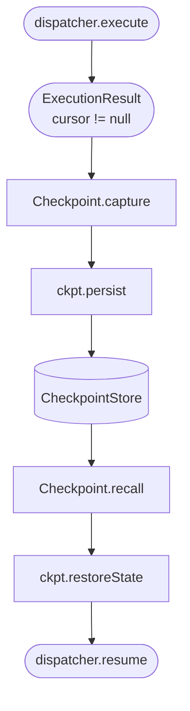

# Checkpoint Persistence

## What It Is

Checkpoint persistence is the durable graph-state path for checkpointed execution. RDF/N-Quads is the default graph serialization for node state, lifecycle, relationships, transfer, and retention, while context-bound JSON-LD is the intermediate representation exposed to Node.js boundaries. `Checkpoint` carries both views of the same graph state: JSON-LD for Node.js restoration and N-Quads for streaming, hashing, and adapter persistence.

Use it when a checkpoint must survive process memory: browser parking, serverless resume, queue hand-off, crash recovery, or any execution that may continue in a different host.

## How It Works

`Checkpoint` owns encoding and validation. `CheckpointStore` owns storage. `ckpt.persist(store, key)` serializes the checkpoint and calls the store; `Checkpoint.recall(store, key)` reads, parses, validates, and returns a checkpoint ready for state/store restore.

`CheckpointStore` is the three-method adapter contract for persistence backends. `Checkpoint` handles the codec (turning an `ExecutionResult` into a `CheckpointData` record and back); persistence is the application's responsibility behind this contract.

### Persist + recall lifecycle



The diagram traces method invocations across the save and resume halves. It is not a Dagonizer DAG; it is a sequence over the codec API.

## Diagrams, Examples, and Outputs

Persistence is not DAG topology, so this page uses a sequence diagram for the checkpoint API lifecycle and source snippets for the runnable store examples.

- [Checkpoint](./checkpoint) - the codec layer (`Checkpoint.capture` and `Checkpoint.load`)
- [Subclassing State](./subclassing) - domain fields survive through graph facts and JSON-LD
- [Cancellation](./cancellation) - produce a checkpointable result by aborting an in-flight flow
- [Example 23: Checkpoint Store](../examples/23-checkpoint-store) runs the store-backed recall path.

## What It Lets You Do

### Use when

Use checkpoint persistence when a checkpoint must survive process memory. This is the backing-store layer for browser parking, serverless resumes, queue hand-offs, crash recovery, and any flow where `Checkpoint.capture` is not enough by itself.

## Code Samples

### API surface

| Symbol | Source | Role |
|--------|--------|------|
| `CheckpointStore` | `@studnicky/dagonizer/contracts` | Adapter contract: `save`, `load`, `delete` |
| `Snapshottable` | `@studnicky/dagonizer/contracts` | Capability contract: `snapshot()`, `restore()`. Required by `Checkpoint.capture` and `restoreStores`. |
| `StoreSnapshotType` | `@studnicky/dagonizer/contracts` | Serialized envelope written into `CheckpointData.stores` |
| `MemoryCheckpointStore` | `@studnicky/dagonizer/checkpoint` | In-memory reference implementation (tests, demos) |
| `ckpt.persist(store, key)` | instance method | Serializes and writes via the store |
| `Checkpoint.recall(store, key)` | `@studnicky/dagonizer/checkpoint` | Reads, parses, validates, wraps |

### The contract

```ts twoslash
import type { CheckpointStoreInterface } from '@studnicky/dagonizer/contracts';
// ---cut---
declare const store: CheckpointStoreInterface;
await store.save('run-42', '{"cursor":null}');
const json: string | null = await store.load('run-42');
await store.delete('run-42');
export {};
```

`load` returns `null` when no entry exists. Implementations handle their own concurrency, retries, and serialization details.

### Schema validation on recall

`Checkpoint.recall` runs the JSON through `Validator.checkpoint.validate(parsed)` before wrapping it. Tampered or version-mismatched payloads throw `ValidationError`. The same goes for `Checkpoint.load` (which `recall` composes with).

## Details for Nerds

### Persist with `ckpt.persist`

<<< @/../examples/08-checkpoint.ts#persist

`ckpt.persist(store, key)` calls `store.save(key, ckpt.toJson())`. One call covers serialization plus storage.

### Recall with `Checkpoint.recall`

<<< @/../examples/08-checkpoint.ts#recall

`Checkpoint.recall` returns `null` when the key is absent, or a `Checkpoint` instance whose `restoreState` yields the rehydrated state, the DAG IRI/CURIE string, the placement-IRI resume cursor, and the executed/skipped node histories.

### Implementing a custom store

Implement the three methods against the backend. The store below backs the contract with a real `Map` — a complete, runnable implementation:

<<< @/../examples/dags/custom-checkpoint-store.ts#custom-store

The same three-method pattern applies for Postgres (`INSERT … ON CONFLICT`/`SELECT`/`DELETE`), Redis (`GET`/`SET`/`DEL`), S3 (`GetObject`/`PutObject`/`DeleteObject`), a file system, or any other key/value store. Only the backing changes; the three methods stay identical. The contract is intentionally thin so it maps cleanly to any backing.

The `custom-checkpoint-store` example exercises the full `save` → `load` → `delete` round-trip end to end; run it with `npx tsx examples/custom-checkpoint-store.ts`.

### Named stores and `Snapshottable`

`Checkpoint.capture` and `ckpt.restoreStores` both depend on the `Snapshottable` capability, not the full key-value `Store` surface. Any object that implements `snapshot(): Promise<StoreSnapshotType>` and `restore(snapshot: StoreSnapshotType): Promise<void>` participates in checkpointing. `Store extends Snapshottable`, so every store qualifies, but a non-KV backing (an RDF triple store, a vector index, an append-only log) can ride along in a checkpoint without implementing `get`/`set`/`has`/`delete`/`update`.

<<< @/../examples/dags/custom-checkpoint-store.ts#snapshottable

`FactLog` implements only `snapshot()` and `restore()` — no `get`/`set`/`has`/`delete`/`update`. Pass it to `Checkpoint.capture('urn:noocodec:dag:my-dag', result, { stores: { log } })` alongside any `MemoryStore`, and restore it on resume with `recalled.restoreStores({ log: freshLog })`. The `custom-checkpoint-store` example runs the `snapshot` → `restore` round-trip; run it with `npx tsx examples/custom-checkpoint-store.ts`.

`CheckpointData.stores` is a **required** field. `Checkpoint.capture` always writes it: as an empty object `{}` when no stores are passed, or as a keyed map of `StoreSnapshotType` envelopes when stores are supplied. Any checkpoint payload lacking a `stores` field is rejected by `Checkpoint.load`.

## RDF graph state

`NodeStateBase` is graph-backed. Its ordinary state fields, metadata, lifecycle, retry counters, warnings, errors, placement events, and run identity are represented as RDF facts in a run-scoped named graph while the public node API remains the familiar `NodeStateInterface` surface.

Use `GraphStateTransferCodec` for graph-aware checkpoint and container boundaries. N-Quads is the required transfer form; `GraphStateTransferCodec.reference` stores a named-graph snapshot behind a reference, `GraphStateTransferCodec.shared` issues scoped shared-graph authority, and `GraphStateTransferCodec.delta` carries additive/deletion deltas. Optional transfer modes are capability-negotiated; inline N-Quads is implicit and is not listed as a capability.

Semantic assertions are additive and exact-quad-idempotent. Relationship facts are not silently replaced. Completed run graphs close with lifecycle facts, then `GraphRetentionManager` can compact and prune transient detail while protecting live checkpoint graphs, externally referenced graphs, and durable memory graphs.

The Node adapter surface is available from `@studnicky/dagonizer/adapter`:

```ts
import { FileGraphDataset } from '@studnicky/dagonizer/adapter';

const graph = new FileGraphDataset('./state.nq');
```

For inspection or migration, decode canonical N-Quads with `dagonizer-rdf-json path/to/state.nq` or pipe N-Quads to the command. The decoder is a presentation tool; it does not replace the canonical RDF dataset.

### Graph round-trip

`Checkpoint.capture` exports the run graph as JSON-LD and N-Quads, then packages those views with the cursor and execution history. State subclasses persist domain fields by writing them to the shared graph-backed state API; there is no second object snapshot contract.

<<< @/../examples/dags/23-checkpoint-store.ts#pipeline-state

Lifecycle resets to `pending` on restore. Resume starts a fresh lifecycle run on the recovered state data.

### Testing with `MemoryCheckpointStore`

<<< @/../examples/23-checkpoint-store.ts#store-init

`MemoryCheckpointStore` exposes a read-only `size` getter for assertions about how many entries the store holds.

### Scatter resume artefacts

Scatter placements with a `source` persist per-item progress under a reserved metadata key (`SCATTER_PROGRESS_KEY === '__dagonizer_scatter_progress__'`). When a checkpoint captures a state mid-scatter, this key carries the indices of already-completed clones so the resumed run can skip them instead of re-issuing every external call from scratch.

Three persistence-side implications:

1. **The key counts toward checkpoint payload size.** A 200-item scatter interrupted at clone 150 stores 150 numeric indices plus their output tags. Plan capacity in the `CheckpointStore` with this in mind; the payload still serialises as a single JSON document.
2. **Per-batch write cadence.** The dispatcher writes the progress entry once per scatter batch (not once per item). The persisted metadata is consistent with the batch boundary that was last `await`-ed; a crash during a batch leaves the last completed batch persisted and the in-flight batch unreported.
3. **Indices are array positions in the source at resume time.** If the `CheckpointStore` is read across processes that may rebuild state with a different source array, the resumed scatter skips by position, not by item identity. Treat the source as immutable while a scatter checkpoint is live, or clear the progress entry before calling `dispatcher.resume()` when the source has changed.

The reserved key is projected into the graph-backed state, so scatter resume uses the same checkpoint graph as every other node field. See [Checkpoint and Resume](./checkpoint#scatter-resume-per-item-progress) for the executable contract and index-semantics worked example.

## Related Concepts

- [Checkpoint](./checkpoint) - the codec layer (`Checkpoint.capture` and `Checkpoint.load`)
- [Subclassing State](./subclassing) - domain fields survive through graph facts and JSON-LD
- [Cancellation](./cancellation) - produce a checkpointable result by aborting an in-flight flow
- [Example 23: Checkpoint Store](../examples/23-checkpoint-store)
- [Reference: Contracts](../reference/contracts)
- [Reference: Checkpoint](../reference/checkpoint)
- [Example 08: Checkpoint and Resume](../examples/08-checkpoint)
