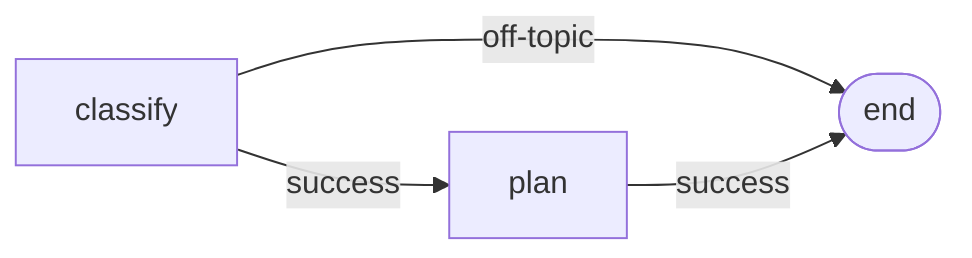

---
seeAlso:
  - text: 'Reference: Dagonizer'
    link: './dagonizer'
    description: 'read accessors'
  - text: 'Reference: Entities'
    link: './entities'
    description: '`DAG`'
  - text: 'Reference: Derive'
    link: './derive'
    description: 'render the DAG `derive()` returned'
---

# Viz

DAG visualization helpers. Ship through `@noocodex/dagonizer/viz`.

```ts
import {
  MermaidRenderer,
  JsonLdRenderer,
  CytoscapeRenderer,
  DAGONIZER_VOCAB,
} from '@noocodex/dagonizer/viz';
import type {
  DagJsonLdDocument,
  JsonLdGraphEntry,
  CytoscapeElement,
  CytoscapeNodeElement,
  CytoscapeEdgeElement,
} from '@noocodex/dagonizer/viz';
```

## MermaidRenderer

Static class.

```ts
class MermaidRenderer {
  static render(dag: DAG): string;
}
```

Render a `DAG` as Mermaid `flowchart` source. The output is a complete Mermaid block ready to embed in a Markdown ```` ```mermaid ```` fence.

### Shape vocabulary

| Placement | Mermaid shape | Example output |
|-----------|---------------|----------------|
| `single`  | rectangle     | `greet[greet]` |
| `scatter` | trapezoid     | `scout[/scout/]` |
| `embedded-dag` | subroutine | `invoke[[invoke]]` |
| `terminal` (completed) | double-circle | `done(((done\n(completed))))` |
| `terminal` (failed) | asymmetric flag | `fail>fail\n(failed)]` |

Every output route renders as a labeled directed edge: `from -->|outcome| to`. Routes targeting `null` route to a synthetic `END` terminator (one per DAG, rendered as `END([end])`). Explicit `TerminalNode` placements render as their own distinct shapes and emit no edges.

### Example

```ts
<<< @/../examples/the-archivist/viz/render-mermaid.ts#mermaid-render
```



### Combining with the dispatcher's read accessors

```ts
const sources = dispatcher.listDAGs().map((dag) => ({
  name: dag.name,
  mermaid: MermaidRenderer.render(dag),
}));
```

`getDAG`, `listDAGs`, `getNode`, and `listNodes` give tooling everything it needs to walk the registry and emit per-DAG documentation.

---

## JsonLdRenderer

Static class.

```ts
class JsonLdRenderer {
  static render(dag: DAG): DagJsonLdDocument;
}
```

Renders a `DAG` as a JSON-LD document with a `@context` and a `@graph` containing the DAG root plus every placement, all typed against the Dagonizer vocabulary (`DAGONIZER_VOCAB`). The output is a plain object; serialize with `JSON.stringify`.

Each placement's `@type` is prefixed with `dag:`: `dag:SingleNode`, `dag:ScatterNode`, `dag:EmbeddedDAGNode`, `dag:TerminalNode`.

```ts
<<< @/../examples/the-archivist/viz/render-jsonld.ts#jsonld-render
```

### `DAGONIZER_VOCAB`

```ts
const DAGONIZER_VOCAB = 'https://noocodex.dev/ontology/dagonizer/';
```

Stable JSON-LD vocabulary URI for the Dagonizer DAG vocabulary. Prefixed as `dag:` in rendered documents.

### Types

```ts
interface DagJsonLdDocument {
  readonly '@context': Record<string, string>;
  readonly '@graph': readonly JsonLdGraphEntry[];
}

interface JsonLdGraphEntry {
  readonly '@id': string;
  readonly '@type': string;
  readonly [key: string]: unknown;
}
```

---

## CytoscapeGraph

Subclassable factory class for mounting an interactive cytoscape graph in a DOM container. `cytoscape` and `@dagrejs/dagre` are optional peer dependencies; install them to use this class. The cytoscape constructor is dependency-injected: consumers pass it to the `CytoscapeGraph` constructor so the factory never bundles cytoscape directly.

```ts
import { CytoscapeGraph } from '@noocodex/dagonizer/viz';
import cytoscape from 'cytoscape';

const graph = new CytoscapeGraph(cytoscape, container, dag, options?);
await graph.mount(); // returns cytoscape.Core
```

### Constructor

```ts
new CytoscapeGraph(
  cytoscapeFactory: typeof cytoscape,
  container:        HTMLElement,
  dag:              DAG,
  options?:         CytoscapeGraphOptions,
)
```

| Parameter | Type | Description |
|-----------|------|-------------|
| `cytoscapeFactory` | `typeof cytoscape` | The cytoscape constructor (DI-injected; not bundled) |
| `container` | `HTMLElement` | DOM element to mount the graph into |
| `dag` | `DAG` | The DAG to render |
| `options` | `CytoscapeGraphOptions?` | Optional configuration |

### `CytoscapeGraphOptions`

| Field | Type | Description |
|-------|------|-------------|
| `embeddedDAGs?` | `ReadonlyMap<string, DAG>` | Registry of embedded-DAGs by name, passed to `CytoscapeRenderer` and `CompositeLayout` for recursive expansion. Default: empty `Map`. |
| `layoutOptions?` | `CompositeLayoutOptions` | Layout tuning options forwarded to `CompositeLayout.compute`. Default: `{}` (all tuning delegated to `CompositeLayout`'s own defaults). |

The constructor accepts `Partial<CytoscapeGraphOptions>`; both fields are optional at the call site with the defaults noted above.

### `async mount(): Promise<cytoscape.Core>`

Builds elements via `CytoscapeRenderer.render`, computes layout via `CompositeLayout.compute` (async), mounts the cytoscape instance into the container, and calls `onReady`. Returns the mounted `cytoscape.Core`.

### `cy` getter

```ts
get cy(): cytoscape.Core | null
```

Returns the `cytoscape.Core` after a successful `mount()`, or `null` if the graph has not yet been mounted.

### Protected hooks (override in subclasses)

| Hook | Signature | Purpose |
|------|-----------|---------|
| `buildElements` | `(dag: DAG, options: CytoscapeGraphOptions) => readonly CytoscapeElement[]` | Override to customize element construction. Default calls `CytoscapeRenderer.render`. |
| `stylesheet` | `() => cytoscape.Stylesheet[]` | Override to supply a custom stylesheet. |
| `presetLayout` | `(elements: readonly CytoscapeElement[]) => cytoscape.LayoutOptions` | Override to supply a preset (position-based) layout when positions are already computed. |
| `interactionDefaults` | `() => cytoscape.CytoscapeOptions` | Override to customize pan/zoom/interaction defaults. |
| `layoutRegistry` | `() => Record<string, cytoscape.LayoutOptions>` | Override to register named layout configurations. |
| `applyLayout` | `(cy: cytoscape.Core) => Promise<void>` | Override to customize the layout application step. |
| `enforceVisibility` | `(cy: cytoscape.Core) => void` | Override to enforce node/edge visibility rules after layout. |
| `onReady` | `(cy: cytoscape.Core) => void` | Called after layout is applied. Override to attach event listeners or run post-mount logic. |

### Example: subclassing for doc animations

The doc site's `AnimatedDagGraph` extends `CytoscapeGraph` and overrides `onReady` to attach execution-trace animation:

```ts
<<< @/../examples/the-archivist/viz/ArchivistGraph.ts#cytoscape-graph-subclass
```

---

## CytoscapeRenderer

Static class. Returns a plain element array with NO computed positions. Layout is performed separately by `CompositeLayout.compute` or handled internally by `CytoscapeGraph`.

```ts
class CytoscapeRenderer {
  static render(dag: DAG, options?: RenderOptions): readonly CytoscapeElement[];
}
```

Renders a `DAG` as a Cytoscape elements array.

- Every placement becomes a node element with a `type` field (`'single'` | `'parallel'` | `'scatter'` | `'embedded-dag'` | `'terminal'`) for per-type stylesheet selectors.
- Every output route becomes a labeled edge element.
- Parallel children render with `parent: <parallelPlacementName>` for compound-graph rendering.
- Embedded-DAG placements are expanded inline when their target DAG is supplied via `options.embeddedDAGs`, showing the full inner flow as a compound cluster.
- Routes to `null` become edges to a synthetic `END` terminal node.

```ts
<<< @/../examples/the-archivist/viz/render-cytoscape.ts#cytoscape-render
```

### `RenderOptions`

```ts
interface RenderOptions {
  readonly embeddedDAGs?: ReadonlyMap<string, DAG>;
  readonly maxDepth?:     number;  // default 6
}
```

Note: `computeLayout` and `layoutOptions` are not options on `CytoscapeRenderer.render`. Positioning is performed by `CompositeLayout.compute` (async) or handled internally by `CytoscapeGraph`.

### Types

```ts
type CytoscapeElement = CytoscapeNodeElement | CytoscapeEdgeElement;

interface CytoscapeNodeElement {
  readonly group: 'nodes';
  readonly data: {
    readonly id: string;
    readonly label: string;
    readonly type: 'single' | 'parallel' | 'scatter' | 'embedded-dag' | 'terminal';
    readonly [key: string]: unknown;
  };
  readonly classes?: string;
  readonly position?: { readonly x: number; readonly y: number };
}

interface CytoscapeEdgeElement {
  readonly group: 'edges';
  readonly data: {
    readonly id: string;
    readonly source: string;
    readonly target: string;
    readonly label: string;
    readonly route: string;
  };
  readonly classes?: string;
}
```

## CompositeLayout

Static class that computes positions for a Cytoscape element array using `@dagrejs/dagre`. `compute` is async: it lazy-loads dagre and applies the layout, then returns a `LayoutResult` with positioned elements.

```ts
import { CompositeLayout } from '@noocodex/dagonizer/viz';

const result = await CompositeLayout.compute(elements, options?);
// result.elements: readonly CytoscapeElement[] with positions set
```

`CytoscapeGraph.mount()` calls `CompositeLayout.compute` internally; direct use is for consumers managing their own cytoscape instances outside the factory.

---

## Related guides

- [Visualization](../guide/visualization)
- [Contract-derived flows](../guide/derive)
- [DAGBuilder](../guide/builder)
