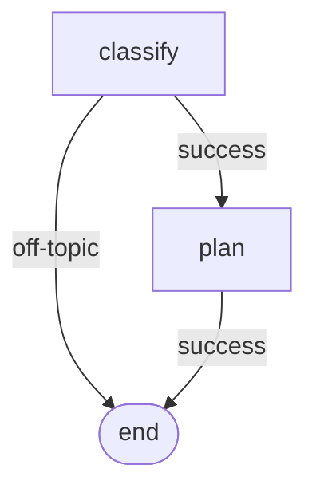

# Viz

DAG visualization helpers. Ship through `@noocodex/dagonizer/viz`.

```ts
import { MermaidRenderer } from '@noocodex/dagonizer/viz';
```

## MermaidRenderer

Static class.

```ts
class MermaidRenderer {
  static render(dag: DAG): string;
}
```

Render a `DAG` as Mermaid `flowchart` source. The output is a complete Mermaid block ready to embed in a Markdown ```` ```mermaid ```` fence.

### Shape vocabulary

| Placement | Mermaid shape | Example output |
|-----------|---------------|----------------|
| `single`  | rectangle     | `greet[greet]` |
| `fan-out` | hexagon       | `scout{{scout}}` |
| `sub-dag` | stadium       | `enrich([enrich])` |
| `parallel`| subgraph      | `subgraph group["group (parallel)"]` … `end` |

Every output route renders as a labeled directed edge: `from -->|outcome| to`. Routes targeting `null` route to a synthetic `END` terminator (one per DAG, rendered as `END([end])`).

### Example

```ts
import { Dagonizer } from '@noocodex/dagonizer';
import { MermaidRenderer } from '@noocodex/dagonizer/viz';

const source = MermaidRenderer.render(dispatcher.getDAG('pipeline')!);
```



### Combining with the dispatcher's read accessors

```ts
const sources = dispatcher.listDAGs().map((dag) => ({
  name: dag.name,
  mermaid: MermaidRenderer.render(dag),
}));
```

`getDAG`, `listDAGs`, `getNode`, and `listNodes` give tooling everything it needs to walk the registry and emit per-DAG documentation.

## See also

- [Reference: Dagonizer — read accessors](./dagonizer)
- [Reference: Entities — `DAG`](./entities)
- [Reference: Derive — `FlowDeriver.derive`](./derive)

## Related guides

- [Visualization](../guide/visualization)
- [Contract-derived flows](../guide/derive)
- [DAGBuilder](../guide/builder)
